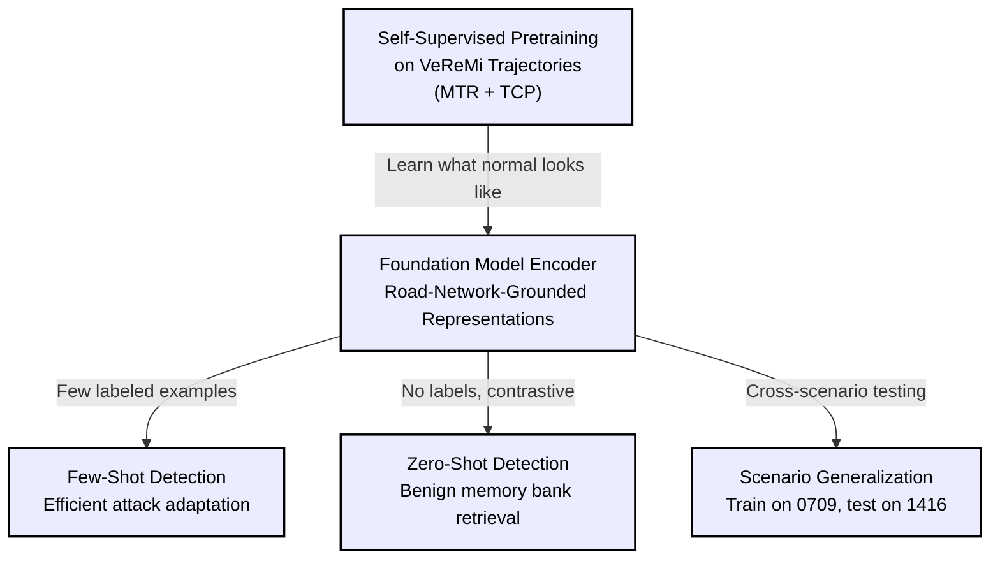
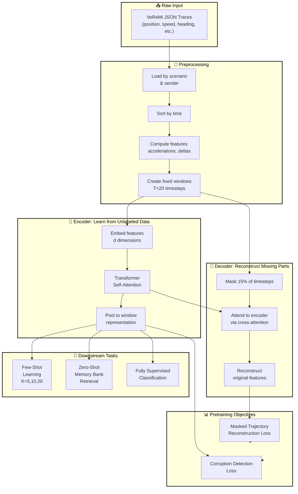
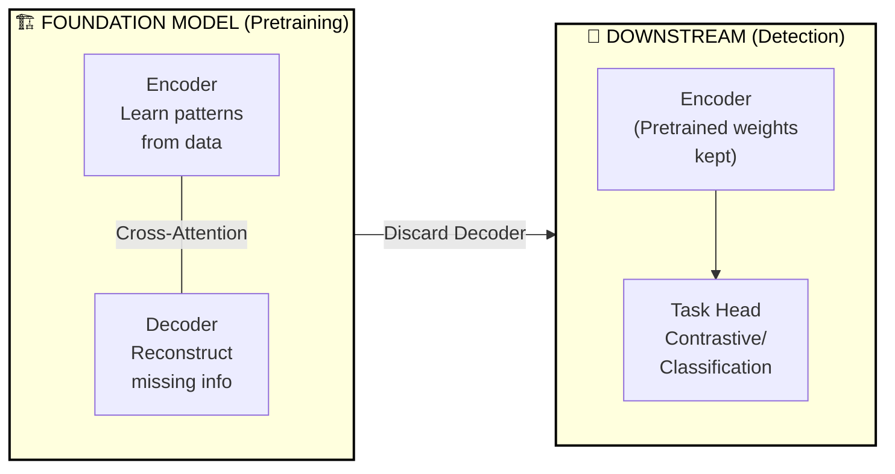
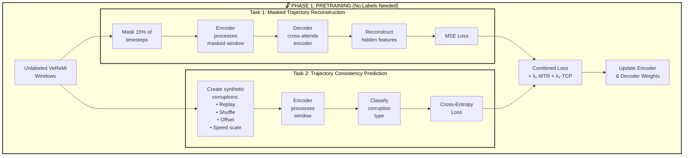
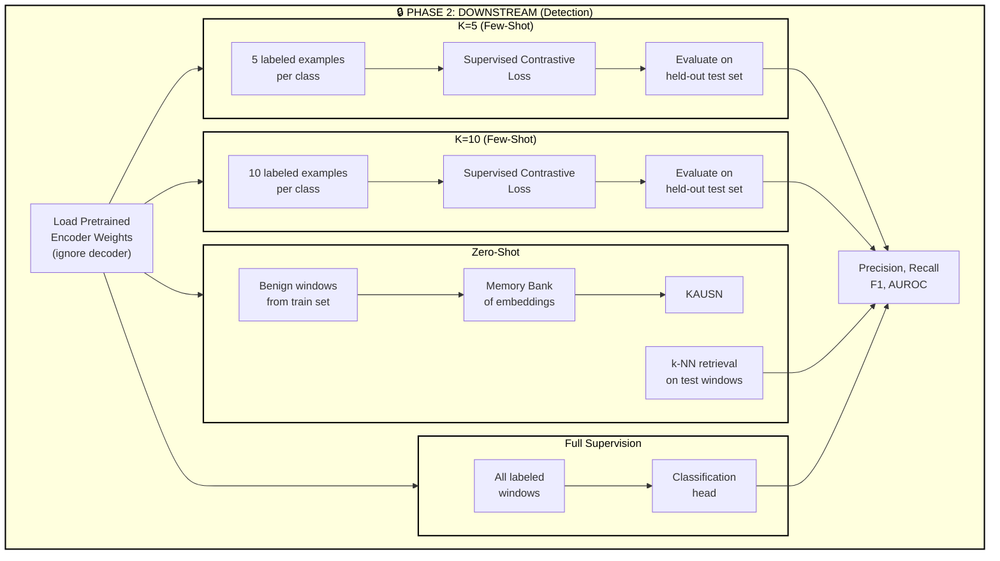
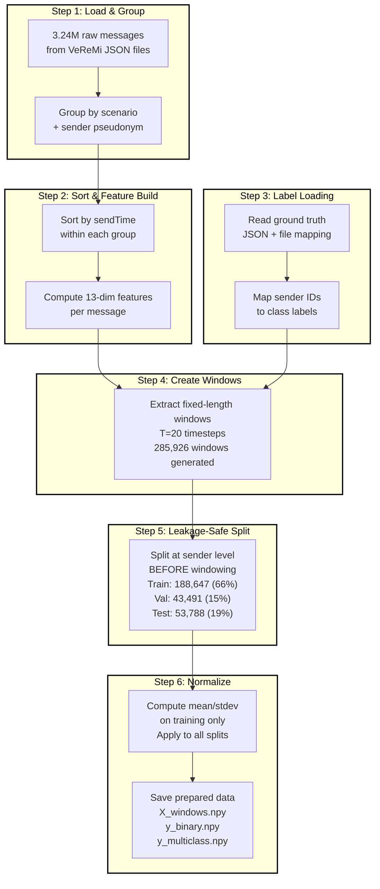

# RoadFM-Lite: Comprehensive Introduction & Dataset Guide

---

## Table of Contents
1. [Quick Overview](#quick-overview)
2. [Problem Statement](#problem-statement)
3. [Research Vision](#research-vision)
4. [Central Hypothesis & Research Question](#central-hypothesis--research-question)
5. [Architecture Overview](#architecture-overview)
6. [Pretraining Objectives](#pretraining-objectives)
7. [Pretraining vs. Downstream Phases](#pretraining-vs-downstream-phases)
8. [Dataset Overview](#dataset-overview)
9. [Attack Types & Characteristics](#attack-types--characteristics)
10. [Data Pipeline](#data-pipeline)
11. [Feature Engineering](#feature-engineering)
12. [Baselines & Evaluation](#baselines--evaluation)
13. [Label Distribution](#label-distribution)
14. [Key Insights](#key-insights)

---

## Quick Overview

**Project Title:** RoadFM-Lite: A Self-Supervised Foundation Model for Road-Network-Grounded Trajectory Representation with Application to Sybil Attack Detection

**Core Idea:** Learn road-network-grounded vehicle movement patterns from unlabeled trajectory windows using two self-supervised objectives (masked reconstruction + consistency prediction), then efficiently detect Sybil attacks in few-shot, zero-shot, and scenario-holdout settings.

**Key Innovation:**
- **Self-supervised pretraining** on 285,926 VeReMi trajectory windows using:
  - **Masked Trajectory Reconstruction (MTR):** Reconstruct hidden motion from surrounding context
  - **Trajectory Consistency Prediction (TCP):** Detect synthetic corruptions (replay, shuffle, offset, speed-scale) that mimic Sybil behavior
- **Foundation model paradigm:** Encoder-decoder during pretraining → encoder-only during downstream detection
- **Road-network-grounding:** Implicit from SUMO-generated data; no explicit road graph needed

**Why It Matters:** 
- Vehicular crowdsensing systems are vulnerable to Sybil attacks (one person forges multiple fake vehicle IDs)
- Current methods rely on hand-crafted rules or require massive labeled datasets
- **RoadFM-Lite's advantage:** Need only 5-20 labeled examples per attack family to adapt (few-shot learning)
- **Scenario robustness:** Generalizes across different traffic conditions (0709 morning ↔ 1416 afternoon)

---

## Problem Statement

### The Sybil Attack Challenge in Vehicular Systems

```
┌─────────────────────────────────────────────────────────────┐
│              Vehicular Crowdsensing System                    │
├─────────────────────────────────────────────────────────────┤
│                                                               │
│  🚗 Vehicle 1 (Real)    📊 Reports Traffic & Info    💰 Reward
│  🚗 Vehicle 2 (Real)    📊 Reports Traffic & Info    💰 Reward
│  🚗 Vehicle 3 (Real)    📊 Reports Traffic & Info    💰 Reward
│  👤 Attacker (1 person) 🤖 Creates 10 Fake Vehicles  💰 Steal Reward
│  👤 Attacker (1 person) 🤖 Creates 5 Fake Vehicles   💰 Steal Reward
│                                                               │
│  ❌ Problem: Fake vehicle messages look locally plausible   │
│     but have hidden inconsistencies over time               │
│                                                               │
└─────────────────────────────────────────────────────────────┘
```

### Current Challenges

| Challenge | Description | Impact |
|-----------|-------------|--------|
| **Plausibility** | Fake trajectories mimic realistic movement patterns locally | Hard to spot with point-in-time checks |
| **Label Scarcity** | Real-world attacks aren't labeled; new variants appear constantly | Supervised learning fails |
| **Scenario Shift** | Different conditions (traffic density, time of day, weather) | Detector degrades in new scenarios |
| **Time-Dependent Patterns** | Attacks reveal themselves over longer windows (replays, repetitions, timing gaps) | Need sequence modeling, not static features |

---

## Central Hypothesis & Research Question

### Central Hypothesis

**Self-supervised pretraining on road-network-grounded vehicular trajectory windows using reconstruction and consistency objectives will produce foundation model embeddings that transfer more effectively to Sybil detection than training the same encoder architecture from scratch.**

This benefit should be largest in two settings where current methods are weakest:
1. **Few-shot supervision:** Only 5-20 labeled attack examples per class
2. **Scenario-holdout evaluation:** Trained on one scenario group (0709), tested on another (1416)

### Research Question (Main)

> **Does a self-supervised trajectory foundation model trained on road-network-grounded vehicular message traces produce representations that improve Sybil detection relative to supervised-only baselines, particularly under few-shot supervision and scenario-holdout evaluation?**

### Sub-Questions

1. Does self-supervised pretraining improve Sybil detection accuracy compared to the same encoder trained from scratch on labeled data?
2. Does the pretrained encoder improve **label efficiency** (require fewer labeled attack examples)?
3. Does the pretrained encoder reduce **generalization loss** when evaluation moves from one scenario group to another?
4. Which components contribute most: masked reconstruction (MTR), trajectory consistency (TCP), decoder depth, feature design, or context window length?

---

## Research Vision

### Three Key Hypotheses



---

## Architecture Overview

### High-Level System Diagram



### Component Details



---

## Pretraining Objectives

The foundation model is trained with **two complementary objectives** that operate on the same encoder-decoder backbone without requiring labels:

$$\mathcal{L}_{\text{pretrain}} = \lambda_1 \mathcal{L}_{\text{MTR}} + \lambda_2 \mathcal{L}_{\text{TCP}}$$

### Objective 1: Masked Trajectory Reconstruction (MTR)

**Purpose:** Teach the encoder to infer missing motion from surrounding context.

**Mechanism:**
1. Randomly mask 15% of timesteps in a window
2. Encoder processes the partially masked sequence
3. Decoder attends to encoder outputs via **cross-attention** to reconstruct masked features
4. Loss is MSE between predicted and original features at masked positions

**What it teaches:** Early stopping velocity patterns, realistic position changes, smooth heading evolution (road-constrained motion)

**Example:**
```
Input window:  [↗, →, →, [MASKED], ↘, ↓, ↙]
Encoder sees:  [↗, →, →,    ?     , ↘, ↓, ↙]
Decoder predicts: ? ≈ ↗ or → (smooth continuation)
Loss = ||predicted - actual||²
```

### Objective 2: Trajectory Consistency Prediction (TCP)

**Purpose:** Detect synthetic corruptions that mimic Sybil attack patterns.

**Corruption Types** (applied to clean windows):
- **Replay:** Duplicate or reinsert an earlier subsequence
- **Local shuffle:** Randomly reorder a short segment
- **Speed scale:** Multiply speed profile and displacement by a factor
- **Position offset:** Add persistent offset to position components
- **Identity (clean):** No corruption (baseline class)

**Mechanism:**
1. For each clean window, generate 4 corrupted variants + 1 clean
2. Encoder processes window and produces embedding
3. Classification head predicts corruption type (5-class)
4. Loss is cross-entropy

**What it teaches:** Detecting replay artifacts, temporal disorder, persistent offsets, unrealistic speed changes (Sybil-specific corruptions)

**Example:**
```
Original:      [t=0, t=1, t=2, t=3, t=4]  ← Clean
Replay:        [t=0, t=1, t=0, t=1, t=4]  ← Duplicated pattern
Shuffle:       [t=0, t=2, t=1, t=3, t=4]  ← Out of order
Speed-scale:   [t=0, t=1×2, t=2×2, ...]   ← 2× faster
Offset:        [t=0+δ, t=1+δ, ...]        ← Position shift

Encoder task: Classify which corruption (or none)
```

---

## Pretraining vs. Downstream Phases

### Phase 1: Self-Supervised Pretraining



**Why This Works:**
- **MTR (Reconstruction):** Forces encoder to understand smooth motion, realistic temporal patterns
- **TCP (Consistency):** Teaches encoder to detect attacks that exhibit replay patterns, timing irregularities, or unrealistic motion jumps
- **No labels needed:** Only raw sequences required
- **Result:** Encoder learns what "normal" road-constrained vehicle movement looks like

---

### Phase 2: Downstream Sybil Detection



**Key Insight:** Decoder is discarded; only the pretrained encoder is reused for all downstream tasks.

---

## Dataset Overview

### VeReMi Dataset Structure

```
VeReMi-Dataset
├── DataReplaySybil_0709/          ← Attack family + Time group
│   └── VeReMi_25200_28800_.../.   ← Time window folder
│       ├── traceJSON-XXX-YYY-A17-...json    ← Trace files (vehicle records)
│       └── traceGroundTruthJSON-Z.json      ← Ground truth labels
├── DataReplaySybil_1416/
├── DoSRandomSybil_0709/
├── DoSRandomSybil_1416/
├── DoSDisruptiveSybil_0709/
├── DoSDisruptiveSybil_1416/
├── GridSybil_0709/
└── GridSybil_1416/
```

### Key Statistics

| Metric | Value | Meaning |
|--------|-------|---------|
| **Total Messages** | 3,240,283 | Ground truth reports from all vehicles |
| **Unique Vehicles** | 23,032 | Individual trace files |
| **Unique Senders** | 26,567 | Distinct sender sequences after grouping |
| **Attack Families** | 5 classes | Benign, GridSybil, DataReplaySybil, DoSRandomSybil, DoSDisruptiveSybil |
| **Time Groups** | 2 scenarios | 0709 (morning 7:00-9:00), 1416 (afternoon 14:00-16:00) |
| **Generated Windows** | 285,926 | Fixed-length sequences (T=20 timesteps) |
| **Benign/Attacker Ratio** | 51.3% / 48.7% | Nearly balanced by windows |

---

## Attack Types & Characteristics

### Detailed Attack Classification

```mermaid
graph TB
    subgraph ROOT["Vehicle Behavior in VeReMi"]
        direction TB
    end
    
    subgraph BENIGN["✅ A0: BENIGN (51%)"]
        B_SPA["🛣️ Spatial: Follow roads"]
        B_TEM["⏱️ Temporal: 1.0s intervals"]
        B_KIN["📈 Kinematic: 10.2 m/s avg speed"]
        B_SPA -.->|Key signal| B_DISC1["DISCRIMINATIVE:<br/>Road-constrained"]
        B_TEM -.->|Key signal| B_DISC2["DISCRIMINATIVE:<br/>Regular timing"]
        B_KIN -.->|Key signal| B_DISC3["DISCRIMINATIVE:<br/>Realistic motion"]
    end
    
    subgraph GRIDSYBIL["🔲 A16: GridSybil (15%)"]
        G_SPA["📍 Spatial: ±10km off-road grid pattern"]
        G_TEM["⏱️ Temporal: 1.0s intervals (same as benign)"]
        G_KIN["📉 Kinematic: 5.2 m/s avg speed (very slow)"]
        G_SPA -.->|Detector| G_DISC1["EASIEST TO SPOT:<br/>Impossible GPS coords"]
        G_KIN -.->|Detector| G_DISC2["Unrealistic for<br/>off-road motion"]
    end
    
    subgraph DATAREPLAY["📂 A17: DataReplaySybil (5%)"]
        D_SPA["🛣️ Spatial: Steal benign GPS traces"]
        D_TEM["⏱️ Temporal: 1.0s (same as source)"]
        D_KIN["📈 Kinematic: Looks realistic"]
        D_SPA -.->|Challenge| D_DISC["HARDEST: Looks like<br/>real trajectory"]
        D_TEM -.->|Context| D_DISC2["Same timing helps<br/>camouflage"]
    end
    
    subgraph DOSRANDOM["🎲 A18: DoSRandomSybil (5%)"]
        R_SPA["📍 Spatial: Random positions"]
        R_TEM["⏱️⚡ Temporal: 0.5s intervals (2× faster!)"]
        R_KIN["📈 Kinematic: Erratic speed changes"]
        R_TEM -.->|Key signal| R_DISC1["KEY DISCRIMINATOR:<br/>2× Message Rate"]
    end
    
    subgraph DOSDISRUPTIVE["⚔️ A19: DoSDisruptiveSybil (5%)"]
        DD_SPA["📍 Spatial: Off-road + Scattered"]
        DD_TEM["⏱️⚡ Temporal: 0.5s intervals (2× faster!)"]
        DD_KIN["📉 Kinematic: Rapid, unrealistic motion"]
        DD_SPA -.->|Combined| DD_DISC1["Multiple signals"]
        DD_TEM -.->|Combined| DD_DISC2["2× message rate"]
        DD_KIN -.->|Combined| DD_DISC3["Impossible kinematics"]
    end
    
    ROOT --> BENIGN
    ROOT --> GRIDSYBIL
    ROOT --> DATAREPLAY
    ROOT --> DOSRANDOM
    ROOT --> DOSDISRUPTIVE
    
    style BENIGN stroke:#000,stroke-width:2px,color:#000
    style GRIDSYBIL stroke:#000,stroke-width:2px,color:#000
    style DATAREPLAY stroke:#000,stroke-width:2px,color:#000
    style DOSRANDOM stroke:#000,stroke-width:2px,color:#000
    style DOSDISRUPTIVE stroke:#000,stroke-width:2px,color:#000
```



### Attack Discriminative Signals

```
┌─────────────────────────────────────────────────────────────────────────┐
│                    TEMPORAL DISCRIMINATION                              │
├─────────────────────────────────────────────────────────────────────────┤
│                                                                         │
│  Benign Messages:     ▓█▓█▓█▓█▓█         (1.0s gap)                    │
│  DoS Attackers:       ▓░▓░▓░▓░▓░░░       (0.5s gap) ← 2× faster!      │
│                       └─┬─┘ └─┬─┘                                      │
│                    Critical Temporal Discriminator                     │
│                                                                         │
├─────────────────────────────────────────────────────────────────────────┤
│                    SPATIAL DISCRIMINATION                               │
├─────────────────────────────────────────────────────────────────────────┤
│                                                                         │
│  Benign:              ╔═══════╗                                        │
│                       ║ Road  ║    ← Vehicles follow roads             │
│                       ║Network║                                        │
│                       ╚═══════╝                                        │
│                                                                         │
│  GridSybil:           ┌─ ─ ─ ─ ─ ─                                    │
│                       │ + + + + +  ← Grid pattern off-road             │
│                       └─ ─ ─ ─ ─ ─                                    │
│                                                                         │
│  DataReplaySybil:     ╔═══════╗                                        │
│                       ║ Road  ║    ← Copy of real trajectory           │
│                       ║Network║                                        │
│                       ╚═══════╝                                        │
│                                                                         │
│  DoSRandom:           ╳ ╳ ╳ ╳           ← Random scattered pts        │
│                       ╳     ╳                                          │
│                       ╳ ╳ ╳   ╳                                        │
│                                                                         │
└─────────────────────────────────────────────────────────────────────────┘
```

### Attack Type Summary Table

| Type | Code | % | Spatial Signal | Temporal Signal | Kinematic Signal | Realism |
|------|------|---|----------------|-----------------|------------------|---------|
| **Benign** | A0 | 51% | Road-constrained | 1.0s intervals | Normal (10.2 m/s) | ✅ High |
| **GridSybil** | A16 | 15% | ±10km grid off-road | 1.0s intervals | Slow (5.2 m/s) | ❌ Very Low |
| **DataReplaySybil** | A17 | 5% | Stolen real traces | 1.0s intervals | Realistic | ⚠️ Medium-High |
| **DoSRandomSybil** | A18 | 5% | Random scattered | **0.5s intervals** | Erratic | ❌ Low |
| **DoSDisruptiveSybil** | A19 | 5% | Off-road scattered | **0.5s intervals** | Chaotic | ❌ Very Low |

**Key Insight:** DoS attacks (A18, A19) are easiest to detect via temporal signal (2× message rate). DataReplaySybil is hardest because it mimics real trajectories. Foundation model learns to detect ALL patterns without explicit feature engineering.

---

## Data Pipeline

### From Raw JSON Messages to Model-Ready Windows

Each message in VeReMi contains:

| Field | Meaning | Use |
|-------|---------|-----|
| `sendTime` | Message timestamp | Temporal ordering & time deltas |
| `sender` | Sender ID | Sequence bookkeeping |
| `senderPseudo` | Pseudonym | Sender-aligned window construction |
| `pos` | Position vector | Absolute position & displacement |
| `spd` | Velocity vector | Speed & velocity-delta features |
| `acl` | Acceleration vector | Acceleration & motion dynamics |
| `hed` | Heading | Directional dynamics |

**Processing Steps:**



### Leakage Prevention Strategy (Critical)

```
SPLIT AT SENDER LEVEL BEFORE WINDOWING:
══════════════════════════════════════

Sender 123 sequence: [m₀, m₁, m₂, ..., m₁₀₀₀]

WRONG (Causes Leakage):
  Window_A: [m₁₀₀-m₁₂₀]   ← Train
  Window_B: [m₁₁₀-m₁₃₀]   ← Test  ❌ Overlaps! Can memorize
  Window_C: [m₁₂₀-m₁₄₀]   ← Train

RIGHT (No Leakage):
  Assign Sender 123 → Train split
  ↓
  Window_A: [m₁₀₀-m₁₂₀]   ← Train ✅
  Window_B: [m₁₁₀-m₁₃₀]   ← Train ✅
  Window_C: [m₁₂₀-m₁₄₀]   ← Train ✅
  (All from same sender in same split)
```

---

## Feature Engineering

### 13-Dimensional Feature Vector

Each window contains T=20 timesteps, each with D=13 features:

```
┌─────────────────────────────────────────────────────────────────┐
│       RoadFM-Lite 13-Dimensional Feature Space                   │
├─────────────────────────────────────────────────────────────────┤
│                                                                   │
│  CATEGORY 1: POSITION (2 dims)                                   │
│  ────────────────────────                                        │
│  • pos_x      : X-coordinate on road (meters)                  │
│  • pos_y      : Y-coordinate on road (meters)                  │
│                                                                   │
│  CATEGORY 2: VELOCITY (2 dims)                                   │
│  ───────────────────────────                                     │
│  • spd_x      : X-component of velocity (m/s)                  │
│  • spd_y      : Y-component of velocity (m/s)                  │
│                                                                   │
│  CATEGORY 3: ACCELERATION (2 dims)                               │
│  ──────────────────────────────                                  │
│  • acl_x      : X-component of acceleration (m/s²)             │
│  • acl_y      : Y-component of acceleration (m/s²)             │
│                                                                   │
│  CATEGORY 4: HEADING (2 dims)                                    │
│  ──────────────────────────                                      │
│  • hed_x      : X-component of heading unit vector              │
│  • hed_y      : Y-component of heading unit vector              │
│                                                                   │
│  CATEGORY 5: TEMPORAL DELTAS (1 dim)                             │
│  ──────────────────────────────────                              │
│  • dt         : Time since last message (seconds)              │
│                                                                   │
│  CATEGORY 6: DISPLACEMENT & VELOCITY CHANGES (2 dims)            │
│  ──────────────────────────────────────────────                 │
│  • dpos_x     : Displacement delta X (meters per Δt)           │
│  • dpos_y     : Displacement delta Y (meters per Δt)           │
│                                                                   │
│  CATEGORY 7: SPEED & ACCELERATION CHANGES (2 dims)               │
│  ─────────────────────────────────────────────                  │
│  • dspd_x     : Speed delta X (m/s per Δt)                     │
│  • dspd_y     : Speed delta Y (m/s per Δt)                     │
│                                                                   │
│  TOTAL: 2 + 2 + 2 + 2 + 1 + 2 + 2 = 13 dimensions              │
│                                                                   │
└─────────────────────────────────────────────────────────────────┘
```

### Why These Features?

```
INFORMATION HIERARCHY:

Level 1 - Absolute State (WHERE & HOW FAST):
  pos_x, pos_y, spd_x, spd_y
  └─ Captures position & velocity, foundation for everything

Level 2 - Rate of Change (HOW ACCELERATION):
  acl_x, acl_y, dspd_x, dspd_y
  └─ Captures dynamics, reveals unrealistic motion

Level 3 - Direction (ORIENTATION):
  hed_x, hed_y
  └─ Captures heading, road-constrained vs scattered

Level 4 - Timing (WHEN):
  dt, dpos_x, dpos_y
  └─ Captures message frequency, reveals DoS 2× faster rate

IMPORTANT: No hand-crafted rules (e.g., "if speed > threshold").
Transformer encoder learns what matters from data during pretraining.
```

### Feature Ranges (From EDA)

| Feature | Benign | GridSybil | DoSRandom | DoSDisruptive | DataReplay |
|---------|--------|-----------|-----------|---------------|-----------|
| **Speed (m/s)** | 8-12 | 3-7 | 5-15 (erratic) | 5-15 (chaotic) | 8-12 |
| **Accel (m/s²)** | -2 to +2 | -1 to +1 (constrained) | -5 to +5 | -5 to +5 | -2 to +2 |
| **Heading Change (deg/s)** | -30 to +30 | -10 to +10 (smooth) | Large jumps | Large jumps | -30 to +30 |
| **Inter-msg gap (s)** | ~1.0 | ~1.0 | **~0.5** ⚠️ | **~0.5** ⚠️ | ~1.0 |

---

## Baselines & Evaluation

### Baseline Comparisons

RoadFM-Lite is evaluated against three baselines:

| Baseline | Method | Purpose |
|----------|--------|---------|
| **Baseline 1: Encoder from Scratch** | Same encoder architecture, no pretraining, trained directly on downstream labels | Isolates value of self-supervised pretraining |
| **Baseline 2: Feature Eng + Random Forest** | Hand-crafted kinematic statistics (speed, accel, heading, displacement) + RF classifier | Traditional non-deep approach |
| **Baseline 3: Supervised BiLSTM** | BiLSTM on same features, trained end-to-end with labels | Tests if benefits come from pretraining vs. sequence modeling |

### Evaluation Protocols

#### 1. Few-Shot Learning (Primary Focus)

**Settings:** $K \in \{5, 10, 20\}$ labeled examples per class

**Method:**
1. Sample $K$ windows per class from training split
2. Fine-tune pretrained encoder with **Supervised Contrastive Loss (InfoNCE)**
3. Train linear classifier on learned embeddings
4. Evaluate on full test split

**Hypothesis:** RoadFM-Lite should show biggest advantage at smallest $K$ (most label scarcity)

**Metrics:** Precision, Recall, F1, AUROC (both multiclass family and binary benign-vs-Sybil)

#### 2. Zero-Shot Detection

**Method:**
1. Build **memory bank** of embeddings from benign windows in training split
2. For each test window, compute distance to $k$ nearest benign neighbors
3. Flag as suspicious if distance exceeds threshold $\delta$

**Hypothesis:** Valid representations should cluster benign windows while pushing Sybil windows away

#### 3. Scenario-Holdout Generalization

**Method:**
1. Train on `0709` scenario group, evaluate on `1416`
2. Swap roles and repeat
3. Measure **generalization degradation**

$$\Delta_{\text{scenario}} = \frac{F1_{\text{standard}} - F1_{\text{holdout}}}{F1_{\text{standard}}} \times 100\%$$

**Hypothesis:** Pretrained encoder should degrade less under scenario shift

#### 4. Fully Supervised (Upper Bound)

**Method:** Fine-tune with all available labeled training data (reference for comparison)

### Ablation Study

| Variant | Purpose |
|---------|---------|
| Full RoadFM-Lite | Reference |
| No pretraining | Isolate pretraining value |
| MTR only | Isolate reconstruction contribution |
| TCP only | Isolate consistency contribution |
| Linear reconstruction head | Isolate decoder value |
| No delta features | Test motion-deltas feature importance |
| Short/long windows | Test context length sensitivity |

---

## Label Distribution

### Class Balance in 285,926 Windows

```
CLASS DISTRIBUTION BY WINDOWS:
━━━━━━━━━━━━━━━━━━━━━━━━━━━━━━━

Benign (A0):              ████████████████████░░░░░░░  142,925 (50%)
GridSybil (A16):          ███████████████░░░░░░░░░░░░░░  63,153 (22%)
DoSDisruptiveSybil (A19): ███████████░░░░░░░░░░░░░░░░░░░  32,412 (11%)
DoSRandomSybil (A18):     ███████████░░░░░░░░░░░░░░░░░░░  32,412 (11%)
DataReplaySybil (A17):    ███░░░░░░░░░░░░░░░░░░░░░░░░░░░░  15,024 (5%)
                          └────────────────────────────────────────┘
                                    TOTAL: 285,926


FOR BINARY CLASSIFICATION:
━━━━━━━━━━━━━━━━━━━━━━━━━

Benign (A0):              ███████████████████░░░░░░░░░░░  142,925 (51%)
Attacker (A16+A17+A18+A19): ████████████████████░░░░░░░  143,001 (49%)
                          └────────────────────────────────┘
                            Nearly Balanced!

PER-SCENARIO GROUP:
━━━━━━━━━━━━━━━━━━

0709 (Morning):           ██████████████████████░░░░░░░  195,551 (68%)
1416 (Afternoon):         ██████████░░░░░░░░░░░░░░░░░░░░░  90,375 (32%)

IMPORTANT: Groups are imbalanced, making scenario-holdout
           evaluation a true generalization test!
```

### Train/Val/Test Split Distribution

| Split | Windows | Senders | Benign (%) | Attacker (%) | 0709 (%) | 1416 (%) |
|-------|---------|---------|-----------|--------------|----------|----------|
| **Train** | 188,647 | 16,124 | 51.2 | 48.8 | 68.3 | 31.7 |
| **Val** | 43,491 | 4,031 | 51.5 | 48.5 | 68.1 | 31.9 |
| **Test** | 53,788 | 5,039 | 50.9 | 49.1 | 67.9 | 32.1 |

**Key Property:** Distributions are uniform across splits (no bias).

---

## Key Insights

### What Foundation Pretraining Teaches

```
SELF-SUPERVISED LEARNING OUTCOME:

1. Masked Trajectory Reconstruction (MTR)
   ────────────────────────────────────────
   ✓ Learns smooth motion patterns
   ✓ Captures: road lanes, speed profiles, heading changes
   ✓ Encoder learns to predict missing motion from context
   Result: Understands what NORMAL vehicles do

2. Trajectory Consistency Prediction (TCP)
   ───────────────────────────────────────
   ✓ Detects corruption patterns:
      • Replay artifacts (duplicate subsequences)
      • Temporal disorder (shuffled messages)
      • Persistent offsets (GPS position shifts)
      • Speed anomalies (unrealistic scaling)
   ✓ Mimics exact attack mechanisms in VeReMi
   Result: Learns to spot FABRICATED patterns
```

### Why Road-Network-Grounded?

```
IMPLICIT GROUNDING (RoadFM-Lite):
═════════════════════════════════

✅ Data-driven approach:
   • VeReMi generated by SUMO on real Luxembourg road network
   • Every position, speed, heading reflects road constraints
   • Encoder learns road structure FROM DATA, not from graphs
   • No external map APIs or map-matching needed
   
✅ Benefits:
   • Reproducible (all from benchmark)
   • Self-contained (no external dependencies)
   • Simpler pipeline
   • Easier to share pretrained weights
   
Analogy: Like learning grammar by examples, not explicit rules
```

### Why Few-Shot & Zero-Shot Matter

```
REAL-WORLD DEPLOYMENT SCENARIO:
═══════════════════════════════

Week 1: New attack variant discovered
  → Only 5-10 labeled examples available
  → Urgency: Deploy within hours

Traditional Supervised Approach:
  ❌ Requires 1000s labeled examples
  ❌ Takes weeks to collect & label
  ❌ While labeling, attacks spread

RoadFM-Lite Few-Shot:
  ✅ Uses pretrained encoder (already knows normal motion)
  ✅ Fine-tune with 5-10 examples
  ✅ Deploy within hours
  ✅ Continues improving as more labels arrive

Zero-Shot Alternative:
  ✅ Detect anomalies without attack labels
  ✅ Use benign memory bank for reference
  ✅ Immediate deployment
  ✅ Buy time while collecting ground truth
```

### Success Criteria

The thesis will be considered successful if:

1. **Detection Quality:** Pretrained encoder achieves ≥ F1 vs. same encoder from scratch under full supervision
2. **Label Efficiency:** Pretrained encoder shows measurable advantage in at least one low-label setting ($K \in \{5, 10, 20\}$)
3. **Scenario Robustness:** Pretrained encoder exhibits lower holdout degradation than from-scratch baseline
4. **Component Contribution:** Ablation study demonstrates that MTR, TCP, decoder, or window design materially affect performance

### Timeline

| Semester | Activities | Deliverables |
|----------|-----------|--------------|
| **Fall 2025** | Preprocessing pipeline, encoder pretraining | Working VeReMi pipeline, v1 pretrained model |
| **Spring 2026** | Few-shot, zero-shot, scenario-holdout, ablation experiments | Results, complete thesis, defense-ready |

---

## Summary: Impact & Next Steps

### Core Contribution

RoadFM-Lite demonstrates that **self-supervised pretraining on road-network-grounded trajectory windows produces foundation model encoders that enable efficient Sybil detection under label scarcity and scenario shift**, advancing both trajectory representation learning and vehicular security.

### Practical Applications

1. **Deployment with Minimal Supervision:** Adapt to new attacks with 5-20 labels instead of 1000s
2. **Scenario Robustness:** Maintains performance across different traffic conditions
3. **Lightweight Foundation:** Compact encoder without external map dependencies
4. **Reproducible:** Built entirely on VeReMi benchmark, easy to share and extend

### Implementation Roadmap

1. **Data Preparation:** Finalize 13-dim feature extraction, verify leakage-safe splits
2. **Encoder-Decoder:** Build Transformer backbone (encoder + decoder)
3. **Pretraining:** Run MTR + TCP on 188,647 training windows (unlabeled)
4. **Evaluation:**
   - Few-shot fine-tuning ($K = 5, 10, 20$)
   - Zero-shot k-NN retrieval
   - Scenario-holdout (0709 ↔ 1416)
   - Ablation studies
5. **Baselines:** Implement Encoder-from-Scratch, Feature+RF, BiLSTM comparisons
6. **Analysis:** Per-family breakdown, error analysis, visualization

---

**Document Version:** 2.0  
**Date Updated:** April 16, 2026  
**Status:** Updated to align with current proposal draft
