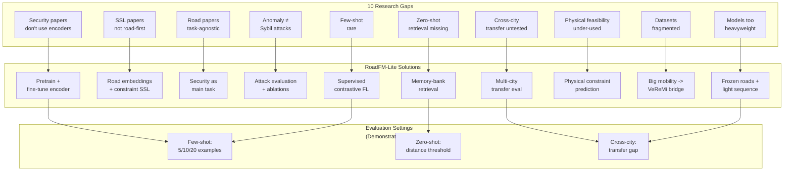
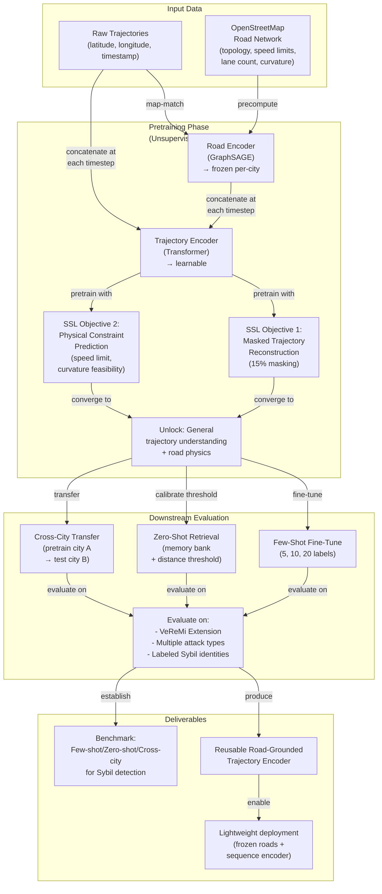
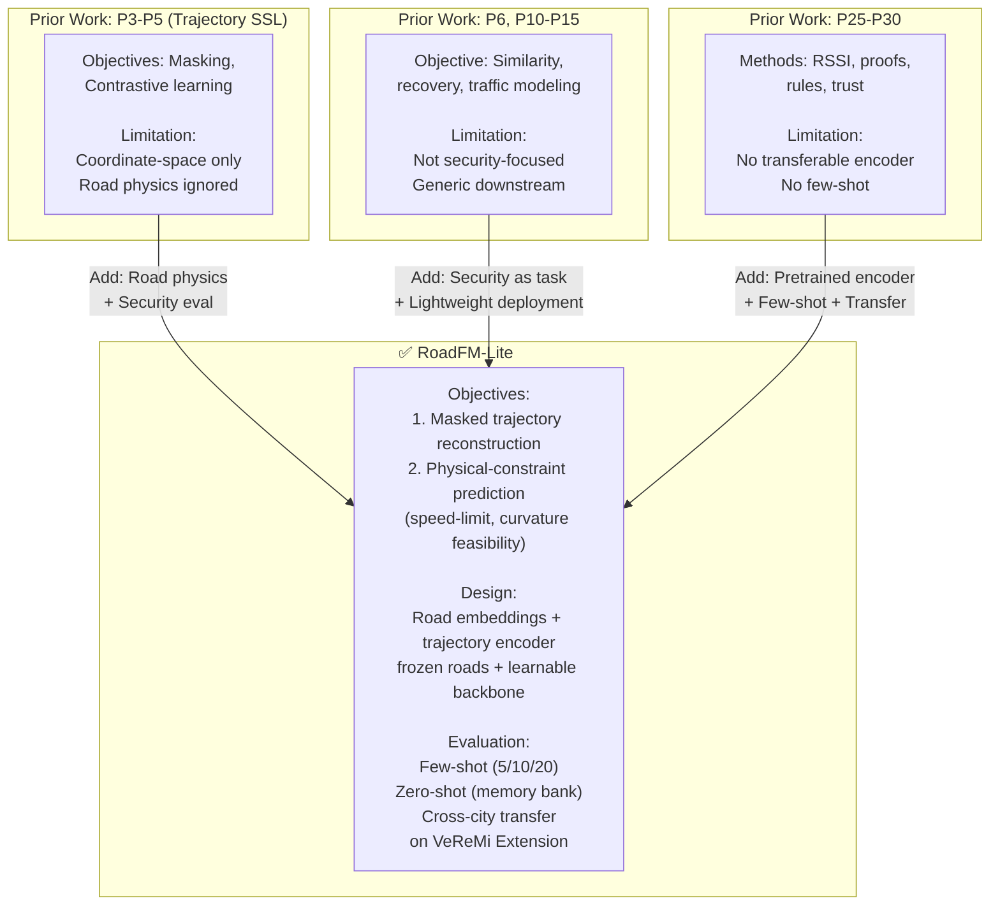

# Detailed Gap Analysis For RoadFM-Lite

## Executive Summary

The literature is mature in three separate lanes but still fragmented:

1. trajectory foundation and self-supervised learning papers learn reusable motion embeddings,
2. road-network papers learn topology-aware or map-constrained representations,
3. vehicular security papers detect Sybil or misbehavior events with trust, RSSI, certificates, plausibility checks, or shallow ML.

The main gap is that these three lanes have not been integrated into a single road-grounded pretrained encoder evaluated specifically for Sybil detection under low-label and cross-city settings.

---

## Visual: The Research Gap Landscape

### 10 Critical Gaps And Where They Exist

```mermaid
graph TD
    GAP1["<b>Gap 1: No Pretrained Encoders in Security<br/>(P25-P30)</b><br/>Security papers use trust, RSSI, rules<br/>No reusable trajectory encoder"] -.->|RoadFM-Lite| SOL1["✅ Solution:<br/>Pretrain, then fine-tune<br/>for few-shot Sybil detection"]
    
    GAP2["<b>Gap 2: Trajectory SSL Not Road-First<br/>(P3-P5, P7)</b><br/>Masking, contrastive views<br/>Road semantics are secondary"] -.->|RoadFM-Lite| SOL2["✅ Solution:<br/>Road-segment embeddings<br/>+ physical-constraint SSL"]
    
    GAP3["<b>Gap 3: Road Papers Task-Agnostic<br/>(P6, P10-P15)</b><br/>Optimize for similarity or recovery<br/>NOT security-oriented"] -.->|RoadFM-Lite| SOL3["✅ Solution:<br/>Use Sybil detection<br/>as main downstream task"]
    
    GAP4["<b>Gap 4: Anomaly ≠ Sybil<br/>(P18-P22)</b><br/>Detect generic outliers<br/>Not adversarial multi-identity"] -.->|RoadFM-Lite| SOL4["✅ Solution:<br/>Evaluate on attack datasets<br/>Compare vs. anomaly + Sybil baselines"]
    
    GAP5["<b>Gap 5: No Few-Shot Sybil Eval<br/>(P25-P30)</b><br/>Assume ample labeled attacks<br/>Few-shot learning rare"] -.->|RoadFM-Lite| SOL5["✅ Solution:<br/>5, 10, 20 labeled examples<br/>Contrastive fine-tuning"]
    
    GAP6["<b>Gap 6: Zero-Shot Retrieval Missing<br/>(All security papers)</b><br/>No memory-bank protocol<br/>No trusted baseline retrieval"] -.->|RoadFM-Lite| SOL6["✅ Solution:<br/>Memory bank of verified<br/>normal trajectories"]
    
    GAP7["<b>Gap 7: Cross-City Transfer Untested<br/>(P1, P2 discuss; P25-P30 skip)</b><br/>Only single-city evaluation<br/>Deployment unclear"] -.->|RoadFM-Lite| SOL7["✅ Solution:<br/>Pretrain on city A<br/>Fine-tune on city B"]
    
    GAP8["<b>Gap 8: Physical Feasibility Under-Used<br/>(P3-P7)</b><br/>No road-rule SSL objective<br/>Speed-limit & curvature ignored"] -.->|RoadFM-Lite| SOL8["✅ Solution:<br/>Constraint prediction<br/>as second SSL objective"]
    
    GAP9["<b>Gap 9: Dataset Fragmentation<br/>(P1-P17 vs P23-P30)</b><br/>Mobility datasets ≠ attack datasets<br/>No unified benchmark"] -.->|RoadFM-Lite| SOL9["✅ Solution:<br/>Pretrain on BigMobility<br/>Fine-tune on VeReMi Extension"]
    
    GAP10["<b>Gap 10: Heavyweight Models<br/>(P10-P14)</b><br/>Heavy graph encoders<br/>Hard to deploy across cities"] -.->|RoadFM-Lite| SOL10["✅ Solution:<br/>Frozen road encoder<br/>+ lightweight sequence model"]
```

### how RoadFM-Lite Closes The Gap Landscape

### RoadFM-Lite's Architecture: Closing The Problem Space

### How RoadFM-Lite Differs From Predecessors

---

## 1. Detailed Gap Matrix

| Gap | Evidence from the papers | Why the gap matters for Sybil detection | How RoadFM-Lite can address it |
| --- | --- | --- | --- |
| Security papers do not usually use pretrained trajectory encoders | P25-P30 mostly rely on trust, RSSI, location proofs, collaborative heuristics, or direct classifiers. | Sybil attacks can imitate local signals or exploit heuristic thresholds; richer latent representations may separate realistic from fabricated motion better. | Pretrain a reusable encoder on unlabeled trajectories before fine-tuning for attacks. |
| Trajectory SSL papers are usually trajectory-first, not road-physics-first | P3-P5 and P7 rely on masking, contrastive views, or multi-view coding; road semantics are not always central. | A fabricated trajectory may look statistically plausible in coordinate space while being physically implausible on the road graph. | Add road-segment embeddings plus physical-constraint prediction. |
| Road-network learning papers are rarely security-oriented | P6, P10-P15 optimize similarity, road embedding quality, or dynamic traffic modeling, not adversarial identity detection. | Good road embeddings alone do not prove value for Sybil defense. | Use Sybil detection as the main downstream task rather than an afterthought. |
| Anomaly papers focus on generic outliers rather than adversarial multi-identity attacks | P18-P22 model abnormal trips, sub-trajectories, or mobility anomalies, often without adversarial attackers. | Sybil trajectories are not just random anomalies; they are fabricated to look benign enough to evade detectors. | Evaluate on attack datasets and compare against both anomaly and Sybil baselines. |
| Few-shot learning is largely absent in vehicular Sybil detection | Most security papers assume enough labeled attack data or use synthetic rules. | In real deployments, new attack variants may have very few labels. | Show 5, 10, and 20 labeled examples per class with supervised contrastive fine-tuning. |
| Zero-shot retrieval is underexplored in this domain | I did not find a standard memory-bank retrieval protocol in the Sybil papers I reviewed. | Retrieval from trusted normal embeddings is attractive when attack labels are scarce or drifting. | Build a verified-normal memory bank and evaluate nearest-neighbor distance thresholds. |
| Cross-city attack transfer is mostly untested | P1 and P2 discuss region transfer, but the Sybil papers rarely test attack detection across road networks or cities. | A detector that only works in one simulated city is weak for deployment claims. | Pretrain on one city, fine-tune or calibrate on another, and report transfer degradation. |
| Physical feasibility is not a standard self-supervised pretext in this area | The closest SSL papers emphasize reconstruction or contrastive consistency, not road-rule feasibility. | Speed-limit or curvature violations are exactly the kind of signals that fabricated trajectories can betray. | Use constraint prediction as a second pretraining objective. |
| Datasets are split across unrelated communities | P1-P17 use mobility benchmarks; P23-P30 use VANET attack benchmarks; there is no standard benchmark that combines rich road semantics with labeled Sybil identities. | This makes it hard to prove that good mobility representations translate into better security. | Pretrain on large mobility data, then fine-tune on VeReMi Extension, and state the dataset mismatch explicitly as part of the contribution. |
| Lightweight deployable road-grounded backbones are underemphasized | Some joint models are heavy or tightly coupled to their task. | Security systems often need reusable features, low inference cost, and simple deployment across cities. | Freeze road-segment embeddings per city and keep the sequence encoder lightweight. |

## 2. Cluster-By-Cluster Reading

### A. Trajectory Foundation And Self-Supervised Papers

P1-P5 and P7-P9 establish that unlabeled trajectories contain enough structure for strong pretraining. Their main innovations are scale, masking, contrastive learning, multi-view coding, and richer context injection. The gap is that these papers optimize generic downstream performance, not security sensitivity. They learn what is common in trajectories, but not necessarily what is physically inconsistent or adversarially fabricated.

### B. Road-Network And Joint Road-Trajectory Papers

P6 and P10-P17 are the strongest technical neighbors to your thesis because they acknowledge that road topology matters. They prove that trajectories should not be treated as unconstrained coordinate strings. The gap is task mismatch: similarity search, representation quality, trajectory recovery, and traffic-state modeling are not the same as Sybil detection. RoadFM-Lite can stand out only if it shows that road grounding materially improves attack detection, not just generic mobility tasks.

### C. Anomaly Detection Papers

P18-P22 show that abnormal motion can be detected from trajectories, sub-trajectories, and graph context. That supports your broader thesis intuition. But anomaly detection is still weaker than Sybil detection as a framing, because Sybil attacks are strategic and multi-identity. A generic anomaly detector may either miss carefully fabricated attacks or over-flag rare but legitimate trajectories.

### D. Vehicular Security And Misbehavior Papers

P23-P30 define the benchmark and the security problem. They are essential, but most of them are not representation-learning papers. Their blind spot is transferability: they typically optimize a detector, not a reusable backbone. They also do not clearly exploit road semantics such as speed limits, curvature, lane counts, or road class as first-class signals.

## 3. The Most Important Research Gaps You Can Claim

If you need a short thesis-positioning statement, these are the strongest gaps:

1. No clear prior work combines road-network-grounded self-supervised trajectory pretraining with Sybil detection as the main downstream task.
2. Physical plausibility based on road attributes is underused as a self-supervised signal.
3. Few-shot and zero-shot detection are not standard evaluation settings in vehicular Sybil papers.
4. Cross-city transfer is discussed in foundation-model papers but not convincingly validated for attack detection.
5. Public benchmarks do not directly pair large real-world pretraining corpora with labeled Sybil trajectories, so the transfer bridge itself is an open problem.

## 4. Risks In The Novelty Claim

These are the likely reviewer objections and how to neutralize them:

| Likely objection | Why a reviewer may raise it | What to do |
| --- | --- | --- |
| "Road information in trajectory learning is already known." | P6 and P10-P17 already use road networks or road partitions. | Do not claim first-ever road grounding; claim first security-oriented road-grounded transfer study for Sybil detection. |
| "Masked trajectory pretraining is already known." | P3 and P5 already cover masked or self-supervised trajectory learning. | Emphasize the physical-constraint objective and the downstream security evaluation. |
| "Sybil detection in VANETs is already a crowded topic." | P26-P30 are established Sybil papers. | Emphasize representation transfer, few-shot data efficiency, and cross-city deployment, not merely detection accuracy. |
| "VeReMi is simulated, so the result may not transfer to real roads." | P23 and P24 are simulation benchmarks. | Pretrain on real mobility datasets, evaluate on attack simulation, and explicitly frame this as simulation-to-representation transfer rather than claiming perfect real-world generalization. |
| "A frozen road encoder may be too simple." | Reviewers may expect full end-to-end graph-trajectory co-training. | Turn the simplicity into a contribution: lower training cost, city-specific precomputation, and easier deployment. Then back it with an ablation. |

## 5. Experiments That Directly Close The Gaps

These experiments will make the gap-closing story much stronger:

1. Compare trajectory-only pretraining against road-grounded pretraining on the same sequence encoder.
2. Remove the physical-constraint objective and show the effect on few-shot Sybil detection.
3. Compare fixed road-segment embeddings versus end-to-end fine-tuned road embeddings if compute allows.
4. Evaluate in-city supervised, few-shot, zero-shot retrieval, and cross-city transfer as four separate settings.
5. Report false positives on unusual but valid trajectories versus physically implausible trajectories to prove the road-grounding argument.
6. Compare against one classical security baseline, one shallow feature baseline, and one recent trajectory SSL baseline.

## 6. Bottom-Line Gap Statement

The clearest gap is not that road networks, self-supervision, or Sybil detection have never been studied. The gap is that the literature still lacks a lightweight, road-grounded, self-supervised trajectory encoder whose value is demonstrated specifically for Sybil detection under scarce labels and city transfer. That is the space where RoadFM-Lite can make a credible thesis-level contribution.
