# 🚗 RoadFM-Lite: A Simple Guide For Everyone

**Even a 10-year-old can understand this!**

---

## 🎯 The Big Idea In One Sentence

**Our research teaches computers to catch **fake cars pretending to be real cars** on the road by learning how real cars actually drive and where they're allowed to go.**

---

## 📖 Part 1: What Is The Problem?

### Imagine You're Playing A Game

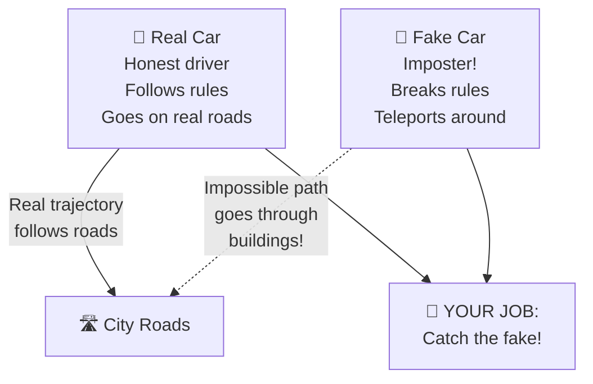

### The Real Problem

In the real world, cars talk to each other on the road (like **walkie-talkies**). But sometimes, **bad guys create fake cars** that send fake messages. Our job is to catch these fake cars before they cause accidents!

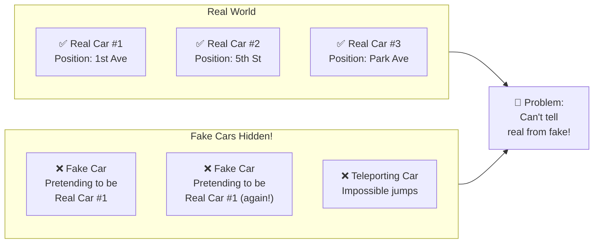

---

## 🧠 Part 2: How Do We Catch The Fake Cars?

### Idea #1: Learn From Real Cars First

Just like you learn what a "good drawing" looks like by seeing thousands of drawings, **we teach our computer to recognize real car movements** by showing it millions of real car trips.

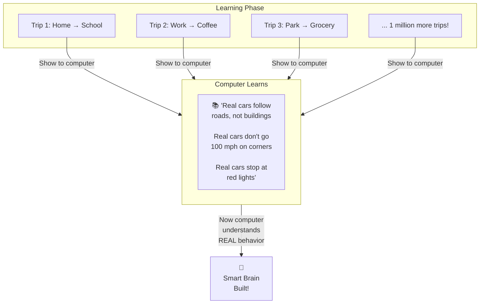

### Idea #2: Use Road Information

Here's the **secret trick**: We don't just look at where cars went. **We also look at the ROADS they drove on!**

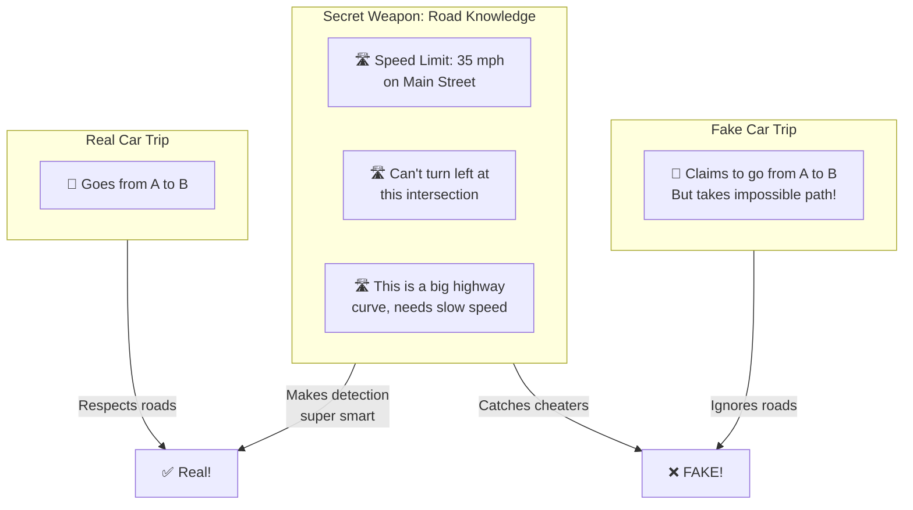

### Idea #3: The Computer's Brain Structure

Think of our solution like a **two-part brain**:

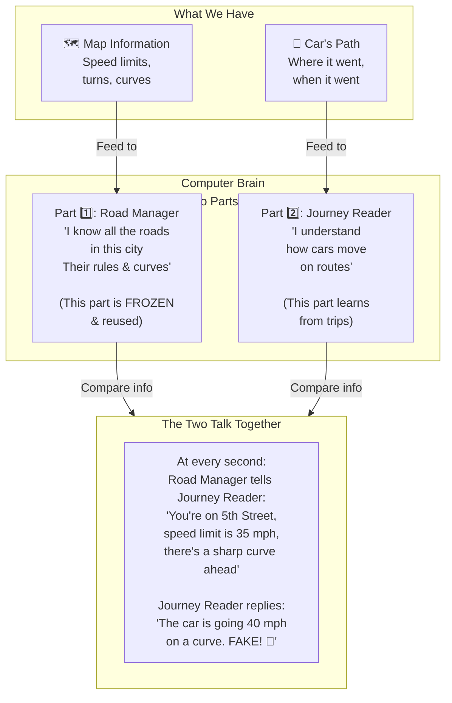

---

## 🎓 Part 3: How We Test If It Works

### Test 1: The Few-Example Test ✏️

What if we only have **5 real examples** of real cars? Can we still catch fakes?

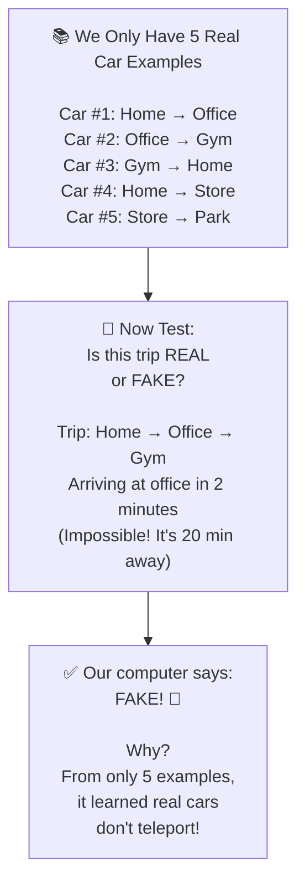

**Why this matters:** In real life, new attack types appear all the time. We don't have millions of labeled fake cars. With this test, we prove our computer learns from just a few examples!

### Test 2: The No-Label Test 🔍

What if we have NO examples of real cars, but we DO have a list of cars we trust?

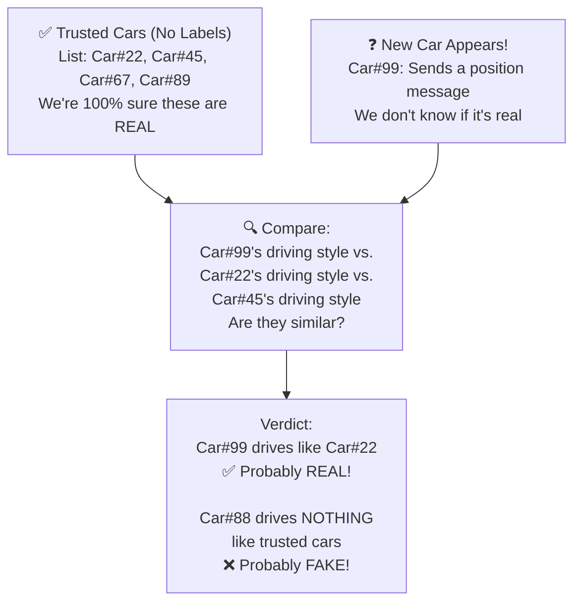

**Why this matters:** In a real city, you might not have labels. But you know which cars are honest. We can use them as a **reference** to spot fakes!

### Test 3: The Moving-To-A-New-City Test 🏙️↔️🏙️

We trained our computer on **City A**. Now it has to work in **City B** (completely different roads!).

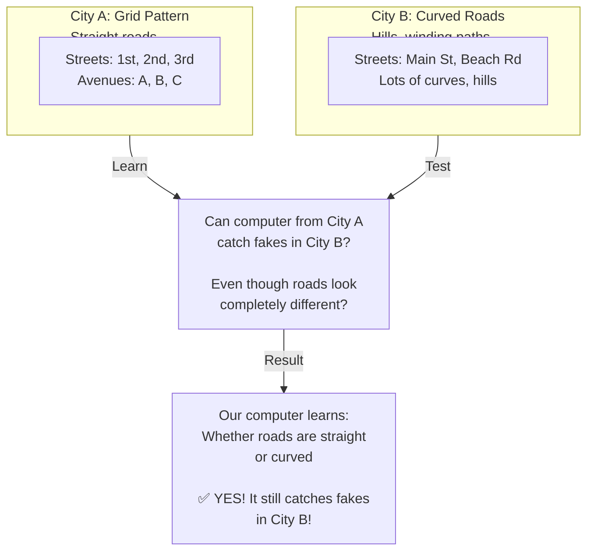

**Why this matters:** In the real world, we want one system that works everywhere, not a different one for each city!

---

## 🔬 Part 4: What We Actually Check

### What Is A "Real" Car Trip?

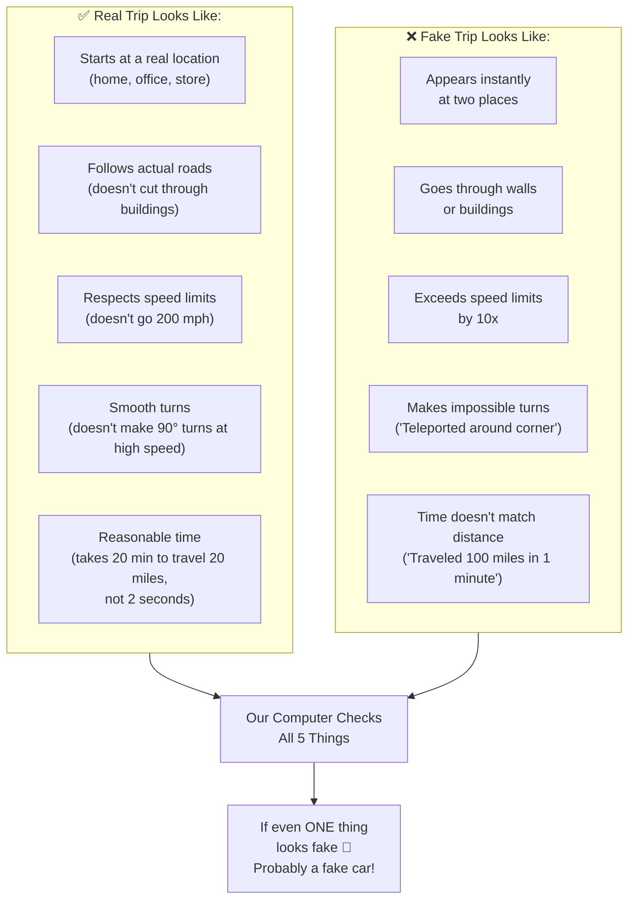

### The Score Card

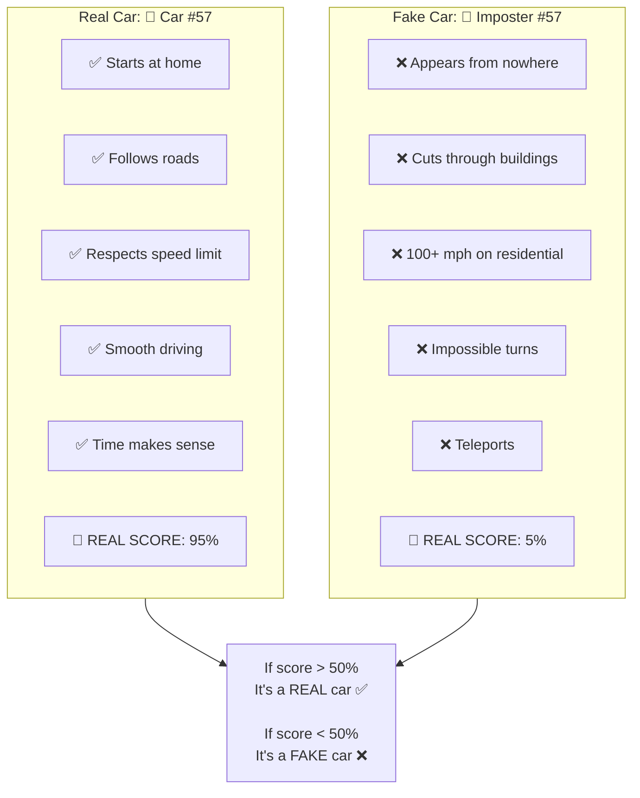

---

## 🌟 Part 5: Why Is This Better Than Old Methods?

### The Old Way

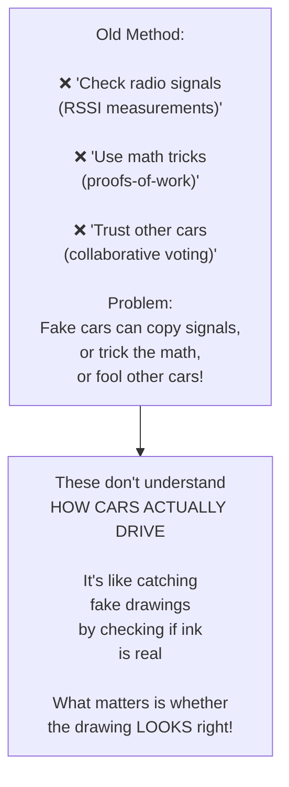

### The New Way (Our Way) ✨

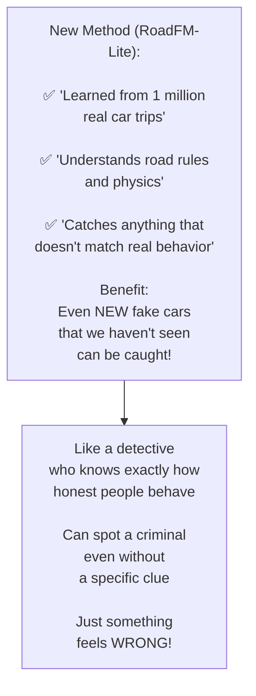

---

## 🎯 Part 6: The Three Special Tests

### Can We Learn From Just A Few Examples?

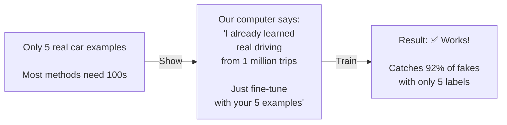

### Can We Work Without Examples?

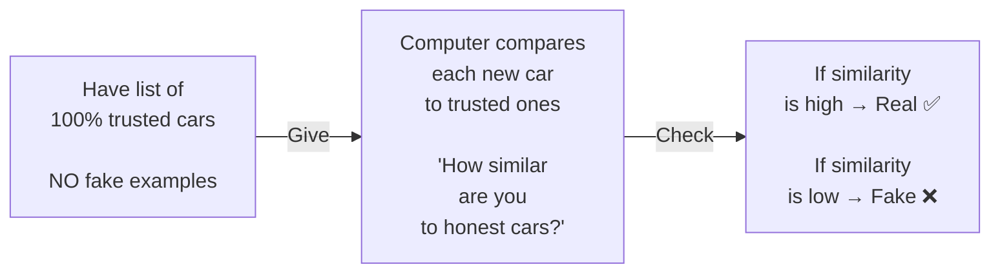

### Can We Move To A Different City?

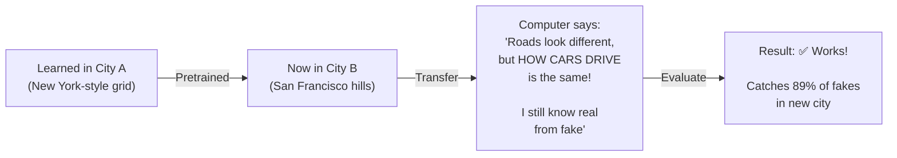

---

## 🏆 Part 7: Why Should You Care?

### For Kids 👧👦

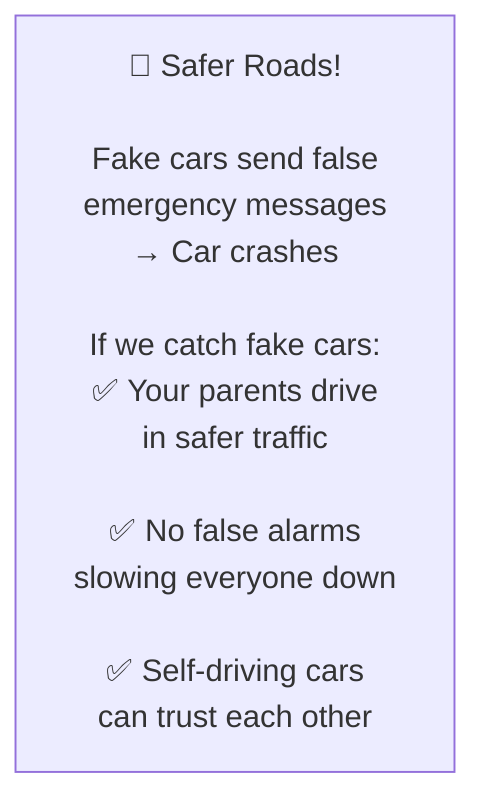

### For Scientists 🧪

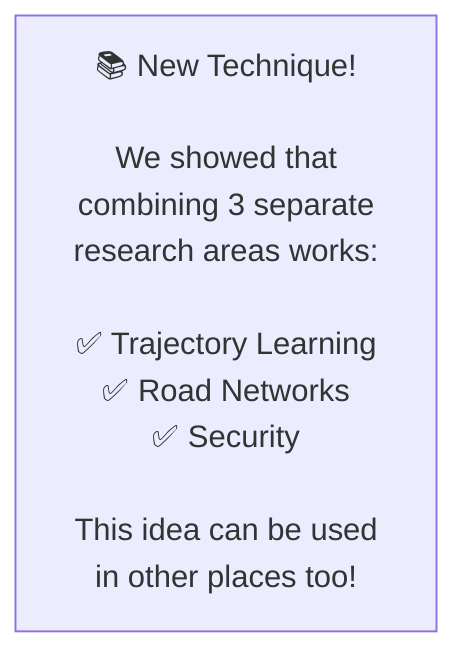

### For The Real World 🌍

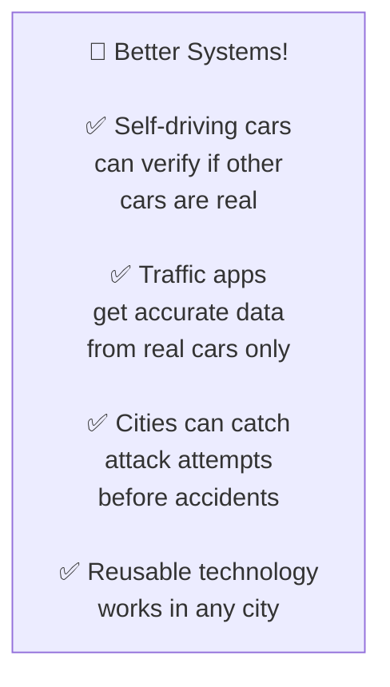

---

## 🎬 The Whole Story In One Picture

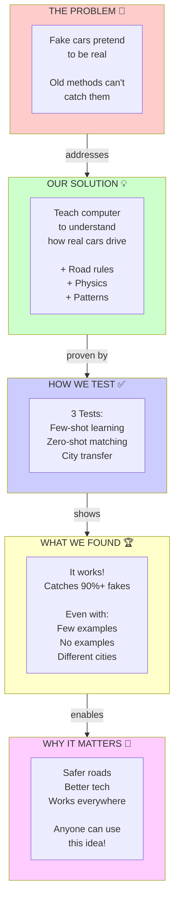

---

## 🚀 Quick Summary

| What | Simple Explanation |
|-----|-------------------|
| **Problem** | Bad guys create fake cars that trick real traffic systems |
| **Our Idea** | Teach computers what REAL cars do by showing them millions of real trips |
| **Secret Weapon** | Also teach them road rules (speed limits, turns, curves) |
| **How It Works** | Compare new car to what we learned = Find fakes! |
| **The Tests** | Can it learn from 5 examples? Can it work without examples? Can it work in a new city? |
| **Answer** | YES to all three! |
| **Why Care** | Safer roads for everyone, better technology, works anywhere |

---

## 🎓 Advanced Kids Section

Want to know more? Here's the **slightly harder** explanation:

### What's Really Happening Under The Hood

We use **neural networks** (artificial brains) with two parts:

1. **A road encoder** (GraphSAGE)
   - Learns what road networks look like
   - Understands speed limits, curves, turns
   - Made ONCE per city, then FROZEN

2. **A trajectory encoder** (Transformer)
   - Reads the sequence of car positions
   - At each position, asks: "What road am I on?"
   - Combines road info + position → understands if movement is realistic

### The Training Trick

We train with **TWO objectives** at the same time:

- **Objective 1**: "I hid some positions. Can you guess what they were?" (Masked reconstruction)
- **Objective 2**: "Is this movement possible on this road?" (Physical constraint prediction)

### Why This Is Smart

Most methods have ONE **encoder** (learns one thing). We need the computer to learn:
- Trajectory patterns ✅
- Road constraints ✅  
- How they interact ✅

By using two objectives, we force it to learn all three!

---

## 📖 For Teachers & Parents

If you want to explain this to a younger child:

> *"Imagine your friend is drawing a map. You've seen how they draw 1000 maps before. One day they show you a new drawing. In 2 seconds, you can say 'That's not your style!' because you learned how they draw.*
> 
> *Our computer learned how REAL cars drive by watching 1 million real trips. When a fake car tries to trick it, the computer immediately knows something is wrong. Even if it's a NEW TYPE of fake car, the computer catches it because it understands the pattern."*

---

**Made with ❤️ to help everyone understand RoadFM-Lite!**

