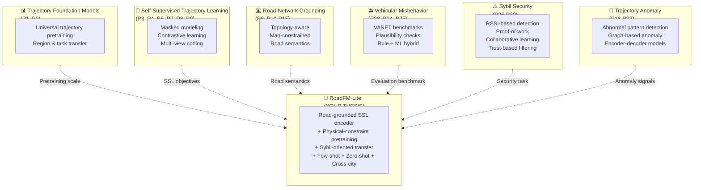
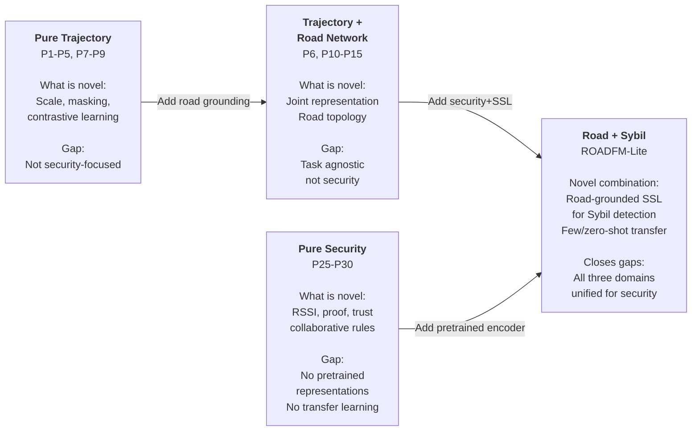

# Novelty Analysis For RoadFM-Lite

This document synthesizes what is already novel in the literature and where RoadFM-Lite can still claim defensible novelty.

## Visual: Problem Space & Literature Landscape

### The Three Domains And Their Intersection

### Where The Literature Clusters Live

## 1. What Prior Papers Are Already Novel For

| Cluster | Representative papers | What was novel there | Why it matters |
| --- | --- | --- | --- |
| Trajectory foundation models | P1, P2 | They scale pretraining and transfer beyond one city or one downstream task. | They prove that trajectory pretraining is worth doing, but they do not make Sybil detection the target problem. |
| Self-supervised trajectory learning | P3, P4, P5, P7, P8 | They show that masking, contrastive learning, and multi-view coding can learn useful trajectory embeddings without labels. | They are strong baselines for pretraining objectives, but most are still trajectory-first rather than road-physics-first. |
| Joint road-network and trajectory representation | P6, P10, P13, P14, P15 | They explicitly connect road topology with trajectories instead of treating movement as free-space coordinates. | This is the closest prior art family to your thesis and the main place where your novelty claim must be precise. |
| Robust road-network representation | P11, P12 | They improve road embeddings through dual-graph modeling and robustness objectives. | They strengthen the road encoder side, but do not close the loop with security-oriented trajectory transfer. |
| Map-constrained trajectory processing | P16, P17 | They show that road-constrained recovery and similarity learning materially improve trajectory reasoning. | They support your road-grounding premise, but they are not pretraining-for-security papers. |
| Trajectory anomaly detection | P18, P19, P20, P21, P22 | They detect abnormal motion patterns and sometimes exploit graph or road context. | They are relevant for anomaly modeling, but they usually target generic outliers rather than adversarial multi-identity fabrication. |
| Vehicular misbehavior benchmarks | P23, P24, P25 | They make misbehavior detection comparable and combine rule-based plausibility with ML. | They are critical for evaluation, but they still do not provide a pretrained road-grounded trajectory encoder. |
| Sybil-specific vehicular security | P26, P27, P28, P29, P30 | They introduce privacy-preserving, RSSI-based, proof-based, or collaborative learning strategies for Sybil detection. | They show the security problem is real and mature, but mostly avoid modern representation learning. |

## 2. What Is Not Novel Enough To Claim As Your Main Contribution

These points are already present in prior work and should not be the headline novelty claim by themselves:

1. Using a transformer on trajectories. P1-P5, P7-P9 already occupy that space.
2. Using self-supervision for trajectories. P3-P5 and P7 are already there.
3. Using road-network information in mobility learning. P6, P10-P17 already establish that road context helps.
4. Using VeReMi for vehicular misbehavior evaluation. P23-P25 already frame that benchmark space.
5. Claiming cross-region transfer in general. P1 and P2 already make broad transfer claims for foundation models.

If the thesis is pitched as "a transformer plus road features plus self-supervision," reviewers can reasonably say that the components are individually known.

## 3. Where RoadFM-Lite Still Has Defensible Novelty

RoadFM-Lite remains genuinely interesting if the thesis claim is framed around the combination and the target task:

| Novelty axis for RoadFM-Lite | Why it is still defensible | Closest priors |
| --- | --- | --- |
| Road-segment embeddings fused at every trajectory timestep for security-oriented transfer | Prior work joins roads and trajectories, but not clearly for Sybil detection under a dedicated security evaluation regime. | P6, P10, P13, P14 |
| Physical-constraint self-supervision tied to speed limits, curvature, and road semantics | Most SSL papers use masking, contrastive views, or entropy coding; very few use explicit road-physics plausibility as a pretext task. | P3, P5, P7 |
| Sybil detection as the downstream target for a pretrained trajectory encoder | Security papers usually use trust, RSSI, certificates, plausibility rules, or shallow ML rather than reusable pretrained encoders. | P25-P30 |
| Few-shot fine-tuning for Sybil detection | Few-shot evaluation is rare in vehicular Sybil papers and not standard in road-grounded trajectory learning papers. | Sparse across the list |
| Zero-shot retrieval against a memory bank of trusted normal trajectories | This retrieval framing is not a standard evaluation protocol in the Sybil papers I found. | Sparse across the list |
| Cross-city transfer specifically for attack detection | Foundation-model papers discuss region transfer, but security papers rarely test cross-city generalization for attacks. | P1, P2 |
| Frozen lightweight road encoder plus reusable backbone for downstream security | This is a strong engineering novelty if you show it is simpler and still competitive. | P10-P14 |

## 4. The Best Way To State The Thesis Novelty

Weak framing to avoid:

1. "This is the first work to use road networks in trajectory learning."
2. "This is the first self-supervised trajectory model for vehicles."
3. "This is the first ML approach to Sybil detection in VANETs."

Those claims are too easy to rebut with P3-P15 and P25-P30.

Stronger framing to use:

1. RoadFM-Lite is a road-network-grounded self-supervised trajectory encoder designed specifically for vehicular Sybil detection rather than generic mobility analytics.
2. Its pretraining objectives are physically grounded by road attributes and motion feasibility, not only by sequence masking or generic contrastive augmentation.
3. It evaluates representation transfer under few-shot supervision, zero-shot retrieval, and cross-city deployment, which is exactly where current Sybil papers are weakest.

## 5. Bottom-Line Novelty Assessment

The strongest novelty is not any single building block. It is the joint claim that:

1. road topology and road semantics are encoded explicitly,
2. trajectory kinematics are pretrained with physics-aware self-supervision,
3. the resulting encoder is evaluated as a reusable security backbone for Sybil detection,
4. the evaluation stresses label efficiency and cross-city transfer instead of only in-city supervised accuracy.

That is a defensible thesis contribution. The literature already covers the pieces, but not this exact combination in a security-first experimental design.
