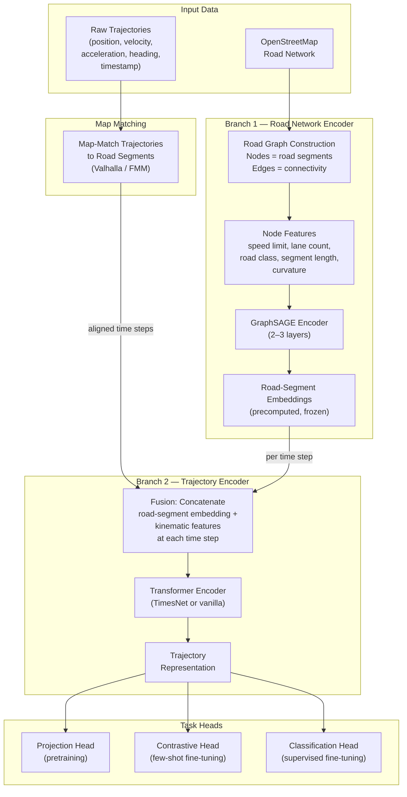

# RoadFM-Lite: A Self-Supervised Foundation Model for Road-Network-Grounded Trajectory Representation with Application to Sybil Attack Detection

---

**Florida Polytechnic University**
**Department of Computer Science**
**Proposal — Master's Thesis**

**Student:** Bibek Gupta
**Time Frame:** Fall 2025 – Spring 2026 (2 semesters)

**Advisor:**
_[Advisor Name]_

**Committee Member(s):**
_[Committee Member Names]_

---

## Abstract

Vehicular crowdsensing systems depend on participating vehicles to collect traffic and environmental data, but the economic incentive model that enables participation also invites Sybil attacks, in which a single adversary forges multiple fake identities to claim unearned rewards and inject corrupted data. Detecting fabricated trajectories is difficult because they can appear statistically plausible in coordinate space while violating physical road constraints that current trajectory models do not encode. Existing trajectory foundation models learn reusable motion representations through self-supervised pretraining but operate exclusively on raw coordinates, ignoring road-network topology, speed limits, and lane geometry. Conversely, the vehicular security literature relies on hand-crafted features, trust metrics, or shallow classifiers rather than pretrained encoders, and evaluation is limited to single-city, fully supervised settings.

This thesis proposes RoadFM-Lite, a self-supervised trajectory foundation model that grounds trajectory representations in road-network structure. The architecture consists of two branches: (1) a GraphSAGE road-network encoder that precomputes fixed embeddings per road segment encoding speed limits, lane counts, road classification, segment length, and curvature; and (2) a Transformer-based trajectory encoder that fuses these frozen road-segment embeddings with kinematic features (position, velocity, acceleration, heading) at each time step via concatenation. The model is pretrained with two complementary objectives: masked trajectory reconstruction (MTR), which teaches the encoder what normal road-conditioned motion looks like, and physical constraint prediction (PCP), which teaches it to recognize road-rule violations—directly targeting the signals that distinguish fabricated trajectories from legitimate ones.

The pretrained encoder is evaluated for Sybil detection on the VeReMi Extension benchmark under three paradigms: few-shot contrastive fine-tuning with $K \in \{5, 10, 20\}$ labeled examples per class using InfoNCE loss, zero-shot retrieval-based detection via a memory bank of verified normal embeddings with $k$-nearest-neighbor thresholding, and fully supervised classification as an upper-bound reference. Three baselines isolate the contribution of road grounding: a trajectory-only TimesNet encoder (identical architecture without road embeddings), a feature-engineered Random Forest classifier, and TrajFM (if feasible). Cross-city transfer experiments pretrain on one city and fine-tune on another, measuring transfer degradation to validate that road-grounded representations generalize across heterogeneous road networks. A seven-variant ablation study quantifies the contribution of road embeddings, MTR, PCP, and GraphSAGE depth.

The expected contributions are: (1) the first self-supervised trajectory encoder that jointly leverages road-network structure for vehicular Sybil detection; (2) the first few-shot, zero-shot, and cross-city transfer evaluation protocol for Sybil detection; and (3) publicly released pretrained weights, data-processing pipeline, and evaluation protocols as a reusable detection backbone for the vehicular security community.

---

## 1 Motivation

Vehicular crowdsensing (VCS) systems rely on networks of participating vehicles to collect traffic, environmental, and infrastructure data in exchange for monetary or service-based rewards [1]. The economic incentive model that makes VCS viable also makes it an attractive target for Sybil attacks, in which a single adversary forges multiple fake vehicle identities to claim unearned rewards and inject corrupted data into the sensing pool [2]. Because every fabricated identity appears as a legitimate participant, Sybil attacks degrade both the economic integrity and the data quality of the entire crowdsensing ecosystem. Detecting these attacks therefore requires methods that can reliably distinguish fabricated vehicle trajectories from legitimate ones.

### 1.1 Current Challenges

Several critical challenges hinder effective Sybil detection in vehicular crowdsensing:

- **Trajectory Plausibility:** Fabricated trajectories can be statistically plausible in raw coordinate space—matching realistic distributions of speed and heading—while being physically impossible on the actual road network (e.g., exceeding posted speed limits on residential segments, executing sharp turns on highway ramps, or transitioning between disconnected road segments) [3].

- **Label Scarcity:** In real-world deployments, labeled Sybil attack samples are scarce. New attack variants emerge faster than ground-truth labels can be curated, making fully supervised detection approaches impractical. Detection systems must learn effective decision boundaries from very few labeled examples.

- **Geographic Generalization:** A detector trained in one city may fail in another because it has memorized coordinate patterns rather than learning transferable concepts of vehicle behavior. Practical deployment demands models that generalize across heterogeneous road networks and traffic environments without retraining from scratch.

- **Representation Limitations:** Existing trajectory foundation models such as TrajFM [4] and UniTraj [5] treat trajectories as sequences of coordinates or point-of-interest tokens. They learn what is common in vehicle motion but largely ignore the physical road-network structure—topology, speed limits, lane counts, road classification—on which vehicles actually travel. This disconnect means that representations optimized for generic mobility tasks (similarity search, travel-time estimation) may not capture the physical constraint violations that are the most reliable signals for detecting fabricated trajectories.

- **Fragmented Research Landscape:** The relevant literature is mature in three separate domains—trajectory self-supervised learning, road-network representation learning, and vehicular security—but these domains have not been integrated. Security papers rely on trust metrics, RSSI measurements, location proofs, or shallow classifiers rather than reusable pretrained encoders [6, 7, 8]. Trajectory SSL papers optimize for generic downstream performance without targeting adversarial detection [9, 10]. Road-network papers prove that topology matters for mobility reasoning but are evaluated on similarity search or traffic modeling, not security tasks [11, 12].

### 1.2 Research Gap

The core research gap this thesis addresses is the absence of a pretrained trajectory encoder that jointly leverages road-network structure and trajectory kinematics for vehicular Sybil detection. Specifically, three integration gaps persist in the current literature:

1. **No road-grounded pretraining for security.** Trajectory foundation models learn reusable motion embeddings but do not incorporate physical road constraints as a pretraining signal. Road-network papers demonstrate that topology-aware representations improve mobility tasks but never evaluate them on adversarial identity detection. No existing work combines road-segment embeddings with self-supervised trajectory encoding and then fine-tunes for Sybil detection.

2. **No few-shot or zero-shot evaluation for Sybil detection.** Vehicular security papers typically assume sufficient labeled attack data or use hand-designed rules. Few-shot contrastive fine-tuning and zero-shot retrieval-based detection—standard evaluation paradigms in representation learning—remain unexplored in the Sybil detection domain.

3. **No cross-city transfer evaluation for attack detection.** Trajectory foundation models discuss region transfer for mobility tasks, but Sybil detection papers evaluate exclusively within a single simulated city. Whether road-grounded representations enable attack detectors to transfer across road networks and traffic environments has not been tested.

### 1.3 Central Hypothesis

Grounding trajectory representations in road-network features—by fusing precomputed road-segment embeddings (encoding topology, speed limits, lane counts, and road classification) with trajectory kinematics at every time step during self-supervised pretraining—produces embeddings that transfer more effectively to Sybil detection tasks than trajectory-only encoders. This advantage should be most pronounced in two settings where current methods are weakest: (1) few-shot supervision, where labeled attack examples are limited to 5–20 per class, and (2) cross-region deployment, where the detector must generalize to a city whose road network was not seen during pretraining.

The hypothesis rests on a concrete mechanistic claim: a model that knows "this vehicle is on a 25 mph residential street with one lane and a sharp curve" can more precisely judge whether observed kinematics are physically plausible than a model that only sees raw coordinates. Fabricated trajectories that survive coordinate-level plausibility checks—because they mimic aggregate speed and heading distributions—are more likely to violate road-segment-specific constraints that a road-grounded encoder has learned to detect.

### 1.4 Research Question

**Does a self-supervised model that jointly encodes road-network structure and trajectory kinematics produce representations that transfer more effectively to vehicular Sybil detection tasks than trajectory-only models, particularly under few-shot supervision and cross-region deployment?**

This question decomposes into four sub-questions:

1. Does fusing road-segment embeddings with trajectory kinematics during pretraining improve Sybil detection accuracy compared to a trajectory-only encoder trained with identical architecture and data?

2. Does road-network grounding improve label efficiency—i.e., does it require fewer labeled attack examples to reach a given detection performance threshold?

3. Does a road-grounded encoder pretrained on one city transfer more effectively to Sybil detection on a different city than a trajectory-only encoder?

4. Which components of the proposed approach contribute most to detection performance: the road-segment embeddings, the masked trajectory reconstruction objective, or the physical constraint prediction objective?

### 1.5 Practical Significance

The development of road-grounded trajectory representations for Sybil detection holds practical importance across several dimensions:

- **Deployment with Minimal Supervision:** Real-world vehicular security systems cannot wait for large labeled attack datasets before becoming operational. A pretrained encoder that supports few-shot fine-tuning enables rapid deployment against emerging attack variants with as few as 5–10 labeled examples.

- **Cross-Region Scalability:** Transportation agencies and crowdsensing platforms operate across multiple cities with diverse road networks and traffic patterns. A model that learns abstract road-conditioned concepts—"trajectory on highway" versus "trajectory on residential street"—rather than memorizing city-specific coordinates can scale across deployment regions without full retraining.

- **Lightweight Architecture:** By precomputing and freezing road-segment embeddings per city and pairing them with a lightweight Transformer-based trajectory encoder, the proposed architecture avoids the computational cost of joint end-to-end graph-sequence training. This makes the model practical for edge deployment in vehicular environments.

- **Open Infrastructure:** The pretrained encoder, data-processing pipeline, and evaluation protocols will be publicly released, providing a reusable detection backbone that can serve the broader vehicular security research community and integrate into federated defense frameworks such as Sybil Guard.

### 1.6 Scientific Context

This thesis sits at the intersection of three active research areas:

**Trajectory Foundation Models and Self-Supervised Learning.** Recent work has established that large-scale self-supervised pretraining on unlabeled trajectories produces transferable representations for downstream mobility tasks [4, 5]. Methods including masked trajectory reconstruction [9], contrastive learning [10], and multi-view entropy coding [13] learn useful embeddings without manual annotation. However, these approaches operate primarily in coordinate space and treat trajectories as free-form sequences disconnected from the physical infrastructure on which vehicles travel.

**Road-Network Representation Learning.** A parallel line of research encodes road-network topology and attributes into learned embeddings using graph neural networks [11, 12, 14]. Joint road-trajectory learning has been explored for similarity search [15], trajectory recovery [16], and traffic-state modeling [17], demonstrating that road context materially improves mobility reasoning. However, these works are task-agnostic with respect to security and have not been evaluated for adversarial detection.

**Vehicular Sybil Detection.** The vehicular security community has developed diverse Sybil detection methods including RSSI-based approaches [6], proof-of-work schemes [7], collaborative learning [8], pseudonym-based detection [18], and hybrid plausibility-ML classifiers [3]. The VeReMi benchmark [19] and its extension [20] provide standardized evaluation datasets. However, these approaches predominantly rely on hand-crafted features, trust metrics, or shallow classifiers rather than leveraging pretrained trajectory representations. Few-shot and cross-city evaluation paradigms have not been adopted.

This thesis proposes to bridge these three domains by building a self-supervised encoder that fuses road-network structure with trajectory kinematics during pretraining and evaluates the resulting representations specifically for Sybil detection under few-shot, zero-shot, and cross-city transfer settings.

## 2 Related Work

The proposed research builds upon and extends several key areas of recent work in trajectory representation learning, road-network modeling, and vehicular security. This section organizes the relevant literature into thematic categories and discusses their relationships to our proposed approach.

### 2.1 Trajectory Foundation Models

Recent work has demonstrated that large-scale pretraining on unlabeled trajectory data produces transferable representations across multiple downstream mobility tasks. TrajFM [4] proposes a vehicle trajectory foundation model targeting region and task transferability, demonstrating that a single pretrained encoder can serve code generation, trajectory prediction, and travel-time estimation across different geographic regions. UniTraj [5] scales this paradigm to billion-scale worldwide traces, achieving universal trajectory transfer by pretraining on the WorldTrace corpus. These foundation models establish that trajectory pretraining is viable and beneficial, but they treat trajectories as sequences of coordinates or point-of-interest tokens without explicitly encoding the physical road infrastructure on which vehicles travel. Their downstream evaluations focus on generic mobility tasks—similarity search, travel-time estimation, trajectory prediction—rather than adversarial security tasks such as Sybil detection.

### 2.2 Self-Supervised Trajectory Learning

Self-supervised learning (SSL) methods for trajectories have matured rapidly, offering diverse pretraining objectives that learn useful motion representations without manual annotation.

**Masked Modeling.** START [9] combines masked trajectory reconstruction with travel-semantics objectives, learning to reconstruct masked time steps while preserving high-level trip semantics. Multi-scale spatio-temporal feature exploration [21] extends masked pretraining by capturing trajectory patterns at multiple spatial and temporal granularities.

**Contrastive Learning.** Large-scale contrastive SSL [10] demonstrates that contrastive pretraining on GPS trajectories produces embeddings that transfer effectively to trajectory classification and clustering. Geography-aware Siamese Transformers [22] inject geographic context into contrastive objectives, producing embeddings that respect spatial structure.

**Multi-View Coding.** MMTEC [13] introduces maximum multi-view entropy coding for trajectory pretraining, learning general-purpose embeddings by maximizing information captured across multiple trajectory views. RED [23] broadens trajectory representations by injecting comprehensive contextual information beyond standard coordinate-only encoders.

These SSL methods learn what is common and predictable in vehicle motion, but they operate primarily in coordinate space. None of them incorporates physical road constraints—speed limits, lane counts, road classification, or segment curvature—as first-class pretraining signals. A fabricated trajectory can be statistically plausible in coordinate space while being physically impossible on the road network, a distinction these methods are not designed to capture.

### 2.3 Road-Network Representation Learning

A parallel line of research focuses on encoding road-network topology and attributes into learned embeddings using graph neural networks.

**Road-Only Representations.** Dual-graph road-network representation learning [24] models complementary structural relations within road networks using a dual-graph formulation. Robust road-network representation learning [25] addresses structural noise and perturbation, producing embeddings that are resilient to missing or noisy topology data. Road-network representation learning from vehicle trajectories [26] learns road embeddings directly from observed traffic patterns rather than from topology alone.

**Joint Road-Trajectory Representations.** Several recent works jointly learn road-network and trajectory representations. Jointly contrastive representation learning on road networks and trajectories [11] contrasts road-network and trajectory views so that topology and motion reinforce each other during representation learning. UniTR [14] proposes a unified framework for joint representation learning of trajectories and road networks, treating them as a single optimization problem rather than separate pipelines. Dynamic road-network and trajectory representation learning [17] bridges traffic-state signals with trajectory data, producing road representations that are traffic-aware rather than purely structural. Trajectory representation learning based on road-network partition [27] uses road-network partitioning to make trajectory similarity learning more locality-aware.

**Road-Constrained Trajectory Processing.** MTrajRec [16] recovers sparse trajectories under explicit map constraints using sequence-to-sequence multi-task learning, demonstrating that road-constrained processing materially improves trajectory reconstruction quality. ST2Vec [15] learns fine-grained spatio-temporal similarity directly on road-network-constrained trajectories.

These works establish that road context improves mobility reasoning. However, they are evaluated on task-agnostic benchmarks—similarity search, trajectory recovery, traffic-state modeling—rather than on security-oriented tasks. No existing road-trajectory representation learning paper evaluates its embeddings for adversarial identity detection or Sybil attack classification.

### 2.4 Trajectory Anomaly Detection

Anomaly detection on trajectories is a related but distinct problem from Sybil detection. Graph contrastive SSL for anomalous sub-trajectory detection [28] detects anomalous sub-trajectories rather than only whole-trajectory outliers by exploiting graph-based contrastive learning. Vehicle anomalous trajectory detection based on road-network partition [29] injects localized road-network partition context into anomaly detection. Deep encoder-decoder models [30] use spatio-temporal context to model normal driving behavior and flag deviations. Deep learning detection of anomalous patterns from bus trajectories [31] applies sequence modeling to anomalous bus trajectory patterns. Coupled IGMM-GANs [32] use generative models to learn normal mobility distributions and flag anomalous movements.

These methods detect generic statistical outliers—unusual routes, abnormal speeds, unexpected stops—but they are not designed for adversarial multi-identity attacks. Sybil trajectories are not random anomalies; they are strategically fabricated to appear plausible enough to evade detection. A generic anomaly detector may either miss carefully fabricated attacks that mimic normal trajectory distributions or over-flag rare but legitimate trajectories. Furthermore, anomaly detection papers rarely evaluate under few-shot or cross-city transfer settings, which are the most practically relevant scenarios for Sybil defense.

### 2.5 Vehicular Sybil Detection

The vehicular security community has developed diverse approaches to Sybil detection in vehicular ad-hoc networks (VANETs) and crowdsensing systems.

**Benchmarks.** The VeReMi dataset [19] establishes the first widely reused comparable benchmark for VANET misbehavior detection, providing standardized attack scenarios and evaluation protocols. The VeReMi Extension [20] broadens attack coverage and evaluation settings, making it the standard reference dataset for vehicular misbehavior research.

**Rule-Based and Hybrid Methods.** Integrating plausibility checks with machine learning [3] combines rule-based plausibility verification with ML classifiers, demonstrating that hybrid approaches outperform either family alone on the VeReMi benchmark.

**Identity and Signal-Based Methods.** P2DAP [18] introduces a privacy-preserving pseudonym-linking approach for Sybil detection without full identity disclosure. Multi-channel RSSI-based Sybil detection [6] exploits inconsistencies across received signal strength indicator channels to expose Sybil identities. Proof-of-work combined with location consistency [7] makes forged multi-identity attacks more expensive and easier to detect by requiring computational work and spatial plausibility.

**Learning-Based Methods.** Collaborative learning-based Sybil detection [8] uses distributed vehicular observations rather than isolated local decision rules. Recent elimination methods [33] offer stronger security framing than classic trust-only schemes by combining multiple detection signals.

Despite the maturity of this literature, several limitations persist. First, these methods predominantly rely on hand-crafted features, trust metrics, RSSI measurements, or shallow classifiers rather than leveraging reusable pretrained trajectory encoders. Second, they assume sufficient labeled attack data for training, neglecting the practical reality that new attack variants emerge with very few labeled samples. Third, evaluation is almost exclusively conducted within a single simulated city, leaving cross-city generalization untested. Fourth, physical road-network features—speed limits, lane counts, road classification, segment curvature—are not exploited as first-class detection signals.

### 2.6 Few-Shot and Contrastive Learning

Few-shot learning and contrastive pretraining have become standard tools in representation learning for enabling data-efficient adaptation to new tasks. Supervised contrastive losses such as InfoNCE learn discriminative embeddings that cluster same-class examples while separating different classes in the embedding space. When combined with self-supervised pretraining, contrastive fine-tuning enables effective decision boundaries from as few as 5–20 labeled examples per class—a paradigm that is well-established in computer vision and natural language processing but has not been applied to vehicular Sybil detection.

Zero-shot retrieval-based detection—maintaining a memory bank of verified normal embeddings and flagging incoming samples whose nearest-neighbor distance exceeds a threshold—is similarly standard in anomaly detection and one-class classification but absent from the vehicular security literature. These evaluation paradigms are directly relevant to Sybil detection, where labeled attack data is scarce and new attack variants appear rapidly.

### 2.7 Research Gaps

Our analysis of the literature reveals several key gaps that this thesis aims to address:

1. **Integration Gap:** No existing work combines road-network-grounded self-supervised trajectory pretraining with Sybil detection as the primary downstream task. Trajectory SSL papers optimize for generic mobility tasks. Road-trajectory papers prove that topology helps but evaluate on similarity search and traffic modeling. Security papers use trust, RSSI, and shallow classifiers rather than pretrained encoders. The three domains remain fragmented.

2. **Physical Constraint Gap:** Physical feasibility based on road attributes—speed limits, curvature, lane counts—is underused as a self-supervised pretraining signal. Existing SSL papers emphasize masked reconstruction or contrastive consistency but do not explicitly train models to recognize road-rule violations, which are precisely the signals that distinguish fabricated trajectories from legitimate ones.

3. **Label Efficiency Gap:** Vehicular Sybil detection papers assume sufficient labeled attack data or rely on rule-based heuristics. Few-shot contrastive fine-tuning and zero-shot retrieval-based detection are not standard evaluation paradigms in this domain, despite being the most practically relevant settings for deployable security systems.

4. **Transfer Gap:** Trajectory foundation models discuss region transfer for mobility tasks, but Sybil detection papers evaluate exclusively within a single simulated city. Whether road-grounded representations enable attack detectors to generalize across road networks and traffic environments has not been tested.

5. **Dataset Bridge Gap:** Mobility pretraining datasets (NGSIM, HighD, OpenDD) and attack evaluation datasets (VeReMi Extension) exist in separate communities with no standard benchmark that combines rich road semantics with labeled Sybil identities. The transfer bridge itself—pretrain on unlabeled real-world mobility data, fine-tune on simulated attack data—is an open problem.

### 2.8 Our Contribution

This thesis aims to address the identified research gaps through several contributions. At its core, we propose RoadFM-Lite, a self-supervised trajectory encoder that fuses precomputed road-segment embeddings with trajectory kinematics at every time step, grounding motion representations in the physical road infrastructure. The model is pretrained with two complementary objectives: masked trajectory reconstruction and physical constraint prediction based on road-segment attributes. Unlike prior road-trajectory learning papers, RoadFM-Lite is evaluated specifically for Sybil detection rather than generic mobility analytics.

We introduce few-shot contrastive fine-tuning and zero-shot retrieval-based detection as evaluation paradigms for vehicular Sybil detection, demonstrating that road-grounded representations require fewer labeled attack samples to learn effective decision boundaries. We conduct cross-city transfer experiments—pretraining on one city and fine-tuning on another—to validate that road-grounded representations generalize across heterogeneous road networks and traffic environments.

Finally, the architecture is designed for lightweight deployment: road-segment embeddings are precomputed and frozen per city using a GraphSAGE encoder, while the trajectory encoder remains a standard Transformer backbone. This separation avoids the computational cost of joint end-to-end graph-sequence training and enables city-specific precomputation with minimal overhead. The pretrained encoder, data-processing pipeline, and evaluation protocols will be publicly released as a reusable detection backbone for the vehicular security community.

## 3 Proposed Architecture

The implementation of RoadFM-Lite follows a systematic approach combining graph-based road-network encoding with sequence-based trajectory modeling. The architecture is structured as a two-branch system fused into a unified trajectory representation, designed for self-supervised pretraining followed by downstream Sybil detection.

### 3.1 Architectural Overview

RoadFM-Lite consists of three principal components: (1) a road-network encoder that produces fixed embeddings per road segment, (2) a trajectory encoder that processes time-series kinematic data fused with road-segment embeddings, and (3) task-specific heads that are swapped depending on the training phase. The overall data flow is illustrated below.

### 3.2 Branch 1: Road Network Encoder

The road network for each target city is extracted from OpenStreetMap and represented as a directed graph $G = (V, E)$, where nodes $v \in V$ correspond to road segments and edges $e \in E$ represent topological connectivity between adjacent segments.

**Node Features.** Each node $v$ is associated with a feature vector $\mathbf{x}_v \in \mathbb{R}^d$ encoding five physical attributes of the road segment:

| Feature | Description | Source |
|---------|-------------|--------|
| Speed limit | Posted maximum speed (km/h or mph) | OSM `maxspeed` tag |
| Lane count | Number of travel lanes | OSM `lanes` tag |
| Road class | Categorical: residential, tertiary, secondary, primary, trunk, motorway | OSM `highway` tag |
| Segment length | Physical length of the road segment (meters) | OSM geometry |
| Curvature | Average curvature computed from segment geometry | Derived from OSM polyline |

Road class is encoded as a learnable embedding vector and concatenated with the scalar features to form the input node representation.

**Encoder Architecture.** A 2–3 layer GraphSAGE encoder [34] processes the road graph, producing a fixed-dimensional embedding $\mathbf{r}_v \in \mathbb{R}^{d_r}$ for each road segment $v$. At each layer $l$, the representation of node $v$ is updated by aggregating information from its neighborhood $\mathcal{N}(v)$:

$$\mathbf{h}_v^{(l)} = \sigma\left(\mathbf{W}^{(l)} \cdot \text{CONCAT}\left(\mathbf{h}_v^{(l-1)},\ \text{AGG}\left(\left\{\mathbf{h}_u^{(l-1)} : u \in \mathcal{N}(v)\right\}\right)\right)\right)$$

where $\text{AGG}$ is a mean aggregator, $\mathbf{W}^{(l)}$ is a learnable weight matrix, and $\sigma$ is a ReLU activation. The final-layer output $\mathbf{h}_v^{(L)} = \mathbf{r}_v$ serves as the road-segment embedding.

**Precomputation and Freezing.** Road-segment embeddings are trained once per city using a self-supervised link prediction or node feature reconstruction objective on the road graph alone. After training, the embeddings are precomputed for all road segments in the city and frozen during trajectory encoder training. This design choice has three advantages:

1. It avoids the computational cost and gradient instability of joint end-to-end graph-sequence training.
2. It enables city-specific road embeddings to be prepared offline and reused across all trajectory training runs.
3. It keeps the trajectory encoder lightweight and suitable for edge deployment.

### 3.3 Branch 2: Trajectory Encoder

Each vehicle trajectory is a time series of $T$ observations: $\mathbf{S} = \{(\mathbf{k}_t, s_t)\}_{t=1}^{T}$, where $\mathbf{k}_t$ is the kinematic feature vector at time step $t$ and $s_t$ is the identifier of the map-matched road segment at that time step.

**Kinematic Features.** At each time step $t$, the kinematic feature vector $\mathbf{k}_t \in \mathbb{R}^{d_k}$ consists of:

- **Position:** Longitude and latitude (or projected x, y coordinates)
- **Velocity:** Instantaneous speed (m/s)
- **Acceleration:** Rate of speed change (m/s²)
- **Heading:** Direction of travel (radians)
- **Timestamp:** Time elapsed since trajectory start (seconds)

**Fusion Mechanism.** At each time step $t$, the frozen road-segment embedding $\mathbf{r}_{s_t}$ corresponding to the map-matched segment $s_t$ is concatenated with the kinematic feature vector $\mathbf{k}_t$ to produce the input token:

$$\mathbf{z}_t = \text{CONCAT}(\mathbf{k}_t,\ \mathbf{r}_{s_t}) \in \mathbb{R}^{d_k + d_r}$$

This fusion ensures that at every time step, the encoder has access to the physical context of the road the vehicle is currently traveling on. For example, the model can distinguish a vehicle reporting 70 mph on a highway segment (normal) from a vehicle reporting 70 mph on a 25 mph residential street (anomalous).

**Encoder Architecture.** The fused token sequence $\{\mathbf{z}_1, \mathbf{z}_2, \ldots, \mathbf{z}_T\}$ is processed by a Transformer-based encoder. We consider two candidate architectures:

1. **Vanilla Transformer Encoder:** A standard multi-head self-attention encoder with sinusoidal positional encoding, offering simplicity and well-understood training dynamics.
2. **TimesNet:** A time-series-specific Transformer variant that captures multi-period temporal patterns through adaptive Fourier decomposition, potentially better suited to the periodic and multi-scale nature of vehicular motion.

The encoder produces a sequence of contextualized representations $\{\mathbf{h}_1, \mathbf{h}_2, \ldots, \mathbf{h}_T\}$. A trajectory-level representation $\mathbf{h}_{\text{traj}}$ is obtained via mean pooling over all time steps:

$$\mathbf{h}_{\text{traj}} = \frac{1}{T}\sum_{t=1}^{T} \mathbf{h}_t$$

### 3.4 Integration Strategy

The integration of the two branches follows a modular design that separates concerns between spatial infrastructure knowledge and temporal motion modeling:

- **Standardized Interfaces:** The road encoder outputs fixed-dimensional embeddings that serve as a plug-in input to the trajectory encoder. Any graph encoder that produces per-segment embeddings can replace GraphSAGE without modifying the trajectory pipeline.
- **City-Level Modularity:** Each city has its own set of precomputed road-segment embeddings. Deploying RoadFM-Lite in a new city requires only running the road encoder on the new city's OSM graph; the trajectory encoder weights transfer without modification.
- **Decoupled Training:** The road encoder and trajectory encoder are trained separately. This enables independent iteration on either component and makes ablation studies straightforward (e.g., removing road embeddings to measure their contribution).

## 4 Pretraining Objectives

The trajectory encoder is pretrained on large volumes of unlabeled trajectory data using two complementary self-supervised objectives. Both objectives operate on the fused input tokens $\{\mathbf{z}_t\}$ and share the same Transformer backbone. The total pretraining loss is a weighted sum:

$$\mathcal{L}_{\text{pretrain}} = \lambda_1 \cdot \mathcal{L}_{\text{MTR}} + \lambda_2 \cdot \mathcal{L}_{\text{PCP}}$$

where $\lambda_1$ and $\lambda_2$ are hyperparameters controlling the relative contribution of each objective.

### 4.1 Masked Trajectory Reconstruction (MTR)

Inspired by masked language modeling in NLP and masked trajectory pretraining in START [9], this objective randomly masks 15% of time steps in each trajectory and trains the encoder to reconstruct the kinematic features at the masked locations.

**Masking Procedure.** For each training trajectory $\mathbf{S} = \{(\mathbf{k}_t, s_t)\}_{t=1}^{T}$, a random subset $\mathcal{M} \subset \{1, \ldots, T\}$ with $|\mathcal{M}| = \lfloor 0.15 \cdot T \rfloor$ is selected. At masked positions, the kinematic features $\mathbf{k}_t$ are replaced with a learnable [MASK] token while the road-segment embedding $\mathbf{r}_{s_t}$ is retained. This forces the model to use road context and surrounding trajectory dynamics to infer the missing motion.

**Reconstruction Target.** The encoder predicts position and velocity at masked positions through a linear projection head:

$$\hat{\mathbf{k}}_t = \mathbf{W}_{\text{rec}} \cdot \mathbf{h}_t + \mathbf{b}_{\text{rec}} \quad \forall\, t \in \mathcal{M}$$

The reconstruction loss is the mean squared error over all masked time steps:

$$\mathcal{L}_{\text{MTR}} = \frac{1}{|\mathcal{M}|} \sum_{t \in \mathcal{M}} \left\| \hat{\mathbf{k}}_t - \mathbf{k}_t \right\|_2^2$$

**Role of Road Grounding.** The road-segment embeddings at masked positions provide context about what motion is physically plausible on each segment. For instance, when a time step on a highway ramp is masked, the road embedding encodes the speed limit, curvature, and road class of that ramp, constraining the space of plausible reconstructions. This forces the model to learn road-conditioned dynamics rather than memorizing coordinate patterns.

### 4.2 Physical Constraint Prediction (PCP)

This objective trains the encoder to predict whether each trajectory time step violates the physical constraints of its road segment. Unlike masked reconstruction, which learns what trajectories typically look like, physical constraint prediction learns what trajectories should not look like—directly targeting the signals that distinguish fabricated from legitimate motion.

**Automatic Label Generation.** Binary violation labels $y_t \in \{0, 1\}$ are generated automatically for each time step by comparing observed kinematic values against road-segment attributes. No manual annotation is required. A time step $t$ is labeled as a violation ($y_t = 1$) if any of the following conditions hold:

1. **Speed Violation:** Observed speed exceeds the posted speed limit of road segment $s_t$ by a tolerance margin $\epsilon_v$:

$$v_t > v_{\text{limit}}(s_t) + \epsilon_v$$

2. **Acceleration Violation:** Observed lateral acceleration is inconsistent with the curvature of road segment $s_t$, i.e., the vehicle is moving too fast for the curve:

$$a_{\text{lat}, t} > a_{\text{max}}(\kappa_{s_t})$$

where $\kappa_{s_t}$ is the curvature of segment $s_t$ and $a_{\text{max}}(\cdot)$ is the maximum safe lateral acceleration as a function of curvature.

3. **Segment Transition Violation:** The vehicle transitions between road segments $s_{t-1}$ and $s_t$ that are not topologically connected in the road graph:

$$(s_{t-1}, s_t) \notin E$$

**Prediction Head.** A binary classification head predicts the violation probability at each time step:

$$\hat{y}_t = \sigma(\mathbf{w}_{\text{pcp}}^\top \cdot \mathbf{h}_t + b_{\text{pcp}})$$

The physical constraint prediction loss is the binary cross-entropy over all time steps:

$$\mathcal{L}_{\text{PCP}} = -\frac{1}{T}\sum_{t=1}^{T}\left[y_t \log \hat{y}_t + (1 - y_t) \log(1 - \hat{y}_t)\right]$$

**Complementarity with MTR.** The two pretraining objectives are complementary: MTR teaches the encoder what normal road-conditioned motion looks like by reconstructing masked kinematic features, while PCP teaches the encoder what physically impossible motion looks like by predicting road-rule violations. Together, they produce representations that encode both the typical dynamics and the physical boundaries of vehicle motion on each road segment.

## 5 Downstream Task: Sybil Detection

After pretraining, the projection heads used for MTR and PCP are discarded, and the pretrained Transformer backbone is repurposed for Sybil trajectory detection. The encoder is evaluated on the VeReMi Extension dataset [20] under two complementary detection paradigms.

### 5.1 Few-Shot Contrastive Fine-Tuning

In real-world deployments, labeled Sybil attack samples are scarce. Few-shot contrastive fine-tuning evaluates whether the pretrained encoder can learn an effective detection boundary from very few labeled examples.

**Setup.** The projection head is replaced with a contrastive/classification head. A small support set of $K$ labeled examples per class (benign and each attack type) is sampled from the VeReMi Extension training split, with $K \in \{5, 10, 20\}$.

**Supervised Contrastive Loss.** Fine-tuning uses the InfoNCE loss [35] to pull same-class trajectory embeddings together while pushing different-class embeddings apart:

$$\mathcal{L}_{\text{InfoNCE}} = -\frac{1}{|B|}\sum_{i \in B} \log \frac{\exp(\text{sim}(\mathbf{h}_i, \mathbf{h}_{j^+}) / \tau)}{\sum_{j \in B \setminus \{i\}} \exp(\text{sim}(\mathbf{h}_i, \mathbf{h}_j) / \tau)}$$

where $B$ is the mini-batch, $j^+$ is a positive example from the same class as $i$, $\text{sim}(\cdot, \cdot)$ is cosine similarity, and $\tau$ is a temperature parameter.

**Evaluation.** After fine-tuning, a nearest-centroid or linear classifier is applied to the learned embeddings. Detection performance is reported as precision, recall, F1-score, and AUROC across all VeReMi attack types. The key metric is detection performance as a function of $K$, measuring how quickly the model reaches acceptable performance with increasing labeled data.

### 5.2 Zero-Shot Retrieval-Based Detection

Zero-shot retrieval evaluates whether the pretrained encoder can detect Sybil trajectories without any labeled attack data, using only verified normal trajectories as a reference.

**Memory Bank Construction.** A memory bank $\mathcal{M}_{\text{normal}}$ is populated with trajectory embeddings from a set of verified benign trajectories. These embeddings are computed by the pretrained encoder without any fine-tuning.

**Detection Protocol.** For each incoming test trajectory with embedding $\mathbf{h}_{\text{test}}$, the distance to its $k$-nearest neighbors in $\mathcal{M}_{\text{normal}}$ is computed:

$$d(\mathbf{h}_{\text{test}}) = \frac{1}{k}\sum_{j=1}^{k} \left\| \mathbf{h}_{\text{test}} - \mathbf{h}_{(j)} \right\|_2$$

where $\mathbf{h}_{(j)}$ is the $j$-th nearest neighbor in the memory bank. A trajectory is flagged as potentially Sybil if $d(\mathbf{h}_{\text{test}}) > \delta$, where $\delta$ is a detection threshold calibrated on a small validation set.

**Role of Road Grounding.** Road grounding is expected to reduce false positives in zero-shot detection by helping the encoder distinguish "unusual but physically valid routes" (e.g., a legitimate driver taking an uncommon detour on valid roads) from "physically impossible trajectories" (e.g., a fabricated trajectory that transitions between disconnected road segments or exceeds speed limits on residential streets). Without road grounding, both cases may appear equally distant from the normal memory bank.

### 5.3 Classification Fine-Tuning

As a supplementary evaluation, the pretrained encoder is fine-tuned with a standard cross-entropy classification head using the full VeReMi Extension training set. This fully supervised setting serves as an upper-bound reference for comparison with the few-shot and zero-shot paradigms and provides a direct comparison point against baseline methods that also use full supervision.

## 6 Baselines

The proposed model will be compared against three baselines specifically chosen to isolate the contribution of road-network grounding. All baselines are trained and evaluated under identical data splits, preprocessing pipelines, and evaluation protocols to ensure fair comparison.

### 6.1 Baseline 1: TimesNet (Trajectory-Only)

This is the primary ablation baseline and the most important comparison. The TimesNet trajectory-only encoder uses the exact same Transformer architecture, hyperparameters, and pretraining objectives (MTR + PCP) as RoadFM-Lite, but without road-segment embeddings. At each time step, the input token consists solely of the kinematic feature vector $\mathbf{k}_t$ rather than the fused vector $\mathbf{z}_t = \text{CONCAT}(\mathbf{k}_t, \mathbf{r}_{s_t})$.

This controlled comparison directly answers the core research question: if RoadFM-Lite outperforms this baseline, the improvement is attributable to road-network grounding rather than to differences in architecture, data, or training procedure.

| Component | RoadFM-Lite | TimesNet (Trajectory-Only) |
|-----------|-------------|---------------------------|
| Encoder architecture | Transformer (same) | Transformer (same) |
| Kinematic features | Yes | Yes |
| Road-segment embeddings | Yes (frozen) | **No** |
| Pretraining objectives | MTR + PCP | MTR + PCP* |
| Pretraining data | Same splits | Same splits |

\* PCP labels for the trajectory-only baseline are generated using the same road-attribute rules but are not accompanied by road-segment embeddings in the input, testing whether the encoder can learn constraint detection from kinematics alone.

### 6.2 Baseline 2: Feature Engineering + Random Forest

This baseline represents the traditional machine learning approach to trajectory-based detection. Hand-crafted trajectory features are extracted from each trajectory and fed into a Random Forest classifier. The feature set includes:

- **Speed statistics:** Mean, standard deviation, maximum, and minimum speed
- **Acceleration statistics:** Mean, standard deviation, maximum, and minimum acceleration
- **Heading statistics:** Heading change rate, mean absolute heading change
- **Route deviation:** Average distance from the trajectory to the expected route
- **Duration and distance:** Total trip time, total distance traveled
- **Stop frequency:** Number and duration of stops

This baseline serves two purposes: (1) it provides a reference for the performance achievable without any deep learning or pretraining, and (2) it represents the class of methods most commonly used in existing vehicular security papers [3, 25].

### 6.3 Baseline 3: TrajFM (If Feasible)

If computational resources and code availability permit, an adapted TrajFM-style model [4] will be trained on the same data for direct comparison with a published trajectory foundation model. TrajFM represents the state of the art in trajectory pretraining for region transfer but does not incorporate road-network grounding. This comparison isolates the benefit of road-network features against a strong foundation-model baseline that already captures region-transferable trajectory patterns.

If TrajFM adaptation proves infeasible within the thesis timeline, this baseline will be replaced with a discussion of how RoadFM-Lite's design differs from TrajFM's architecture, supported by the trajectory-only TimesNet comparison as the primary controlled ablation.

## 7 Evaluation Plan

The evaluation methodology is designed to rigorously assess RoadFM-Lite across four dimensions: detection quality, label efficiency, cross-city transferability, and component contribution. Each dimension corresponds to one of the four sub-questions defined in Section 1.4.

### 7.1 Detection Metrics

All detection experiments report the following metrics on the VeReMi Extension test set:

| Metric | Definition | Purpose |
|--------|-----------|---------|
| **Precision** | $\frac{TP}{TP + FP}$ | Measures false positive rate; critical for avoiding flagging legitimate vehicles |
| **Recall** | $\frac{TP}{TP + FN}$ | Measures detection coverage; critical for catching all Sybil identities |
| **F1-Score** | $\frac{2 \cdot P \cdot R}{P + R}$ | Harmonic mean of precision and recall; primary balanced metric |
| **AUROC** | Area under ROC curve | Threshold-independent discrimination quality |

Metrics are reported (1) aggregated across all attack types, and (2) per attack type to identify which attack categories benefit most from road grounding.

### 7.2 Few-Shot Analysis Protocol

The few-shot evaluation measures label efficiency—how many labeled attack examples are needed to achieve a given level of detection performance.

**Protocol:**

1. From the VeReMi Extension training set, sample $K$ labeled examples per class, where $K \in \{5, 10, 20\}$.
2. Fine-tune the pretrained encoder using supervised contrastive loss (InfoNCE) on the sampled support set.
3. Evaluate on the full VeReMi Extension test set using precision, recall, F1, and AUROC.
4. Repeat each $K$-shot experiment 5 times with different random support set samples to report mean and standard deviation.

**Comparison Matrix:**

| Setting | RoadFM-Lite | TimesNet (traj-only) | Feature Eng. + RF |
|---------|-------------|----------------------|-------------------|
| $K = 5$ | ✓ | ✓ | ✓ |
| $K = 10$ | ✓ | ✓ | ✓ |
| $K = 20$ | ✓ | ✓ | ✓ |
| Full supervision | ✓ | ✓ | ✓ |

The key hypothesis is that RoadFM-Lite achieves higher F1 and AUROC than the trajectory-only baseline at every $K$ value, with the largest gap at $K = 5$ where label scarcity is most severe.

### 7.3 Cross-City Transfer Experiment

The cross-city transfer experiment is the strongest contribution of this thesis. It tests whether road-grounded representations generalize across cities because the model has learned abstract road-conditioned concepts rather than memorizing city-specific coordinate patterns.

**Protocol:**

1. **Pretrain** the encoder on City A (SUMO-simulated trajectories or NGSIM/HighD real-world data), using City A's road network for the GraphSAGE road encoder.
2. **Replace** the road-segment embeddings with City B's precomputed road graph embeddings. The trajectory encoder weights are transferred without modification.
3. **Fine-tune** on City B's VeReMi Extension data using the few-shot protocol ($K \in \{5, 10, 20\}$) or full supervision.
4. **Evaluate** on City B's test set and compare against a model pretrained and fine-tuned entirely on City B (in-city upper bound) and a model pretrained on City A without road grounding (trajectory-only transfer).

**Expected Outcome:** RoadFM-Lite should exhibit a smaller performance gap between in-city and cross-city settings than the trajectory-only baseline, because road-segment embeddings encode abstract road properties (speed limits, road class, curvature) that transfer across cities even though the specific road topology differs.

**Transfer Degradation Metric:** The transfer degradation $\Delta$ is defined as:

$$\Delta = \frac{F1_{\text{in-city}} - F1_{\text{cross-city}}}{F1_{\text{in-city}}} \times 100\%$$

A lower $\Delta$ indicates better transferability. The hypothesis predicts $\Delta_{\text{RoadFM}} < \Delta_{\text{traj-only}}$.

### 7.4 Ablation Study

The ablation study quantifies the contribution of each architectural and training component by systematically removing them and measuring the effect on detection performance.

| Ablation Variant | Road Embeddings | MTR Objective | PCP Objective | Purpose |
|-----------------|----------------|---------------|---------------|---------|
| **Full RoadFM-Lite** | ✓ | ✓ | ✓ | Full system reference |
| **No road embeddings** | ✗ | ✓ | ✓ | Isolate road grounding contribution |
| **MTR only** | ✓ | ✓ | ✗ | Isolate PCP contribution |
| **PCP only** | ✓ | ✗ | ✓ | Isolate MTR contribution |
| **No pretraining** | ✓ | ✗ | ✗ | Isolate value of self-supervised pretraining |
| **Shallow road encoder** | ✓ (1 layer) | ✓ | ✓ | Effect of GraphSAGE depth |
| **Deep road encoder** | ✓ (3 layers) | ✓ | ✓ | Effect of GraphSAGE depth |

Each ablation variant is evaluated under the same few-shot protocol ($K = 10$) and full supervision setting, reporting F1 and AUROC. This design enables precise attribution of performance gains to specific components.

### 7.5 Additional Analyses

**False Positive Analysis.** To validate the road-grounding argument, we will separately analyze false positive rates on two trajectory categories:

- **Unusual but physically valid trajectories:** Legitimate drivers taking uncommon but road-legal routes (e.g., detours through residential areas).
- **Physically implausible trajectories:** Fabricated trajectories that violate road constraints (e.g., exceeding speed limits, transitioning between disconnected segments).

Road grounding should reduce false positives on the first category while maintaining high detection on the second, a distinction the trajectory-only baseline cannot make.

**Per-Attack-Type Breakdown.** VeReMi Extension includes multiple attack types (constant position, constant offset, random position, random speed, eventual stop, etc.). We will report per-attack-type F1 to identify which attacks benefit most from road-network grounding and which remain challenging.

## 8 Datasets

The experimental pipeline spans four dataset categories, each serving a distinct role in pretraining, evaluation, or transfer analysis. The table below provides a summary, followed by detailed descriptions.

| Dataset | Role | Data Type | Access |
|---------|------|-----------|--------|
| VeReMi Extension | Primary Sybil detection evaluation | Simulated VANET trajectories with labeled attack types | Public [20] |
| NGSIM / HighD / OpenDD | Pretraining on real-world trajectories | Real vehicle trajectories with high-resolution kinematics | Public |
| OpenStreetMap | Road network graph construction | Road topology, speed limits, lane counts, road classification | Open data |
| SUMO-simulated cities | Cross-city transfer experiments | Controlled synthetic trajectories with ground truth | Generated |

### 8.1 VeReMi Extension (Primary Evaluation)

The VeReMi Extension dataset [20] is the standard benchmark for evaluating vehicular misbehavior detection. It extends the original VeReMi dataset [19] with broader attack coverage and more evaluation scenarios.

**Contents.** The dataset contains simulated Basic Safety Messages (BSMs) generated in the VEINS/SUMO simulation environment using the Luxembourg SUMO Traffic (LuST) scenario. Each BSM includes vehicle position, speed, heading, acceleration, and timestamp. The dataset provides both benign vehicle traces and multiple Sybil/misbehavior attack types:

- **Constant Position:** Attacker reports a fixed position regardless of actual movement.
- **Constant Offset:** Attacker adds a fixed offset to its true position.
- **Random Position:** Attacker reports randomly generated positions.
- **Random Speed/Offset:** Attacker reports randomized speed or positional offsets.
- **Eventual Stop:** Attacker gradually decelerates to a stop while reporting continued movement.
- **Data Replay:** Attacker replays previously observed legitimate BSM sequences.

**Usage.** VeReMi Extension serves as the primary evaluation dataset for all downstream Sybil detection experiments (few-shot, zero-shot, and full supervision). Train/validation/test splits follow the standard protocol established in the benchmark to ensure comparability with prior work.

### 8.2 Real-World Trajectory Datasets (Pretraining)

Large-scale real-world trajectory data is used for pretraining the trajectory encoder. These datasets provide realistic kinematic patterns that the self-supervised objectives (MTR and PCP) can exploit to learn road-conditioned motion representations.

**NGSIM (Next Generation Simulation).** Collected by the U.S. Federal Highway Administration, NGSIM provides high-resolution vehicle trajectory data (10 Hz) from multiple highway and arterial locations in the United States. It includes precise position, velocity, acceleration, and lane information for thousands of vehicles. NGSIM data is particularly valuable for pretraining because it captures fine-grained kinematic patterns on well-characterized road segments with known speed limits and geometry.

**HighD.** The highD dataset contains naturalistic vehicle trajectories recorded on German highways using drone-mounted cameras. It provides 110,000+ vehicle trajectories at 25 Hz with centimeter-level accuracy. The high temporal resolution and positional precision make it suitable for learning subtle kinematic patterns and validating physical constraint prediction.

**OpenDD.** The Open Drone Dataset provides vehicle trajectories recorded at roundabouts and intersections in Germany. It complements NGSIM and HighD by covering complex road geometries (roundabouts, multi-lane intersections) where curvature and speed constraints produce distinctive kinematic signatures.

**Preprocessing.** All trajectory datasets are downsampled to a common frequency, coordinate-projected to a local Cartesian frame, and map-matched to OpenStreetMap road segments using the pipeline described in Section 3.

### 8.3 OpenStreetMap (Road Network)

OpenStreetMap (OSM) provides the road-network graphs for all target cities. For each city, the road network is extracted using the OSMnx Python library and converted into the graph representation described in Section 3.2.

**Extracted Features per Road Segment:**

| Feature | OSM Tag | Preprocessing |
|---------|---------|--------------|
| Speed limit | `maxspeed` | Parse to numeric (km/h); impute missing values from road class defaults |
| Lane count | `lanes` | Parse to integer; impute from road class |
| Road class | `highway` | Map to categorical: residential, tertiary, secondary, primary, trunk, motorway |
| Segment length | Geometry | Compute from polyline coordinates (meters) |
| Curvature | Geometry | Compute average curvature from polyline vertices |

**Cities.** Road graphs are extracted for each city represented in the trajectory and evaluation datasets. For SUMO-simulated cities, OSM provides the base road network that SUMO uses for traffic simulation, ensuring consistency between the road graph and the simulated trajectories.

### 8.4 SUMO-Simulated Cities (Cross-City Transfer)

Controlled synthetic trajectories are generated using the SUMO (Simulation of Urban MObility) traffic simulator to support the cross-city transfer experiments described in Section 7.3.

**Purpose.** SUMO simulation provides three key advantages for cross-city transfer evaluation:

1. **Ground truth:** Every simulated trajectory is fully labeled with vehicle identity and behavior, enabling precise evaluation of Sybil detection without label noise.
2. **Controlled variation:** Different city road networks can be loaded into SUMO while controlling traffic density, vehicle mix, and attack parameters, isolating the effect of road-network differences on transfer performance.
3. **Reproducibility:** Simulation seeds and configuration files are saved and released for exact reproduction of experiments.

**Simulation Protocol.** For each city, SUMO generates a traffic scenario with configurable parameters (vehicle count, simulation duration, traffic demand patterns). Benign vehicles follow standard car-following and lane-changing models. Sybil attackers are injected with the same attack types as VeReMi Extension to ensure consistent evaluation across cities.

## 9 Timeline and Deliverables

The thesis is structured across two semesters, with the first semester focused on infrastructure and pretraining, and the second on experimentation, analysis, and writing.

### 9.1 Semester-Wise Timeline

| Period | Activities | Deliverables |
|--------|-----------|--------------|
| **Semester 1** | Literature review and proposal finalization. Data pipeline: OSM road graph extraction, VeReMi preprocessing, map matching (Valhalla/FMM). Road network encoder (GraphSAGE) implementation and per-city embedding precomputation. Trajectory encoder (Transformer) implementation. Pretraining on one primary city with MTR + PCP objectives. | Working end-to-end data pipeline; Pretrained encoder v1; Literature review chapter draft |
| **Semester 2** | Few-shot and zero-shot Sybil detection experiments on VeReMi Extension. Baseline comparisons (TimesNet trajectory-only, Feature Eng. + RF, TrajFM if feasible). Cross-city transfer experiments. Ablation study. Thesis writing: methodology, results, discussion, conclusion chapters. Conference paper drafting and submission. Defense preparation. | Experimental results and analysis; Complete thesis document; Conference paper submission; Thesis defense |

### 9.2 Expected Contributions

This thesis aims to deliver three categories of contributions:

1. **Road-Grounded Trajectory Representations.** A self-supervised encoder that fuses road-network graph embeddings with trajectory kinematics, producing representations that encode both motion dynamics and physical road context. Unlike prior trajectory foundation models, the encoder is designed and evaluated specifically for security-oriented transfer rather than generic mobility analytics.

2. **Empirical Validation for Sybil Detection.** Controlled experiments demonstrating that road-network grounding improves Sybil detection accuracy, label efficiency, and cross-region transferability compared to trajectory-only models. This includes the first few-shot, zero-shot, and cross-city transfer evaluation protocol for vehicular Sybil detection.

3. **Pretrained Weights and Open Pipeline.** Publicly released pretrained encoder weights, data-processing pipeline (OSM extraction, map matching, feature engineering), and evaluation protocols that can serve as the detection backbone for the broader vehicular security community.

### 9.3 Success Criteria

The success of this thesis will be measured against the following criteria:

- **Detection Quality:** RoadFM-Lite achieves equal or higher F1-score and AUROC than the trajectory-only baseline (TimesNet) under full supervision on VeReMi Extension.
- **Label Efficiency:** RoadFM-Lite achieves higher F1 than the trajectory-only baseline at every few-shot setting ($K \in \{5, 10, 20\}$), with the largest margin at $K = 5$.
- **Transfer Performance:** RoadFM-Lite exhibits lower transfer degradation ($\Delta$) than the trajectory-only baseline in cross-city experiments.
- **Component Contribution:** The ablation study demonstrates statistically significant contributions from both road-segment embeddings and the physical constraint prediction objective.

### 9.4 Connection to Sybil Guard Project

This thesis produces the pretrained trajectory encoder required by Thrust 2 of the Sybil Guard grant proposal, but with a deeper treatment of road-network integration than the proposal's current TimesNet-only design. Specifically:

- The pretrained weights become a direct project deliverable, providing a drop-in replacement for the baseline encoder in the Sybil Guard pipeline.
- The few-shot evaluation validates the proposal's claim about minimal supervision requirements for attack detection.
- The cross-city transfer experiments support the proposal's claim about deployment across heterogeneous traffic environments.
- The encoder architecture is designed to slot directly into the personalized federated learning framework described in the Sybil Guard proposal, with frozen road embeddings enabling city-specific adaptation without retraining the full model.

### 9.5 Publication Target

One conference paper targeting IEEE ICC, IEEE VTC, ACM SIGSPATIAL, or a workshop at NDSS/CCS on vehicular security. The paper presents the road-grounded encoder and demonstrates that it outperforms trajectory-only models for Sybil detection under few-shot and cross-city transfer settings.

---

## References

[1] X. Wang, Z. Ning, S. Guo, and L. Wang, "Imitation learning enabled task scheduling for online vehicular edge computing," *IEEE Transactions on Mobile Computing*, vol. 21, no. 2, pp. 598–611, 2022.

[2] J. R. Douceur, "The Sybil attack," in *Proc. 1st International Workshop on Peer-to-Peer Systems (IPTPS)*, 2002, pp. 251–260.

[3] S. So, P. Sharma, and J. Petit, "Integrating plausibility checks and machine learning for misbehavior detection in VANET," in *Proc. IEEE International Conference on Machine Learning and Applications (ICMLA)*, 2018, pp. 564–571.

[4] D. Jiang, J. Wu, Y. Chen, T. Peng, Z. Li, and S. Zhao, "TrajFM: A vehicle trajectory foundation model for region and task transferability," *arXiv preprint arXiv:2408.15251*, 2024.

[5] Y. Liang, H. Wen, Y. Ye, H. Zhang, W. Zhang, and R. Zimmermann, "UniTraj: Learning a universal trajectory foundation model from billion-scale worldwide traces," in *Proc. Advances in Neural Information Processing Systems (NeurIPS)*, 2025.

[6] S. Abbas, M. Merabti, D. Llewellyn-Jones, and K. Sherif, "Multi-channel based Sybil attack detection in vehicular ad hoc networks using RSSI," *IEEE Transactions on Mobile Computing*, vol. 18, no. 2, pp. 461–474, 2018.

[7] S. Chang, Y. Qi, H. Zhu, J. Zhao, and X. Shen, "Detecting Sybil attacks using proofs of work and location in VANETs," *IEEE Transactions on Dependable and Secure Computing*, vol. 18, no. 3, pp. 1228–1241, 2020.

[8] S. Hussain, A. A. Alamer, and I. Ahmad, "Collaborative learning based Sybil attack detection in vehicular ad-hoc networks (VANETs)," *Sensors*, vol. 22, no. 18, p. 6934, 2022.

[9] J. Lin, H. Wen, Y. Zheng, and H. Huang, "Self-supervised trajectory representation learning with temporal regularities and travel semantics," in *Proc. IEEE International Conference on Data Engineering (ICDE)*, 2023, pp. 843–855.

[10] Q. Chen, H. Wang, Q. Li, and Z. Huang, "Self-supervised contrastive representation learning for large-scale trajectories," *Future Generation Computer Systems*, vol. 148, pp. 357–370, 2023.

[11] Z. Chang, H. Wu, G. Tan, J. Bao, and T. He, "Jointly contrastive representation learning on road network and trajectory," in *Proc. ACM International Conference on Information and Knowledge Management (CIKM)*, 2022, pp. 251–260.

[12] Y. Lin, H. Wen, T. Hu, and H. Huang, "Robust road network representation learning," in *Proc. ACM International Conference on Information and Knowledge Management (CIKM)*, 2021, pp. 1038–1047.

[13] J. Lin, H. Wen, Y. Zheng, and H. Huang, "Pre-training general trajectory embeddings with maximum multi-view entropy coding," *IEEE Transactions on Knowledge and Data Engineering*, vol. 36, no. 4, pp. 1528–1541, 2023.

[14] J. Zhou, J. Wu, Y. Chen, T. Peng, Z. Li, and S. Zhao, "UniTR: A unified framework for joint representation learning of trajectories and road networks," in *Proc. AAAI Conference on Artificial Intelligence*, vol. 39, no. 12, 2025, pp. 33457–33465.

[15] Z. Fang, Y. Du, X. Chen, D. Zhao, T. Xie, and Y. Li, "Spatio-temporal trajectory similarity learning in road networks," in *Proc. ACM SIGKDD Conference on Knowledge Discovery and Data Mining (KDD)*, 2022, pp. 347–356.

[16] H. Ren, Y. Ruan, Y. Mao, J. Bao, T. He, and H. Huang, "MTrajRec: Map-constrained trajectory recovery via seq2seq multi-task learning," in *Proc. ACM SIGKDD Conference on Knowledge Discovery and Data Mining (KDD)*, 2021, pp. 1410–1419.

[17] J. Zhou, J. Wu, H. Wen, T. Peng, Z. Li, and S. Zhao, "Bridging traffic state and trajectory for dynamic road network and trajectory representation learning," in *Proc. AAAI Conference on Artificial Intelligence*, vol. 39, no. 11, 2025, pp. 33280–33288.

[18] S. Park, B. Aslam, D. Turgut, and C. Zou, "P2DAP — Sybil attacks detection in vehicular ad hoc networks," *IEEE Journal on Selected Areas in Communications*, vol. 29, no. 3, pp. 582–594, 2011.

[19] R. W. van der Heijden, T. Lukaseder, and F. Kargl, "VeReMi: A dataset for comparable evaluation of misbehavior detection in VANETs," in *Proc. Security and Privacy in Communication Networks (SecureComm)*, LNCS, vol. 255, 2018, pp. 318–337.

[20] R. W. van der Heijden, A. Kaber, and F. Kargl, "VeReMi Extension: A dataset for comparable evaluation of misbehavior detection in VANETs," in *Proc. IEEE International Conference on Communications (ICC)*, 2020, pp. 1–6.

[21] Z. Zhou, Y. Yang, M. Li, and H. Gao, "Self-supervised trajectory representation learning with multi-scale spatio-temporal feature exploration," in *Proc. IEEE International Conference on Data Engineering (ICDE)*, 2025.

[22] Z. Liu, J. Li, and K. Wang, "Learning universal trajectory representation via a Siamese geography-aware transformer," *ISPRS International Journal of Geo-Information*, vol. 13, no. 3, p. 64, 2024.

[23] H. Wen, Y. Lin, Y. Xia, and H. Huang, "RED: Effective trajectory representation learning with comprehensive information," *Proceedings of the VLDB Endowment*, vol. 18, no. 2, pp. 200–212, 2024.

[24] L. Wang, Y. Qin, H. Wen, T. He, and H. Huang, "Road network representation learning: A dual graph-based approach," *ACM Transactions on Knowledge Discovery from Data*, vol. 17, no. 9, pp. 1–23, 2023.

[25] Y. Lin, H. Wen, T. Hu, and H. Huang, "Robust road network representation learning," in *Proc. ACM International Conference on Information and Knowledge Management (CIKM)*, 2021, pp. 1038–1047.

[26] J. Wu, Y. Chen, T. Peng, and Z. Li, "Road network representation learning with vehicle trajectories," in *Lecture Notes in Computer Science*, vol. 13947, Springer, 2023, pp. 56–70.

[27] Y. Li, C. Jin, S. Jing, and H. Lu, "Trajectory representation learning based on road network partition for similarity computation," in *Lecture Notes in Computer Science*, vol. 13946, Springer, 2023, pp. 391–407.

[28] X. Li, H. Yang, J. Wu, and Y. Zhang, "Anomalous sub-trajectory detection with graph contrastive self-supervised learning," *IEEE Transactions on Vehicular Technology*, vol. 73, no. 8, pp. 11037–11049, 2024.

[29] Y. Li, S. Jing, C. Jin, and H. Lu, "Vehicle anomalous trajectory detection algorithm based on road network partition," *Applied Intelligence*, vol. 52, no. 5, pp. 5043–5059, 2021.

[30] Y. Zhang, X. Li, J. Yang, and Z. Wang, "A deep encoder-decoder network for anomaly detection in driving trajectory behavior under spatio-temporal context," *International Journal of Applied Earth Observation and Geoinformation*, vol. 115, p. 103115, 2022.

[31] T. Cheng, X. Li, S. Wang, and Y. Zhang, "Deep learning detection of anomalous patterns from bus trajectories for traffic insight analysis," *Knowledge-Based Systems*, vol. 217, p. 106833, 2021.

[32] J. Ouyang, Y. Zhang, K. Zheng, M. A. Cheema, and X. Zhou, "Coupled IGMM-GANs with applications to anomaly detection in human mobility data," *ACM Transactions on Spatial Algorithms and Systems*, vol. 6, no. 4, pp. 1–28, 2020.

[33] A. Sharma, S. Kumar, and P. Singh, "Detection method to eliminate Sybil attacks in vehicular ad-hoc networks," *Ad Hoc Networks*, vol. 140, p. 103092, 2023.

[34] W. L. Hamilton, R. Ying, and J. Leskovec, "Inductive representation learning on large graphs," in *Proc. Advances in Neural Information Processing Systems (NeurIPS)*, 2017, pp. 1025–1035.

[35] A. van den Oord, Y. Li, and O. Vinyals, "Representation learning with contrastive predictive coding," *arXiv preprint arXiv:1807.03748*, 2018.
