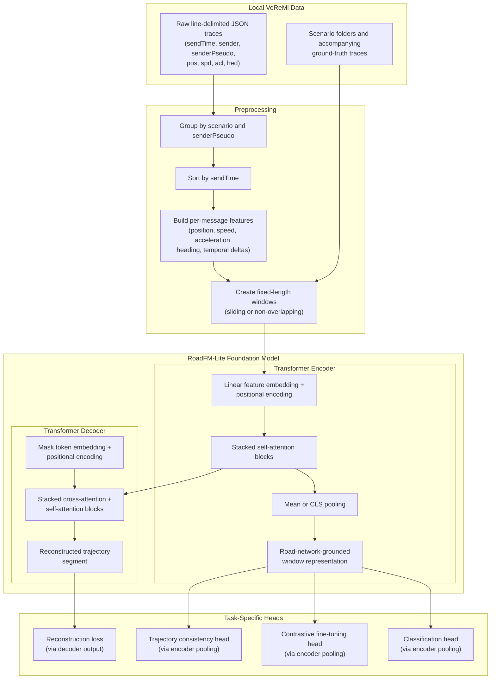

# RoadFM-Lite: A Self-Supervised Foundation Model for Road-Network-Grounded Trajectory Representation with Application to Sybil Attack Detection

---

**Florida Polytechnic University**
**Department of Computer Science**
**Proposal — Master's Thesis**

**Student:** Bibek Gupta
**Time Frame:** Fall 2025 – Spring 2026 (2 semesters)

**Advisor:**
_[Advisor Name]_

**Committee Member(s):**
_[Committee Member Names]_

---

## Abstract

Vehicular crowdsensing systems are increasingly vulnerable to Sybil attacks, in which a single adversary forges multiple vehicle identities to inject fabricated Basic Safety Messages and claim illegitimate rewards. These attacks are difficult to detect because forged messages can appear locally plausible in position, speed, and heading while concealing their illegitimacy in temporal inconsistencies, replay behavior, and physically unrealistic motion patterns that only emerge over longer observation windows. Existing detection methods either rely on handcrafted kinematic features that generalize poorly across traffic conditions, or require large quantities of labeled attack data that are expensive to obtain and unlikely to cover novel adversarial strategies.

This thesis proposes RoadFM-Lite, a self-supervised foundation model that addresses these limitations by learning road-network-grounded trajectory representations directly from vehicular message traces without requiring labeled attack samples at pretraining time. RoadFM-Lite operates through two complementary pretraining objectives: masked trajectory reconstruction (MTR), which captures normal short-horizon motion regularities, and trajectory consistency prediction (TCP), which trains the model to recognize synthetic perturbations including replay, shuffling, speed-scaling, and positional offsets. Because the training data is generated by SUMO, a microscopic traffic simulator operating on a real urban road network, the learned representations implicitly encode lane-following behavior, intersection dynamics, and network-constrained motion without requiring an explicit road graph or map-matching pipeline.

The pretrained model is evaluated under three paradigms: few-shot contrastive fine-tuning with limited labeled examples, zero-shot retrieval-based detection using a benign memory bank, and scenario-holdout generalization across unseen traffic conditions and attack realizations. Comparisons against a from-scratch encoder, a feature-engineered Random Forest, and a supervised BiLSTM establish the value of self-supervised pretraining and the data efficiency of the resulting representations. This thesis demonstrates that road-network-grounded self-supervision provides a viable and practically scalable foundation for Sybil detection in settings where labeled data is scarce and attack variants are not known in advance.

---

## 1 Motivation

Vehicular crowdsensing (VCS) systems rely on networks of participating vehicles to collect traffic, environmental, and infrastructure data in exchange for monetary or service-based rewards [1]. The economic incentive model that makes VCS viable also makes it an attractive target for Sybil attacks, in which a single adversary forges multiple fake vehicle identities to claim unearned rewards and inject corrupted data into the sensing pool [2]. Because every fabricated identity appears as a legitimate participant, Sybil attacks degrade both the economic integrity and the data quality of the entire crowdsensing ecosystem. Detecting these attacks therefore requires methods that can reliably distinguish fabricated vehicle trajectories from legitimate ones.

### 1.1 Current Challenges

Several critical challenges hinder effective Sybil detection in vehicular crowdsensing:

- **Trajectory Plausibility:** Fabricated trajectories can look locally plausible in raw coordinate space. A forged trace may match realistic speed and heading ranges at individual time steps while still revealing replay artifacts, temporal discontinuities, or unrealistic motion changes over a longer sequence [3].

- **Label Scarcity:** In real-world deployments, labeled Sybil attack samples are scarce. New attack variants emerge faster than ground-truth labels can be curated, making fully supervised detection approaches impractical. Detection systems must learn effective decision boundaries from very few labeled examples.

- **Scenario Generalization:** Vehicular datasets often contain multiple attack families and scenario groups that vary in traffic density, timing, and attack realization. A detector that memorizes a single split can fail when evaluated on another scenario from the same benchmark.

- **Representation Limitations:** Sybil detection in vehicular networks still relies heavily on hand-crafted plausibility rules, RSSI signals, trust scores, or fully supervised classifiers [3, 6, 7, 8]. By contrast, self-supervised trajectory foundation models are designed to learn reusable motion representations from unlabeled sequences, but they have not been systematically adapted to vehicular message traces for Sybil detection.

- **Benchmark-to-Model Gap:** Raw vehicular message traces are message-oriented rather than model-ready. They must be transformed into trajectory windows, aligned by sender pseudonym and time, and split carefully to avoid leakage between nearly adjacent windows. This preprocessing problem is central to the study but is not addressed by off-the-shelf security baselines.

### 1.2 Research Gap

The core research gap addressed in this thesis is the absence of a self-supervised trajectory foundation model that learns road-network-grounded representations for Sybil detection in vehicular networks. Most existing studies either depend on hand-crafted heuristics or train directly on labeled attack data, while most trajectory foundation models are evaluated on generic mobility tasks rather than adversarial detection. Three practical gaps remain:

1. **No benchmark-centered self-supervised pipeline.** There is no established method for converting raw vehicular message traces into reusable trajectory windows and learning sequence representations from them before downstream Sybil detection.

2. **No few-shot or zero-shot focus.** Vehicular Sybil detection is still evaluated mostly in fully supervised settings, even though realistic deployments often begin with very few labeled attack samples.

3. **No systematic within-benchmark generalization study.** Available vehicular security benchmarks contain multiple scenario families and time-group splits that allow evaluation beyond a single train/test split, but this structure is rarely used to measure whether learned representations transfer across scenario conditions.

### 1.3 Central Hypothesis

Self-supervised pretraining on road-network-grounded vehicular trajectory windows using reconstruction and consistency objectives will produce foundation model embeddings that transfer more effectively to Sybil detection than training the same encoder architecture from scratch. This benefit should be largest in two settings where current methods are weakest: (1) few-shot supervision, where labeled attack examples are limited to 5 to 20 per class, and (2) scenario-holdout evaluation, where the detector is trained on one scenario group and tested on another.

The mechanistic claim is straightforward: a foundation model that has already learned how road-network-constrained vehicular trajectories evolve over time, and that has been trained to identify corrupted sequence patterns such as replay, shuffling, and offset perturbations, should separate benign and Sybil behavior more efficiently than a model that sees the same data only through supervised labels.

### 1.4 Research Question

**Does a self-supervised trajectory foundation model trained on road-network-grounded vehicular message traces produce representations that improve Sybil detection relative to supervised-only baselines, particularly under few-shot supervision and scenario-holdout evaluation?**

This question decomposes into four sub-questions:

1. Does self-supervised pretraining improve Sybil detection accuracy compared to the same sequence encoder trained from scratch on the same data splits?

2. Does the pretrained encoder improve label efficiency, i.e., require fewer labeled attack examples to reach a useful detection threshold?

3. Does the pretrained encoder reduce performance loss when evaluation moves from one scenario group to another?

4. Which components contribute most to downstream detection performance: masked reconstruction, trajectory consistency prediction, feature design, or context-window length?

### 1.5 Practical Significance

The development of a self-supervised trajectory foundation model for road-network-grounded Sybil detection is practically important for four reasons:

- **Deployment with Minimal Supervision:** A pretrained encoder that already captures motion regularities can be adapted with only a small labeled support set when new attack conditions appear.

- **Scenario Robustness:** If the model generalizes across different scenario groups, it is less likely to depend on a single curated split and more likely to capture durable behavioral signals.

- **Lightweight Foundation Model:** A single sequence encoder with compact pretraining heads is simpler to implement, train, and reproduce than multi-branch systems that require external maps or additional corpora, while still producing reusable road-network-grounded trajectory representations.

- **Reproducible Scope:** Building the foundation model on an established vehicular benchmark keeps the experimental scope focused and reproducible, and it makes the final pipeline and pretrained weights easier to release and reuse.

### 1.6 Scientific Context

This thesis sits at the intersection of three closely related research areas:

**Trajectory Self-Supervised Learning.** Recent work has shown that masked modeling, contrastive learning, and related self-supervised objectives can produce reusable trajectory embeddings without manual annotation [4, 5, 9, 10, 12]. The key open question for this thesis is whether those ideas can be adapted effectively to raw vehicular message traces.

**Trajectory Anomaly and Consistency Modeling.** Sequence models are increasingly used to learn what normal motion looks like and to detect corrupted or implausible temporal patterns [27, 28, 29, 30, 31]. This thesis draws on that idea by using synthetic trajectory corruptions during pretraining, but targets Sybil detection rather than generic anomaly detection.

**Vehicular Sybil Detection.** The vehicular security literature provides the attack framing, benchmark setting, and strong traditional baselines [3, 6, 7, 8, 17, 18, 19, 32]. However, most of this literature still favors heuristics or fully supervised classifiers over reusable pretrained trajectory foundation models. This thesis targets that gap directly.

## 2 Related Work

The proposed research builds on recent work in trajectory foundation models, self-supervised representation learning, and vehicular security. This section emphasizes self-supervised sequence learning, road-network-grounded trajectory modeling, Sybil detection on vehicular benchmarks, and low-label evaluation settings.

### 2.1 Trajectory Foundation Models

Recent trajectory foundation models show that large-scale pretraining on unlabeled motion sequences can produce transferable embeddings for downstream mobility tasks. TrajFM [4] and UniTraj [5] are representative examples: both demonstrate that pretrained encoders can support region transfer and multiple downstream tasks when trained on large trajectory corpora. Their importance for this thesis is conceptual rather than direct. They establish that trajectory pretraining is useful, but they depend on large external corpora and are evaluated on generic mobility tasks such as prediction, retrieval, and similarity rather than adversarial detection.

For this thesis, the main lesson from these works is not to replicate their scale but to adapt the foundation model paradigm, that is, pretrain on unlabeled trajectory data and then adapt to downstream tasks, to a security-oriented vehicular setting. RoadFM-Lite shares this paradigm but applies it to road-network-grounded vehicular traces for Sybil detection rather than generic mobility analysis.

### 2.2 Self-Supervised Trajectory Learning

Self-supervised learning for trajectories has matured around several common pretraining strategies.

**Masked Modeling.** START [9] and related masked-trajectory methods learn useful motion representations by hiding part of a sequence and asking the encoder to reconstruct it. Multi-scale spatiotemporal pretraining [20] further shows that temporal structure at different granularities can be learned without manual labels.

**Contrastive and Multi-View Learning.** Contrastive SSL for large-scale trajectories [10], geography-aware Siamese models [21], MMTEC [12], and RED [22] all demonstrate that agreement across multiple views or augmentations can produce embeddings that transfer to downstream tasks.

These works are strong methodological priors for this thesis, but they are mostly optimized for generic trajectory semantics rather than Sybil-specific inconsistencies. In particular, they do not focus on replay behavior, local temporal reordering, or other corruption patterns that are especially relevant to fabricated vehicular messages. This is precisely where a security-oriented consistency objective becomes useful.

### 2.3 Trajectory Anomaly and Consistency Modeling

Trajectory anomaly detection is related to Sybil detection because both tasks require identifying motion patterns that deviate from normal behavior. Graph-based anomaly detection [27], road-partition anomaly models [28], encoder-decoder methods for driving anomalies [29], bus-trajectory anomaly detection [30], and generative approaches to mobility anomalies [31] all show that temporal models can learn a notion of normality and then flag deviations.

However, Sybil behavior is not simply a generic outlier problem. A Sybil trajectory may be crafted to look locally plausible while still betraying replay artifacts, inconsistent timing, duplicated patterns, or systematic offsets over a window. That makes the task closer to sequence-consistency modeling than to unconstrained outlier detection. This thesis therefore borrows the idea of learning normal motion structure, but targets Sybil-specific corruptions generated directly from vehicular trajectory windows.

### 2.4 Vehicular Sybil Detection and the VeReMi Benchmark

The vehicular security literature provides the attack framing and the benchmark context for this study. VeReMi [18] and the VeReMi Extension [19] established a reusable benchmark for VANET misbehavior detection. On top of that benchmark, prior work has explored plausibility checks combined with machine learning [3], RSSI-based methods [6], proof-of-work and location-based methods [7], collaborative learning [8], and pseudonym-based approaches such as P2DAP [17].

These methods are important baselines for the field, but they share two limitations that matter for this thesis. First, they usually operate with hand-crafted signals or directly supervised models rather than reusable pretrained sequence encoders. Second, they generally evaluate a detector on a fixed split instead of asking whether the representation remains useful under few-shot adaptation or scenario holdout. The VeReMi benchmark is therefore well established, but the representation-learning story on top of it is still underdeveloped.

### 2.5 Few-Shot and Retrieval-Based Detection

Few-shot adaptation and retrieval-based detection are standard tools in broader representation learning, but they are not yet common in vehicular Sybil detection. Supervised contrastive learning and related objectives make it possible to separate classes in embedding space with very limited labeled data, which is attractive when attack labels are scarce. Likewise, a memory-bank or nearest-neighbor view of detection is useful when only benign reference behavior is available and explicit attack labels are limited.

These settings are especially relevant because they let the thesis evaluate not just raw classification accuracy, but also label efficiency and representation quality. In other words, the model should not only classify known attacks well; it should also adapt quickly and detect suspicious behavior when supervision is weak.

### 2.6 Implicit Road-Network Grounding Through Simulation Data

Several trajectory-learning papers achieve road-network grounding by consuming explicit map assets, road graphs, or external corpora [11, 13, 14, 15, 16, 23, 24, 25, 26]. RoadFM-Lite takes a different approach: it achieves road-network-grounded representations implicitly because the VeReMi dataset is itself generated by SUMO, a microscopic traffic simulator that models vehicles on a real urban road network (the Luxembourg SUMO scenario). Every position, speed, heading, and acceleration value in VeReMi reflects road-constrained movement: vehicles follow lanes, decelerate at intersections, and turn according to the network topology.

This means the foundation model learns road-level structure from the trajectory data without requiring an explicit road graph as input. The approach is more reproducible, avoids dependencies on external map-matching pipelines, and keeps the experimental scope focused on the benchmark while still producing trajectory representations that are grounded in road-network dynamics.

### 2.7 Research Gaps

Our analysis of the literature reveals four concrete gaps that this thesis addresses:

1. **Foundation Model Gap:** Sybil detection in vehicular networks still relies heavily on rule-based approaches, trust metrics, signal-based checks, or supervised classifiers [3, 6, 7, 8]. Self-supervised trajectory foundation models that learn road-network-grounded representations for Sybil detection are largely absent.

2. **Label-Efficiency Gap:** Few-shot contrastive adaptation and zero-shot retrieval are natural settings for security problems with scarce labels, but they are not standard practice in the vehicular Sybil literature.

3. **Scenario-Generalization Gap:** Vehicular security datasets often contain multiple scenario families and group splits, yet this structure is rarely used to test whether learned representations transfer beyond one curated split.

4. **Preprocessing Gap:** Raw vehicular message traces are typically message-oriented rather than model-ready. There is no widely adopted benchmark-centered pipeline for turning them into leakage-safe trajectory windows for self-supervised learning and downstream detection.

### 2.8 Our Contribution

This thesis addresses those gaps through a focused and internally consistent contribution set. First, it proposes RoadFM-Lite as a self-supervised trajectory foundation model that learns road-network-grounded representations from simulated vehicular data. Second, it introduces a pretraining design based on masked trajectory reconstruction and trajectory consistency prediction using synthetic corruptions derived directly from the benchmark. Third, it evaluates the resulting embeddings under few-shot, zero-shot, fully supervised, and scenario-holdout settings, thereby measuring both label efficiency and within-benchmark generalization. Finally, it defines a reproducible preprocessing pipeline that converts raw vehicular messages into sender-aligned trajectory windows suitable for security-oriented sequence learning.

## 3 Proposed Architecture

The implementation of RoadFM-Lite follows an encoder-decoder foundation model design built directly on raw vehicular messages. The architecture has four components: a preprocessing stage that converts line-delimited traces into fixed-length trajectory windows, a Transformer encoder that produces road-network-grounded representations from those windows, a Transformer decoder that reconstructs masked or corrupted trajectory segments from the encoder representations, and task-specific heads that change across self-supervised pretraining and downstream detection. During pretraining, the encoder and decoder are trained jointly; during downstream Sybil detection, only the encoder is retained and the decoder is discarded, following the standard foundation model paradigm.

### 3.1 Architectural Overview

RoadFM-Lite achieves road-network-grounded trajectory representation without requiring an explicit road graph or map-matching pipeline as input. Because the VeReMi dataset is generated by the SUMO microscopic traffic simulator, every message trace already encodes road-constrained vehicle dynamics: position coordinates follow road geometry, speed profiles reflect network-level conditions, and heading changes correspond to turns and lane maneuvers. The foundation model learns from these inherently road-grounded features: message time, sender identity fields, position, speed, acceleration, and heading. The overall data flow is shown below.

### 3.2 VeReMi Window Construction

Each vehicular message is treated as one time step in a sender-aligned sequence. Let a raw message at time $t$ be

$$m_t = (\mathbf{p}_t, \mathbf{v}_t, \mathbf{a}_t, h_t, \tau_t, u_t),$$

where $\mathbf{p}_t$ denotes planar position derived from `pos`, $\mathbf{v}_t$ denotes planar velocity from `spd`, $\mathbf{a}_t$ denotes planar acceleration from `acl`, $h_t$ is heading from `hed`, $\tau_t$ is the send time, and $u_t$ identifies the sender pseudonym within a scenario.

Messages are grouped first by scenario and sender pseudonym, then sorted by `sendTime`. Fixed-length windows of length $T$ are created from each ordered sequence. To reduce leakage, split assignment is performed before or jointly with window generation so that overlapping windows from the same source sequence never appear in different partitions.

For each time step, the feature vector $\mathbf{x}_t$ contains the directly observed values plus short-horizon motion deltas:

$$\mathbf{x}_t = [\mathbf{p}_t,\ \mathbf{v}_t,\ \mathbf{a}_t,\ h_t,\ \Delta \tau_t,\ \Delta \mathbf{p}_t,\ \Delta \mathbf{v}_t].$$

This representation is intentionally simple. It uses only information present in the dataset while still exposing the encoder to both absolute state and short-term temporal change.

### 3.3 Trajectory Encoder

The sequence $\mathbf{X} = \{\mathbf{x}_1, \mathbf{x}_2, \ldots, \mathbf{x}_T\}$ is processed by the Transformer encoder. A linear layer first projects each feature vector into a $d$-dimensional embedding space, sinusoidal positional encoding is added, and the resulting token sequence is passed through $L_e$ stacked self-attention blocks. The encoder outputs contextualized hidden states

$$\mathbf{H} = \{\mathbf{h}_1, \mathbf{h}_2, \ldots, \mathbf{h}_T\} \in \mathbb{R}^{T \times d}.$$

The final window-level representation $\mathbf{h}_{\text{win}}$ is obtained either by mean pooling or by a dedicated CLS token prepended to the sequence:

$$\mathbf{h}_{\text{win}} = \frac{1}{T}\sum_{t=1}^{T} \mathbf{h}_t.$$

The encoder is the primary output of the foundation model. After pretraining, the encoder representations $\mathbf{H}$ and the pooled embedding $\mathbf{h}_{\text{win}}$ are the artifacts that transfer to all downstream tasks. The encoder is kept compact so that the foundation model remains small enough for repeated few-shot experiments, scenario-holdout studies, and ablations while remaining expressive enough to capture road-network-grounded motion patterns, replay artifacts, temporal irregularities, and motion consistency.

### 3.4 Trajectory Decoder

The Transformer decoder is a sequence-to-sequence reconstruction module that learns to recover masked or corrupted trajectory segments by attending to the encoder output. It is used during pretraining and discarded during downstream detection, following the standard encoder-decoder foundation model paradigm (analogous to how BART and T5 drop the decoder for classification tasks).

Given a masked window in which a subset $\mathcal{M}$ of time steps has been replaced by a learned mask token $\mathbf{e}_{\text{mask}}$, the decoder receives the mask token embeddings with positional encoding at the masked positions and attends to the full encoder hidden states $\mathbf{H}$ through cross-attention:

$$\mathbf{D} = \text{TransformerDecoder}(\mathbf{Q}_{\text{mask}},\ \mathbf{H}),$$

where $\mathbf{Q}_{\text{mask}} \in \mathbb{R}^{|\mathcal{M}| \times d}$ is the sequence of mask queries with positional information, and $\mathbf{D} \in \mathbb{R}^{|\mathcal{M}| \times d}$ is the decoder output. The decoder consists of $L_d$ layers, each containing masked self-attention over the query sequence, cross-attention to the encoder output, and a feed-forward network.

A linear projection layer then maps each decoder output back to the original feature space:

$$\hat{\mathbf{x}}_t = \mathbf{W}_{\text{rec}} \mathbf{d}_t + \mathbf{b}_{\text{rec}}, \quad t \in \mathcal{M}.$$

The decoder serves two purposes in the foundation model. First, it provides a much richer reconstruction signal than a single linear head, because cross-attention allows each masked position to selectively attend to all unmasked encoder representations when predicting the original feature vector. This produces stronger pretraining gradients that propagate back into the encoder, improving the quality of the learned road-network-grounded representations. Second, the decoder makes the foundation model architecturally complete: it supports not only discriminative downstream tasks (via the encoder) but also potential generative tasks such as trajectory prediction, imputation, and anomaly synthesis in future work.

The decoder is deliberately kept lightweight ($L_d \leq L_e$) relative to the encoder, because the thesis prioritizes encoder representation quality for downstream Sybil detection rather than standalone generation capability.

### 3.5 Training Phases and Head Separation

RoadFM-Lite operates in two distinct phases with different active components:

**Phase 1 — Self-Supervised Pretraining (Encoder + Decoder):**
- The encoder and decoder are trained jointly.
- The decoder reconstructs masked trajectory segments (MTR objective).
- The encoder pooling output feeds a consistency classification head (TCP objective).
- No labels are used.

**Phase 2 — Downstream Detection (Encoder Only):**
- The decoder is discarded; only the pretrained encoder weights are retained.
- A task-specific head is attached to the encoder:
  - **Few-shot head:** A projection layer for supervised contrastive fine-tuning on limited labeled samples.
  - **Classification head:** A linear classifier for fully supervised upper-bound evaluation.
  - **Zero-shot:** No head; the encoder embeddings are used directly for nearest-neighbor retrieval.

This separation follows the standard foundation model paradigm: the pretraining phase uses the full encoder-decoder architecture to maximize representation quality, while the downstream phase discards the decoder and evaluates whether the encoder alone has learned transferable structure.

## 4 Pretraining Objectives

The encoder-decoder foundation model is pretrained on unlabeled trajectory windows using two complementary objectives. Both operate on the same backbone and require no external annotations. The overall pretraining loss is

$$\mathcal{L}_{\text{pretrain}} = \lambda_1 \mathcal{L}_{\text{MTR}} + \lambda_2 \mathcal{L}_{\text{TCP}},$$

where $\lambda_1$ and $\lambda_2$ control the balance between reconstruction and consistency learning.

### 4.1 Masked Trajectory Reconstruction (MTR)

Masked trajectory reconstruction teaches the foundation model to infer missing motion from surrounding context using the full encoder-decoder pipeline. Given a window $\mathbf{X} = \{\mathbf{x}_t\}_{t=1}^{T}$, a subset of indices $\mathcal{M}$ is sampled, typically covering 15% of the time steps. At masked positions, the original token is replaced with a learned mask embedding $\mathbf{e}_{\text{mask}}$ before being fed to the encoder.

The encoder processes the partially masked window and produces contextualized hidden states $\mathbf{H}$. The decoder then takes mask-position queries with positional encoding and attends to $\mathbf{H}$ through cross-attention to reconstruct the original features at masked positions:

$$\mathbf{D} = \text{TransformerDecoder}(\mathbf{Q}_{\text{mask}},\ \mathbf{H}), \quad \hat{\mathbf{x}}_t = \mathbf{W}_{\text{rec}} \mathbf{d}_t + \mathbf{b}_{\text{rec}}, \quad t \in \mathcal{M}.$$

The reconstruction loss is the mean squared error over masked positions:

$$\mathcal{L}_{\text{MTR}} = \frac{1}{|\mathcal{M}|} \sum_{t \in \mathcal{M}} \|\hat{\mathbf{x}}_t - \mathbf{x}_t\|_2^2.$$

Using the decoder for reconstruction rather than a simple linear head is important for two reasons. First, cross-attention allows each masked position to selectively gather information from all unmasked encoder states, producing richer reconstruction signals than a per-token linear projection. Second, the reconstruction gradients propagate through both the decoder and back into the encoder via cross-attention, producing stronger encoder representations. This objective encourages the encoder to learn short-horizon motion regularities such as smooth displacement, consistent heading evolution, and reasonable temporal continuity. It is the main mechanism through which the foundation model learns what normal road-network-grounded vehicular trajectories look like without using labels.

### 4.2 Trajectory Consistency Prediction (TCP)

Trajectory consistency prediction trains the encoder to distinguish clean trajectory windows from windows corrupted by synthetic perturbations derived directly from the benchmark. Let $g(\cdot)$ be a corruption operator sampled from a set

$$\mathcal{G} = \{\text{identity},\ \text{replay},\ \text{local-shuffle},\ \text{speed-scale},\ \text{position-offset}\}.$$

For each original window $\mathbf{X}$, we generate $\tilde{\mathbf{X}} = g(\mathbf{X})$ and assign a corruption label $c$. The identity operator yields a clean window; the other operators generate controlled inconsistencies that mimic patterns relevant to Sybil behavior:

- **Replay:** Duplicate or reinsert an earlier subsequence into the current window.
- **Local shuffle:** Randomly reorder a short segment while preserving the rest of the window.
- **Speed scale:** Multiply the speed profile and corresponding short-horizon displacement by a factor.
- **Position offset:** Add a persistent offset to position-related components across the window.

The encoder produces a window embedding $\mathbf{h}_{\text{win}}$, and a softmax head predicts the corruption class:

$$\hat{\mathbf{y}} = \text{softmax}(\mathbf{W}_{\text{tcp}} \mathbf{h}_{\text{win}} + \mathbf{b}_{\text{tcp}}).$$

The TCP loss is standard cross-entropy:

$$\mathcal{L}_{\text{TCP}} = - \sum_{k=1}^{|\mathcal{G}|} y_k \log \hat{y}_k.$$

TCP is deliberately closer to the downstream problem than a generic augmentation objective. It teaches the encoder to become sensitive to replay artifacts, temporal disorder, and persistent offsets that are plausible manifestations of Sybil-style fabrication in vehicular message traces.

## 5 Downstream Task: Sybil Detection

After pretraining, the decoder and self-supervised heads are discarded and the pretrained encoder is evaluated on Sybil detection tasks built from the same dataset. The central question is whether the road-network-grounded representations learned by the full encoder-decoder foundation model improve downstream discrimination and label efficiency compared to encoder-only training from scratch.

### 5.1 Few-Shot Contrastive Fine-Tuning

In realistic deployments, labeled attack traces are limited. Few-shot contrastive fine-tuning evaluates whether the pretrained encoder can adapt with only a small support set.

**Setup.** A support set of $K$ labeled windows per class is sampled from the VeReMi training partition, with $K \in \{5, 10, 20\}$. The class set is defined by the locally available scenario families: benign, DataReplaySybil, DoSDisruptiveSybil, DoSRandomSybil, and GridSybil, subject to availability after preprocessing.

**Supervised Contrastive Loss.** Fine-tuning uses the InfoNCE loss [33] to pull same-class trajectory embeddings together while pushing different-class embeddings apart:

$$\mathcal{L}_{\text{InfoNCE}} = -\frac{1}{|B|}\sum_{i \in B} \log \frac{\exp(\text{sim}(\mathbf{h}_i, \mathbf{h}_{j^+}) / \tau)}{\sum_{j \in B \setminus \{i\}} \exp(\text{sim}(\mathbf{h}_i, \mathbf{h}_j) / \tau)}$$

where $B$ is the mini-batch, $j^+$ is a positive example from the same class as $i$, $\text{sim}(\cdot, \cdot)$ is cosine similarity, and $\tau$ is a temperature parameter.

**Evaluation.** After fine-tuning, a linear classifier is trained on the learned embeddings. Results are reported both as multiclass family recognition and as binary benign-versus-Sybil detection, with F1 and AUROC serving as the main summary metrics.

### 5.2 Zero-Shot Retrieval-Based Detection

Zero-shot retrieval evaluates whether the pretrained encoder can flag suspicious windows without any labeled attack data, using only benign reference behavior.

**Memory Bank Construction.** A memory bank $\mathcal{M}_{\text{benign}}$ is populated with embeddings from verified benign trajectory windows in the training partition.

**Detection Protocol.** For each test window with embedding $\mathbf{h}_{\text{test}}$, the distance to its $k$ nearest benign neighbors is computed:

$$d(\mathbf{h}_{\text{test}}) = \frac{1}{k}\sum_{j=1}^{k} \left\| \mathbf{h}_{\text{test}} - \mathbf{h}_{(j)} \right\|_2$$

where $\mathbf{h}_{(j)}$ is the $j$th nearest neighbor in the benign memory bank. A test window is flagged as suspicious when $d(\mathbf{h}_{\text{test}}) > \delta$, with $\delta$ calibrated on validation data.

This setting is important because it tests representation quality directly. If the learned embedding space is meaningful, clean benign windows should cluster while replayed, offset, or otherwise corrupted Sybil windows should fall farther away from the benign reference set.

### 5.3 Classification Fine-Tuning

As an upper-bound reference, the pretrained encoder is also fine-tuned with a standard cross-entropy classifier using the full labeled training split. This setting answers a separate question from few-shot learning: whether self-supervised initialization still helps when all available labels are used.

## 6 Baselines

The proposed model is compared against three baselines that can all be trained using the same inputs and splits.

### 6.1 Baseline 1: Same Encoder From Scratch

This is the primary controlled baseline. It uses the exact same encoder architecture and input features as RoadFM-Lite but removes the encoder-decoder pretraining phase entirely. The encoder is initialized randomly and trained directly on the downstream labels only.

This comparison isolates the value of the foundation model's self-supervised pretraining. If the pretrained encoder outperforms this baseline, the improvement cannot be attributed to extra input features or a larger architecture, but to the representations learned through the encoder-decoder pretraining process.

### 6.2 Baseline 2: Feature Engineering + Random Forest

This baseline represents the traditional non-deep-learning approach. Each window is summarized by hand-crafted kinematic features and classified with a Random Forest. The feature set includes:

- **Speed statistics:** Mean, standard deviation, maximum, and minimum speed magnitude
- **Acceleration statistics:** Mean, standard deviation, maximum, and minimum acceleration magnitude
- **Heading statistics:** Mean heading change and heading change variance
- **Displacement statistics:** Total displacement, path length, and straightness ratio
- **Temporal statistics:** Mean and variance of inter-message time gaps
- **Motion smoothness:** Jerk-related summary statistics and idle fraction

This baseline provides a practical benchmark for how far simple, interpretable summary features can go on this dataset without sequence pretraining.

### 6.3 Baseline 3: Supervised BiLSTM Sequence Classifier

This baseline feeds the same feature sequence into a standard bidirectional LSTM followed by a classification head. It tests whether the benefits of RoadFM-Lite come from self-supervised pretraining rather than from sequence modeling alone.

## 7 Evaluation Plan

The evaluation methodology is designed to assess four properties of the learned representation: detection quality, label efficiency, scenario robustness, and component contribution.

### 7.1 Detection Metrics

All detection experiments report the following metrics on held-out test data:

| Metric | Definition | Purpose |
|--------|-----------|---------|
| **Precision** | $\frac{TP}{TP + FP}$ | Measures false positive rate; critical for avoiding flagging legitimate vehicles |
| **Recall** | $\frac{TP}{TP + FN}$ | Measures detection coverage; critical for catching all Sybil identities |
| **F1-Score** | $\frac{2 \cdot P \cdot R}{P + R}$ | Harmonic mean of precision and recall; primary balanced metric |
| **AUROC** | Area under ROC curve | Threshold-independent discrimination quality |

Metrics are reported for both binary benign-versus-Sybil detection and per-family analysis across the available attack families.

### 7.2 Leakage-Safe Split Protocol

Because trajectory windows are extracted from continuous traces, preventing leakage is essential. The split protocol follows three rules:

1. Partition at the scenario-group and sender-sequence level before creating overlapping windows whenever possible.
2. Keep all windows derived from the same source subsequence in exactly one split.
3. Compute normalization statistics on the training partition only.

This protocol prevents nearly identical windows from appearing in both training and testing, which would otherwise inflate downstream performance.

### 7.3 Few-Shot Analysis Protocol

The few-shot evaluation measures label efficiency, specifically how many labeled attack examples are needed to achieve a given level of detection performance.

**Protocol:**

1. From the VeReMi training split, sample $K$ labeled windows per class, where $K \in \{5, 10, 20\}$.
2. Fine-tune the pretrained encoder using supervised contrastive loss (InfoNCE) on the sampled support set.
3. Evaluate on the full held-out test split using precision, recall, F1, and AUROC.
4. Repeat each $K$-shot experiment 5 times with different random support set samples to report mean and standard deviation.

**Comparison Matrix:**

| Setting | RoadFM-Lite | Same Encoder From Scratch | Feature Eng. + RF |
|---------|-------------|---------------------------|-------------------|
| $K = 5$ | ✓ | ✓ | ✓ |
| $K = 10$ | ✓ | ✓ | ✓ |
| $K = 20$ | ✓ | ✓ | ✓ |
| Full supervision | ✓ | ✓ | ✓ |

The key hypothesis is that the pretrained encoder will show the largest advantage at the smallest $K$ values, where label scarcity is most severe.

### 7.4 Scenario-Holdout Generalization

The primary generalization study uses a within-benchmark scenario-holdout evaluation.

**Protocol:**

1. Train on the `0709` scenario groups and evaluate on `1416`, then swap the roles of the groups.
2. Report the same metrics used in the standard split setting.
3. Optionally extend the study with attack-family holdout, where one family such as DataReplaySybil is excluded from training and used only for testing.

This experiment tests whether the representation captures durable trajectory structure rather than memorizing one particular dataset subset.

**Generalization Degradation Metric:** The holdout degradation $\Delta_{\text{scenario}}$ is defined as:

$$\Delta_{\text{scenario}} = \frac{F1_{\text{standard}} - F1_{\text{holdout}}}{F1_{\text{standard}}} \times 100\%$$

A lower value indicates that the representation degrades less under scenario shift.

### 7.5 Ablation Study

The ablation study quantifies the contribution of each architectural and training component by systematically removing them and measuring the effect on detection performance.

| Ablation Variant | MTR | TCP | Decoder | Delta Features | Window Length | Purpose |
|-----------------|-----|-----|---------|----------------|---------------|---------|
| **Full RoadFM-Lite** | ✓ | ✓ | ✓ | ✓ | $T$ | Full encoder-decoder system reference |
| **No pretraining** | ✗ | ✗ | — | ✓ | $T$ | Isolate pretraining value |
| **MTR only** | ✓ | ✗ | ✓ | ✓ | $T$ | Isolate reconstruction contribution |
| **TCP only** | ✗ | ✓ | — | ✓ | $T$ | Isolate consistency contribution |
| **Linear recon. head** | ✓ | ✓ | ✗ | ✓ | $T$ | Isolate decoder contribution to MTR |
| **No delta features** | ✓ | ✓ | ✓ | ✗ | $T$ | Test short-horizon motion features |
| **Short window** | ✓ | ✓ | ✓ | ✓ | $T/2$ | Test context length sensitivity |
| **Long window** | ✓ | ✓ | ✓ | ✓ | $2T$ | Test context length sensitivity |

Each variant is evaluated under the same few-shot protocol ($K = 10$) and the full-supervision setting, reporting at least F1 and AUROC.

### 7.6 Additional Analyses

**Per-Family Breakdown.** Results will be reported separately for DataReplaySybil, DoSDisruptiveSybil, DoSRandomSybil, and GridSybil to identify which families benefit most from pretraining.

**Error Analysis.** False positives and false negatives will be inspected qualitatively in terms of replay-like segments, abrupt offsets, timing discontinuities, and benign high-variance motion. This is important because the proposal claims a representation benefit, not merely a classifier improvement.

## 8 Dataset Scope and Preprocessing

This thesis uses only the local VeReMi Sybil dataset available in the workspace. No external trajectory corpora, road-network assets, or additional simulators are required.

### 8.1 Local Scenario Coverage

The available data is organized into VeReMi scenario families and group identifiers. The local top-level families include the following folders:

| Scenario Family | Available Local Groups | Role in Thesis |
|----------------|------------------------|----------------|
| `DataReplaySybil` | `0709`, `1416` | Pretraining and downstream evaluation |
| `DoSDisruptiveSybil` | `0709`, `1416` | Pretraining and downstream evaluation |
| `DoSRandomSybil` | `0709`, `1416` | Pretraining and downstream evaluation |
| `GridSybil` | `0709`, `1416` | Pretraining and downstream evaluation |

Within each family/group folder, the data is further organized into time-windowed VeReMi subdirectories such as `VeReMi_25200_28800_...`, each containing line-delimited trace files and accompanying ground-truth traces. This structure is sufficient to support both standard train/test evaluation and scenario-holdout experiments.

### 8.2 Available Message Fields

A local inspection of the dataset confirms that each message trace contains at least the following fields:

| Field | Meaning | Use in Thesis |
|------|---------|---------------|
| `sendTime` | Message timestamp | Temporal ordering and delta-time features |
| `sender` | Sender identifier | Sequence bookkeeping |
| `senderPseudo` | Pseudonym identifier | Sender-aligned window construction |
| `pos` | Position vector | Absolute position and displacement features |
| `spd` | Velocity vector | Speed and velocity-delta features |
| `acl` | Acceleration vector | Acceleration and jerk-related features |
| `hed` | Heading | Directional dynamics |

Noise-augmented variants such as `pos_noise`, `spd_noise`, `acl_noise`, and `hed_noise` are present in the traces as well, but the core proposal is based on the main kinematic fields listed above.

### 8.3 Window Generation and Label Use

The same raw dataset supports both unlabeled pretraining and labeled downstream evaluation.

- **For self-supervised pretraining:** Labels are ignored, and only the raw windows are used.
- **For downstream evaluation:** Labels are derived from the scenario family and the accompanying ground-truth trace organization.
- **For benign reference retrieval:** Only benign windows from the training split populate the memory bank.

This arrangement preserves the benchmark-focused scope while still allowing multiple evaluation settings from the same dataset.

### 8.4 Road-Network Grounding and Dataset Scope

The VeReMi dataset provides a strong foundation for learning road-network-grounded trajectory representations because it is generated by the SUMO microscopic traffic simulator operating on a detailed urban road network (the Luxembourg scenario). All kinematic features, including position, speed, acceleration, and heading, reflect real road-constrained vehicle movement. This means the foundation model learns road-level structure implicitly from trajectory patterns rather than from an explicit graph input, which simplifies the pipeline while preserving the road-network-grounded character of the representations. Focusing the thesis on this benchmark has three additional benefits: it makes every experiment reproducible from one known data source, it sharpens the contribution to a concrete foundation model for road-network-grounded Sybil detection, and it keeps the scope realistic for a master's thesis timeline.

## 9 Timeline and Deliverables

The thesis remains structured across two semesters, with the work plan organized around building and evaluating the RoadFM-Lite foundation model.

### 9.1 Semester-Wise Timeline

| Period | Activities | Deliverables |
|--------|-----------|--------------|
| **Semester 1** | Literature review and proposal finalization. Implement VeReMi preprocessing, sender-aligned window generation, leakage-safe split logic, and feature extraction. Implement the Transformer encoder and pretraining heads. Run pilot self-supervised pretraining on the training scenarios. | Working VeReMi preprocessing pipeline; pretrained foundation model v1; updated literature review and methodology drafts |
| **Semester 2** | Run few-shot, zero-shot, fully supervised, and scenario-holdout experiments. Train baselines (from-scratch encoder, Random Forest, BiLSTM). Perform ablation study and error analysis. Complete thesis writing, revision, and defense preparation. | Experimental results and analysis; complete thesis document; paper draft; defense-ready manuscript |

### 9.2 Expected Contributions

This thesis aims to deliver three categories of contributions:

1. **Road-Network-Grounded Trajectory Foundation Model.** A self-supervised foundation model pipeline that converts raw vehicular message traces into leakage-safe trajectory windows, learns road-network-grounded representations through a compact Transformer encoder, and supports downstream task adaptation without external data.

2. **Empirical Validation for Data-Efficient Sybil Detection.** Controlled experiments showing whether self-supervised pretraining improves few-shot, zero-shot, and fully supervised detection relative to strong baselines.

3. **Scenario-Holdout Evaluation Protocol.** A benchmark-centered generalization study across available scenario groups, including reproducible split definitions and ablation settings.

### 9.3 Success Criteria

The success of this thesis will be measured against the following criteria:

- **Detection Quality:** The pretrained encoder achieves equal or higher F1-score and AUROC than the same encoder trained from scratch under full supervision.
- **Label Efficiency:** The pretrained encoder shows a measurable advantage in at least one low-label setting $K \in \{5, 10, 20\}$.
- **Scenario Robustness:** The pretrained encoder exhibits lower holdout degradation than the from-scratch baseline under scenario-group evaluation.
- **Component Contribution:** The ablation study demonstrates that reconstruction, consistency learning, or window-design choices materially affect downstream performance.

### 9.4 Connection to Sybil Guard Project

This thesis produces a pretrained trajectory foundation model relevant to Thrust 2 of the Sybil Guard project, delivering road-network-grounded representations within a focused and reproducible benchmark scope. Specifically:

- The pretrained weights and preprocessing pipeline become direct reusable artifacts for downstream security experiments.
- The few-shot evaluation validates the claim that attack detection can adapt with very limited labels.
- The scenario-holdout study provides a concrete robustness benchmark within the currently available data.
- The compact foundation model is easier to integrate into future federated or personalized detection pipelines than a heavier multi-branch system.

### 9.5 Publication Target

One conference paper targeting IEEE ICC, IEEE VTC, or a vehicular security workshop. The paper will present RoadFM-Lite as a self-supervised foundation model for road-network-grounded trajectory representation and evaluate it under few-shot, zero-shot, and scenario-holdout Sybil detection settings on the VeReMi benchmark.

---

## References

[1] X. Wang, Z. Ning, S. Guo, and L. Wang, "Imitation learning enabled task scheduling for online vehicular edge computing," *IEEE Transactions on Mobile Computing*, vol. 21, no. 2, pp. 598–611, 2022.

[2] J. R. Douceur, "The Sybil attack," in *Proc. 1st International Workshop on Peer-to-Peer Systems (IPTPS)*, 2002, pp. 251–260.

[3] S. So, P. Sharma, and J. Petit, "Integrating plausibility checks and machine learning for misbehavior detection in VANET," in *Proc. IEEE International Conference on Machine Learning and Applications (ICMLA)*, 2018, pp. 564–571.

[4] D. Jiang, J. Wu, Y. Chen, T. Peng, Z. Li, and S. Zhao, "TrajFM: A vehicle trajectory foundation model for region and task transferability," *arXiv preprint arXiv:2408.15251*, 2024.

[5] Y. Liang, H. Wen, Y. Ye, H. Zhang, W. Zhang, and R. Zimmermann, "UniTraj: Learning a universal trajectory foundation model from billion-scale worldwide traces," in *Proc. Advances in Neural Information Processing Systems (NeurIPS)*, 2025.

[6] S. Abbas, M. Merabti, D. Llewellyn-Jones, and K. Sherif, "Multi-channel based Sybil attack detection in vehicular ad hoc networks using RSSI," *IEEE Transactions on Mobile Computing*, vol. 18, no. 2, pp. 461–474, 2018.

[7] S. Chang, Y. Qi, H. Zhu, J. Zhao, and X. Shen, "Detecting Sybil attacks using proofs of work and location in VANETs," *IEEE Transactions on Dependable and Secure Computing*, vol. 18, no. 3, pp. 1228–1241, 2020.

[8] S. Hussain, A. A. Alamer, and I. Ahmad, "Collaborative learning based Sybil attack detection in vehicular ad-hoc networks (VANETs)," *Sensors*, vol. 22, no. 18, p. 6934, 2022.

[9] J. Lin, H. Wen, Y. Zheng, and H. Huang, "Self-supervised trajectory representation learning with temporal regularities and travel semantics," in *Proc. IEEE International Conference on Data Engineering (ICDE)*, 2023, pp. 843–855.

[10] Q. Chen, H. Wang, Q. Li, and Z. Huang, "Self-supervised contrastive representation learning for large-scale trajectories," *Future Generation Computer Systems*, vol. 148, pp. 357–370, 2023.

[11] Z. Chang, H. Wu, G. Tan, J. Bao, and T. He, "Jointly contrastive representation learning on road network and trajectory," in *Proc. ACM International Conference on Information and Knowledge Management (CIKM)*, 2022, pp. 251–260.

[12] J. Lin, H. Wen, Y. Zheng, and H. Huang, "Pre-training general trajectory embeddings with maximum multi-view entropy coding," *IEEE Transactions on Knowledge and Data Engineering*, vol. 36, no. 4, pp. 1528–1541, 2023.

[13] J. Zhou, J. Wu, Y. Chen, T. Peng, Z. Li, and S. Zhao, "UniTR: A unified framework for joint representation learning of trajectories and road networks," in *Proc. AAAI Conference on Artificial Intelligence*, vol. 39, no. 12, 2025, pp. 33457–33465.

[14] Z. Fang, Y. Du, X. Chen, D. Zhao, T. Xie, and Y. Li, "Spatio-temporal trajectory similarity learning in road networks," in *Proc. ACM SIGKDD Conference on Knowledge Discovery and Data Mining (KDD)*, 2022, pp. 347–356.

[15] H. Ren, Y. Ruan, Y. Mao, J. Bao, T. He, and H. Huang, "MTrajRec: Map-constrained trajectory recovery via seq2seq multi-task learning," in *Proc. ACM SIGKDD Conference on Knowledge Discovery and Data Mining (KDD)*, 2021, pp. 1410–1419.

[16] J. Zhou, J. Wu, H. Wen, T. Peng, Z. Li, and S. Zhao, "Bridging traffic state and trajectory for dynamic road network and trajectory representation learning," in *Proc. AAAI Conference on Artificial Intelligence*, vol. 39, no. 11, 2025, pp. 33280–33288.

[17] S. Park, B. Aslam, D. Turgut, and C. Zou, "P2DAP — Sybil attacks detection in vehicular ad hoc networks," *IEEE Journal on Selected Areas in Communications*, vol. 29, no. 3, pp. 582–594, 2011.

[18] R. W. van der Heijden, T. Lukaseder, and F. Kargl, "VeReMi: A dataset for comparable evaluation of misbehavior detection in VANETs," in *Proc. Security and Privacy in Communication Networks (SecureComm)*, LNCS, vol. 255, 2018, pp. 318–337.

[19] R. W. van der Heijden, A. Kaber, and F. Kargl, "VeReMi Extension: A dataset for comparable evaluation of misbehavior detection in VANETs," in *Proc. IEEE International Conference on Communications (ICC)*, 2020, pp. 1–6.

[20] Z. Zhou, Y. Yang, M. Li, and H. Gao, "Self-supervised trajectory representation learning with multi-scale spatio-temporal feature exploration," in *Proc. IEEE International Conference on Data Engineering (ICDE)*, 2025.

[21] Z. Liu, J. Li, and K. Wang, "Learning universal trajectory representation via a Siamese geography-aware transformer," *ISPRS International Journal of Geo-Information*, vol. 13, no. 3, p. 64, 2024.

[22] H. Wen, Y. Lin, Y. Xia, and H. Huang, "RED: Effective trajectory representation learning with comprehensive information," *Proceedings of the VLDB Endowment*, vol. 18, no. 2, pp. 200–212, 2024.

[23] L. Wang, Y. Qin, H. Wen, T. He, and H. Huang, "Road network representation learning: A dual graph-based approach," *ACM Transactions on Knowledge Discovery from Data*, vol. 17, no. 9, pp. 1–23, 2023.

[24] Y. Lin, H. Wen, T. Hu, and H. Huang, "Robust road network representation learning," in *Proc. ACM International Conference on Information and Knowledge Management (CIKM)*, 2021, pp. 1038–1047.

[25] J. Wu, Y. Chen, T. Peng, and Z. Li, "Road network representation learning with vehicle trajectories," in *Lecture Notes in Computer Science*, vol. 13947, Springer, 2023, pp. 56–70.

[26] Y. Li, C. Jin, S. Jing, and H. Lu, "Trajectory representation learning based on road network partition for similarity computation," in *Lecture Notes in Computer Science*, vol. 13946, Springer, 2023, pp. 391–407.

[27] X. Li, H. Yang, J. Wu, and Y. Zhang, "Anomalous sub-trajectory detection with graph contrastive self-supervised learning," *IEEE Transactions on Vehicular Technology*, vol. 73, no. 8, pp. 11037–11049, 2024.

[28] Y. Li, S. Jing, C. Jin, and H. Lu, "Vehicle anomalous trajectory detection algorithm based on road network partition," *Applied Intelligence*, vol. 52, no. 5, pp. 5043–5059, 2021.

[29] Y. Zhang, X. Li, J. Yang, and Z. Wang, "A deep encoder-decoder network for anomaly detection in driving trajectory behavior under spatio-temporal context," *International Journal of Applied Earth Observation and Geoinformation*, vol. 115, p. 103115, 2022.

[30] T. Cheng, X. Li, S. Wang, and Y. Zhang, "Deep learning detection of anomalous patterns from bus trajectories for traffic insight analysis," *Knowledge-Based Systems*, vol. 217, p. 106833, 2021.

[31] J. Ouyang, Y. Zhang, K. Zheng, M. A. Cheema, and X. Zhou, "Coupled IGMM-GANs with applications to anomaly detection in human mobility data," *ACM Transactions on Spatial Algorithms and Systems*, vol. 6, no. 4, pp. 1–28, 2020.

[32] A. Sharma, S. Kumar, and P. Singh, "Detection method to eliminate Sybil attacks in vehicular ad-hoc networks," *Ad Hoc Networks*, vol. 140, p. 103092, 2023.

[33] A. van den Oord, Y. Li, and O. Vinyals, "Representation learning with contrastive predictive coding," *arXiv preprint arXiv:1807.03748*, 2018.
