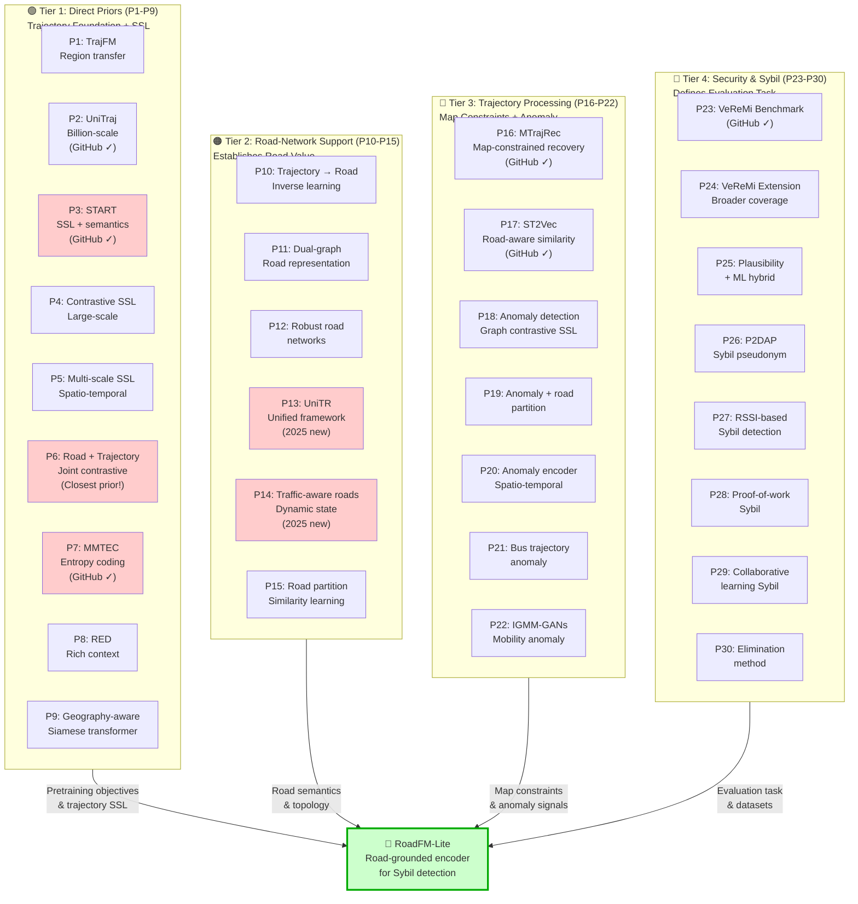
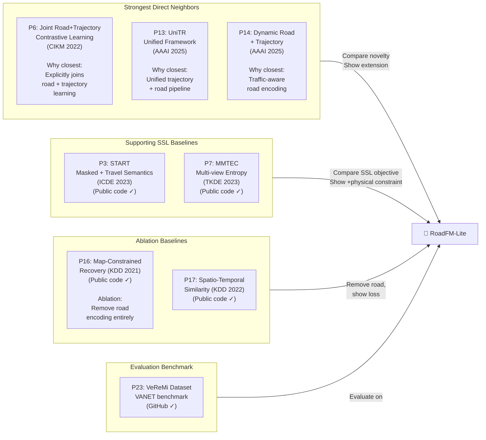

# Top 30 Related Papers For RoadFM-Lite

Search date: 2026-03-30

Scope notes:
- This list prioritizes renowned journals and supplements them with top-tier conferences for recent trajectory foundation-model work, where journal coverage is still thin.
- The ranking is by relevance to RoadFM-Lite, not by raw citation count.
- The GitHub column only includes public repositories I could verify. If a row says "No verified public repo found," that means I did not find an official public GitHub release during this pass.
- For some publisher metadata pages, the exact benchmark names are not exposed without the full PDF. Those rows are marked explicitly instead of guessing.

---

## Visual: The 30 Papers Organized By Relevance Cluster

### Paper Landscape: Which Clusters Contribute To RoadFM-Lite

### Closest Aligned Papers (Top Priors)

## 1. Direct Priors: Trajectory Foundation Models, Self-Supervised Trajectory Learning, And Road-Network Grounding

| ID | Paper | Venue | Year | Main novelty | Datasets | GitHub / Code |
| --- | --- | --- | --- | --- | --- | --- |
| P1 | [TrajFM: A Vehicle Trajectory Foundation Model for Region and Task Transferability](https://arxiv.org/abs/2408.15251) | arXiv preprint | 2024 | Proposes a vehicle trajectory foundation model aimed at region transfer and multi-task transfer rather than single-task training. | [nuScenes](https://www.nuscenes.org/); [Argoverse](https://www.argoverse.org/); [INTERACTION](https://interaction-dataset.com/); [Lyft Level 5](https://level5.lyft.com/dataset/) | No verified public repo found |
| P2 | [UniTraj: Learning a Universal Trajectory Foundation Model from Billion-Scale Worldwide Traces](https://arxiv.org/abs/2411.03859) | NeurIPS | 2025 | Scales pretraining to billion-scale worldwide traces to target universal trajectory transfer across regions and tasks. | [WorldTrace](https://huggingface.co/datasets/OpenTrace/WorldTrace) | [Yasoz/UniTraj](https://github.com/Yasoz/UniTraj) |
| P3 | [Self-supervised Trajectory Representation Learning with Temporal Regularities and Travel Semantics](https://doi.org/10.1109/ICDE55515.2023.00070) | ICDE | 2023 | Combines masked modeling and contrastive travel-semantics objectives to learn generic trajectory embeddings. | [BJ](https://github.com/aptx1231/START#data); [Porto](https://www.kaggle.com/c/pkdd-15-predict-taxi-service-trajectory-i); [OpenStreetMap](https://www.openstreetmap.org/) | [aptx1231/START](https://github.com/aptx1231/START) |
| P4 | [Self-supervised contrastive representation learning for large-scale trajectories](https://doi.org/10.1016/j.future.2023.05.033) | Future Generation Computer Systems | 2023 | Pushes contrastive self-supervised learning into large-scale trajectory representation learning in a journal setting. | Large-scale urban GPS trajectories; exact named benchmark not clearly exposed in metadata | No verified public repo found |
| P5 | [Self-Supervised Trajectory Representation Learning with Multi-Scale Spatio-Temporal Feature Exploration](https://doi.org/10.1109/ICDE65448.2025.00064) | ICDE | 2025 | Adds multi-scale spatio-temporal feature exploration to self-supervised trajectory pretraining. | Urban trajectory benchmarks; exact named benchmark not clearly exposed in metadata | No verified public repo found |
| P6 | [Jointly Contrastive Representation Learning on Road Network and Trajectory](https://doi.org/10.1145/3511808.3557370) | CIKM | 2022 | Jointly contrasts road-network and trajectory views so topology and motion reinforce each other during representation learning. | Road-network and trajectory benchmarks; exact named benchmark not clearly exposed in metadata | No verified public repo found |
| P7 | [Pre-Training General Trajectory Embeddings With Maximum Multi-View Entropy Coding](https://doi.org/10.1109/TKDE.2023.3347513) | IEEE Transactions on Knowledge and Data Engineering | 2023 | Introduces maximum multi-view entropy coding for general-purpose trajectory pretraining across downstream tasks. | [Chengdu sample](https://github.com/Logan-Lin/MMTEC); additional full datasets not clearly exposed in README | [Logan-Lin/MMTEC](https://github.com/Logan-Lin/MMTEC) |
| P8 | [RED: Effective Trajectory Representation Learning with Comprehensive Information](https://doi.org/10.14778/3705829.3705830) | Proceedings of the VLDB Endowment | 2024 | Broadens trajectory representations by injecting more comprehensive contextual information than standard coordinate-only encoders. | Comprehensive urban trajectory benchmarks; exact names not clearly exposed in metadata | No verified public repo found |
| P9 | [Learning Universal Trajectory Representation via a Siamese Geography-Aware Transformer](https://doi.org/10.3390/ijgi13030064) | ISPRS International Journal of Geo-Information | 2024 | Uses a Siamese geography-aware transformer to inject geographic context into universal trajectory embeddings. | Geography-aware trajectory benchmarks; exact names not clearly exposed in metadata | No verified public repo found |
| P10 | [Road Network Representation Learning with Vehicle Trajectories](https://doi.org/10.1007/978-3-031-33383-5_5) | Lecture Notes in Computer Science | 2023 | Learns road representations directly from vehicle trajectories rather than from topology alone. | Vehicle trajectories plus road networks; exact benchmark names not clearly exposed in metadata | No verified public repo found |
| P11 | [Road Network Representation Learning: A Dual Graph-based Approach](https://doi.org/10.1145/3592859) | ACM Transactions on Knowledge Discovery from Data | 2023 | Uses a dual-graph formulation to model complementary relations inside road networks. | Road-network graphs; exact benchmark names not clearly exposed in metadata | No verified public repo found |
| P12 | [Robust Road Network Representation Learning](https://doi.org/10.1145/3459637.3482293) | CIKM | 2021 | Focuses on robustness to structural noise and perturbation in road-network embeddings. | Road-network graphs; exact benchmark names not clearly exposed in metadata | No verified public repo found |
| P13 | [UniTR: A Unified Framework for Joint Representation Learning of Trajectories and Road Networks](https://doi.org/10.1609/aaai.v39i12.33457) | AAAI | 2025 | Unifies trajectory and road-network representation learning in one framework instead of treating them separately. | Joint trajectory-road benchmarks; exact names not clearly exposed in metadata | No verified public repo found |
| P14 | [Bridging Traffic State and Trajectory for Dynamic Road Network and Trajectory Representation Learning](https://doi.org/10.1609/aaai.v39i11.33280) | AAAI | 2025 | Bridges dynamic traffic-state signals with trajectories so road representations become traffic-aware instead of purely structural. | Dynamic traffic-state plus trajectory benchmarks; exact names not clearly exposed in metadata | No verified public repo found |
| P15 | [Trajectory Representation Learning Based on Road Network Partition for Similarity Computation](https://doi.org/10.1007/978-3-031-30637-2_26) | Lecture Notes in Computer Science | 2023 | Uses road-network partitioning to make trajectory similarity learning more locality-aware. | Road-network-partitioned trajectory similarity benchmarks; exact names not clearly exposed in metadata | No verified public repo found |

## 2. Road-Aware Trajectory Processing And Trajectory Anomaly Detection

| ID | Paper | Venue | Year | Main novelty | Datasets | GitHub / Code |
| --- | --- | --- | --- | --- | --- | --- |
| P16 | [MTrajRec: Map-Constrained Trajectory Recovery via Seq2Seq Multi-task Learning](https://doi.org/10.1145/3447548.3467238) | KDD | 2021 | Recovers sparse trajectories under explicit map constraints using seq2seq multi-task learning. | Sample map-constrained data in [repo](https://github.com/huiminren/MTrajRec); preprocessing via [tptk](https://github.com/sjruan/tptk) | [huiminren/MTrajRec](https://github.com/huiminren/MTrajRec) |
| P17 | [Spatio-Temporal Trajectory Similarity Learning in Road Networks](https://doi.org/10.1145/3534678.3539375) | KDD | 2022 | Learns fine-grained spatio-temporal similarity directly on road-network-constrained trajectories. | [T-Drive](https://www.microsoft.com/en-us/research/publication/t-drive-trajectory-data-sample/); Rome sample in [repo](https://github.com/zealscott/ST2Vec) | [zealscott/ST2Vec](https://github.com/zealscott/ST2Vec) |
| P18 | [Anomalous Sub-Trajectory Detection With Graph Contrastive Self-Supervised Learning](https://doi.org/10.1109/TVT.2024.3382685) | IEEE Transactions on Vehicular Technology | 2024 | Detects anomalous sub-trajectories rather than only whole-trajectory outliers by using graph contrastive SSL. | Driving sub-trajectory anomaly benchmarks; exact names not clearly exposed in metadata | No verified public repo found |
| P19 | [Vehicle anomalous trajectory detection algorithm based on road network partition](https://doi.org/10.1007/s10489-021-02867-5) | Applied Intelligence | 2021 | Detects anomalous vehicle trajectories by injecting localized road-network partition context. | Road-network-partitioned vehicle trajectories; exact dataset names not clearly exposed in metadata | No verified public repo found |
| P20 | [A deep encoder-decoder network for anomaly detection in driving trajectory behavior under spatio-temporal context](https://doi.org/10.1016/j.jag.2022.103115) | International Journal of Applied Earth Observation and Geoinformation | 2022 | Uses a deep encoder-decoder with spatio-temporal context to model normal driving and expose abnormal trajectory behavior. | Driving trajectory data under spatio-temporal context; exact benchmark names not clearly exposed in metadata | No verified public repo found |
| P21 | [Deep learning detection of anomalous patterns from bus trajectories for traffic insight analysis](https://doi.org/10.1016/j.knosys.2021.106833) | Knowledge-Based Systems | 2021 | Applies deep sequence modeling to anomalous bus trajectory patterns for traffic insight extraction. | Bus trajectory data; exact city benchmark name not clearly exposed in metadata | No verified public repo found |
| P22 | [Coupled IGMM-GANs with Applications to Anomaly Detection in Human Mobility Data](https://doi.org/10.1145/3385809) | ACM Transactions on Spatial Algorithms and Systems | 2020 | Uses coupled generative models to learn normal mobility distributions and flag anomalous movements. | Human mobility datasets; exact benchmark names not clearly exposed in metadata | No verified public repo found |

## 3. Vehicular Misbehavior And Sybil Detection

| ID | Paper | Venue | Year | Main novelty | Datasets | GitHub / Code |
| --- | --- | --- | --- | --- | --- | --- |
| P23 | [VeReMi: A Dataset for Comparable Evaluation of Misbehavior Detection in VANETs](https://doi.org/10.1007/978-3-030-01701-9_18) | SecureComm / LNCS | 2018 | Establishes the first widely reused comparable benchmark for VANET misbehavior detection. | [VeReMi](https://github.com/VeReMi-dataset/VeReMi/releases); [LuST](https://github.com/lcodeca/LuSTScenario); [VEINS](http://veins.car2x.org/) | [VeReMi-popper](https://github.com/VeReMi-dataset/VeReMi-popper) |
| P24 | [VeReMi Extension: A Dataset for Comparable Evaluation of Misbehavior Detection in VANETs](https://doi.org/10.1109/ICC40277.2020.9149132) | IEEE ICC | 2020 | Extends VeReMi with broader attack and evaluation coverage for misbehavior studies. | VeReMi Extension; public extension release not clearly linked from metadata | No verified public extension repo found |
| P25 | [Integrating Plausibility Checks and Machine Learning for Misbehavior Detection in VANET](https://doi.org/10.1109/ICMLA.2018.00091) | ICMLA | 2018 | Combines rule-based plausibility checks with machine learning instead of relying on either family alone. | [VeReMi](https://github.com/VeReMi-dataset/VeReMi/releases) | No verified public repo found |
| P26 | [P2DAP — Sybil Attacks Detection in Vehicular Ad Hoc Networks](https://doi.org/10.1109/JSAC.2011.110308) | IEEE Journal on Selected Areas in Communications | 2011 | Early privacy-preserving pseudonym linking approach for Sybil detection without full identity disclosure. | Simulated VANET traces; public benchmark not reported | No verified public repo found |
| P27 | [Multi-Channel Based Sybil Attack Detection in Vehicular Ad Hoc Networks Using RSSI](https://doi.org/10.1109/TMC.2018.2833849) | IEEE Transactions on Mobile Computing | 2018 | Exploits inconsistencies across RSSI channels to expose Sybil identities. | Simulated VANET traces with RSSI channels; public benchmark not reported | No verified public repo found |
| P28 | [Detecting Sybil Attacks Using Proofs of Work and Location in VANETs](https://doi.org/10.1109/TDSC.2020.2993769) | IEEE Transactions on Dependable and Secure Computing | 2020 | Combines proof-of-work with location consistency to make forged multi-identity attacks more expensive and easier to detect. | Likely VANET simulation traces; public benchmark not clearly reported in metadata | No verified public repo found |
| P29 | [Collaborative Learning Based Sybil Attack Detection in Vehicular AD-HOC Networks (VANETS)](https://doi.org/10.3390/s22186934) | Sensors | 2022 | Uses collaborative learning across vehicular observations instead of isolated local decision rules. | Simulated VANET traces; public benchmark not clearly reported | No verified public repo found |
| P30 | [Detection method to eliminate Sybil attacks in Vehicular Ad-hoc Networks](https://doi.org/10.1016/j.adhoc.2023.103092) | Ad Hoc Networks | 2023 | Offers a recent VANET-targeted elimination method for Sybil nodes with a stronger security framing than classic trust-only schemes. | Simulated VANET traces; public benchmark not clearly reported | No verified public repo found |

## Fast Takeaways

1. The closest technical priors to RoadFM-Lite are P3, P6, P7, P13, P14, P16, and P17 because they jointly touch trajectory pretraining, road context, or road-constrained learning.
2. The closest security priors are P23-P30, but most of them do not learn transferable trajectory encoders; they focus on trust, RSSI, certificates, plausibility rules, or direct attack detection heuristics.
3. No single paper in this list cleanly combines road-segment graph embeddings, self-supervised trajectory pretraining, physical plausibility objectives, few-shot Sybil detection, zero-shot retrieval, and cross-city transfer in one pipeline.
